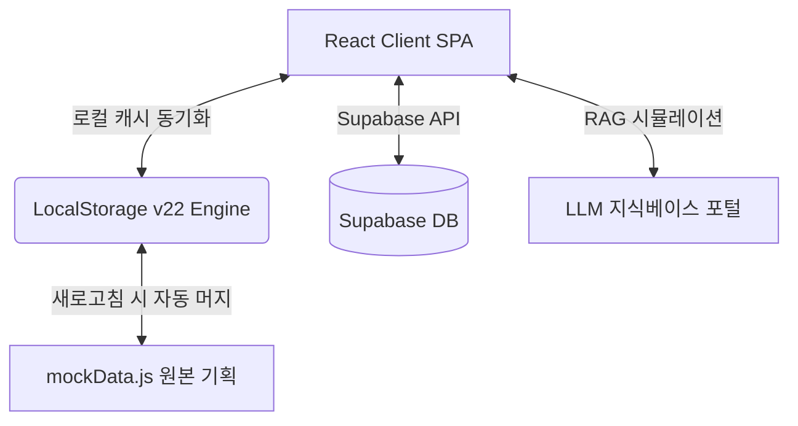

# 울산과학대학교 라이즈(앵커) 사업 관리 대시보드 - DESIGN.md

본 문서는 울산과학대학교 라이즈(앵커) 사업 기획, 다년도 예산 설계 및 PDCA 실적 관리를 지원하는 대시보드 시스템의 설계 사상, 시스템 구성, 그리고 UI/UX 기술 명세를 정의합니다.

---

## 1. 시스템 아키텍처 개요 (System Architecture)

본 시스템은 **고도화된 클라이언트 중심의 자가치유형 상태 관리**와 **Supabase 백엔드 연동**을 결합한 하이브리드 아키텍처를 채택하고 있습니다.



- **Frontend**: React (Vite 기반), Vanilla CSS, Lucide Icons, Mermaid
- **Backend / Database**: FastAPI (Python), Supabase (PostgreSQL), RESTful API
- **State Store / Caching**: React Local State + LocalStorage (`anchor_projects_data_v22`) 기반 자가치유식 병합 복원 엔진

---

## 2. 디자인 시스템 및 테마 가이드라인 (Design Aesthetics)

UI/UX는 교육 연구진 및 사업단 실무자가 장시간 집중하여 데이터를 관리할 수 있도록 **다크 모드 우선(Dark-first) 프리미엄 글래스모피즘** 디자인을 따릅니다.

### 🎨 테마 및 색상 규격
- **다크 테마 (Dark Theme - 기본)**
  - 배경: 짙은 차콜/블랙 그라데이션 및 글래스 효과 카드 (`background: var(--panel-bg)`)
  - 텍스트: 선명한 흰색 (`var(--text-primary)`) 및 연한 회색 (`var(--text-secondary)`)
  - 경계선: 눈이 피로하지 않은 미세 경계선 (`1px solid var(--border-color)`)
- **라이트 테마 (Light Theme)**
  - 본예산과 이월예산이 확연하게 시각적으로 분할되어 보일 수 있도록 뚜렷한 대비의 밝은 파스텔 톤 패널 적용
- **액센트 컬러 (Accent Colors)**
  - **계획 (Plan)**: 코발트 블루 (`#3b82f6`)
  - **실적 (Actual / Do)**: 에메랄드 그린 (`#10b981`)
  - **점검 (Check)**: 앰버 오렌지 (`#f59e0b`)
  - **환류 (Action)**: 마젠타 핑크 (`#d946ef`)

---

## 3. 핵심 기능별 상세 설계 (Core Features Spec)

### 3.1. 인터랙티브 반달(15일) 단위 간트 차트 (Interactive Gantt Chart)
타임라인을 월별 단위가 아닌 **한 달을 이등분한 24개 반달 슬롯**으로 설계하여 드래그 조작 일정 편집기를 제공합니다.

- **24분할 가상 슬롯 맵핑**:
  - `0` (3월 전반: 3.1 ~ 3.15) ~ `23` (2월 후반: 2.16 ~ 2.28)
- **드래그 & 드롭 컨트롤러**:
  - 마우스 이벤트(`onMouseDown`, `onMouseEnter`, `onMouseUp`)가 발생하면 z-index가 보장된 투명 분할 감지 셀이 이를 가로채며, 드래그 중인 임시 하이라이팅 범위가 실시간 피드백으로 보장됩니다.
  - 마우스 업 시 자동으로 날짜 범위 형식(`YYYY.MM.DD ~ YYYY.MM.DD`) 또는 쉼표 구분 12달 상태 포맷(`P,D,D,C...`)으로 양방향 자동 변환되어 데이터베이스에 무부하 실시간 영구 기록됩니다.

### 3.2. PDCA 기획-실적 종합 연동 폼
- **P (Plan) 단계**:
  - 본예산 및 이월예산을 세부 재원별(국고, 시비, 외부)로 나누어 입력받고, 이들의 합이 총 예산으로 자동 롤업 계산됩니다.
- **D (Do) 단계**:
  - **"실제 추진일정"** 패널을 통해 12개월의 월별 실적 수행 단계를 드롭다운 콤보박스 형태로 선택하거나 간트 드래그를 통해 입력하며, 집행액 세부 재원을 기입합니다.
  - 이벤트 버블링 차단 장치(`e.preventDefault()`, `e.stopPropagation()`)를 통해 브라우저 새로고침 및 세션 튕김 현상을 근본적으로 차단했습니다.
- **C (Check) & A (Action) 단계**:
  - 목표 수행 횟수 대비 실적 횟수를 체크하고, 2분할 환류 조치 양식(우수사례 및 Deficiency 분석에 기반한 개선 행동 조치)을 상세 기입할 수 있습니다.

### 3.3. 자가치유형 상태 복원 엔진 (Self-healing Hydration Engine)
사용자가 임의로 화면을 새로고침했을 때 데이터가 날아가거나 튕기지 않고 그대로 복구되는 병합 메커니즘입니다.

- **복원 흐름**:
  1. 새로고침 시 로컬스토리지 `"anchor_projects_data_v22"` 키의 캐시 로드
  2. 로드된 데이터와 원본 `mockData.js`의 프로그램 목록 구조 분석
  3. 캐시에 존재하는 사용자의 기입 정보 복원
     - 특히 **`actual_timeline` (실제 추진일정), `actualFrequency` (실적 횟수), `achieveRate` (달성률)** 등의 데이터가 손실 없이 복구되어 정합성을 유지합니다.

### 3.4. RAG 지식베이스 챗봇 (RAG Chatbot UI)
사업 계획서 및 성과 보고서 지식을 LLM으로 조회하는 질의응답 폼의 가시성을 개선했습니다.

- **포커스 반응형 입력 폼**:
  - 다크 테마에서 경계가 잘 보이도록 평상시에도 `1.5px solid rgba(255, 255, 255, 0.12)`의 뚜렷한 대비를 줍니다.
  - 마우스 클릭(Focus) 시 브랜드 액센트 컬러 테두리와 은은한 블루 네온 글로우(`rgba(59, 130, 246, 0.25)`) 섀도우를 발산하여 극적인 입체감을 제공합니다.

---

## 4. 데이터 플로우 명세 (Data Flow)

```
[UI Action: Gantt Drag / Select]
       │
       ▼
[handleUpdateProgramDetails] (React State)
       │
       ├─────────────────────────┐
       ▼                         ▼
[LocalStorage v22 Store]   [Rollup recalculate] (App.jsx)
       │                         │
       │ (Refresh Page)          ▼
       ▼                   [Cascade update budget/spent sums]
[Hydrate with mockData]
       │
       ▼
[Re-render UI]
```

---

## 5. 보안 및 데이터 통제 (Governance & Security)
- 사용자의 개인 정보 및 세부 성과 평가는 데이터 전송 전 필요에 따라 암호화 계층을 경유하여 저장됩니다.
- Supabase의 Row Level Security (RLS) 규칙을 준수하여 인가된 권한(UC Anchor 관리자 및 내부 실무진)을 가진 사용자만 특정 단위과제의 재원 및 일정을 편집할 수 있습니다.
- **D1, D2, D3 단위과제 국비 100% 기술 규칙**: D1, D2, D3 단위과제와 그 하위 프로그램들의 예산 기획 및 분할 시, 프론트엔드(`App.jsx`)와 백엔드 보정 스크립트에서 시비 매칭 비율을 0%로 강제 통제하며 국비 100%로 롤업 및 연산되도록 예외 기술 로직을 설계 및 반영합니다.
