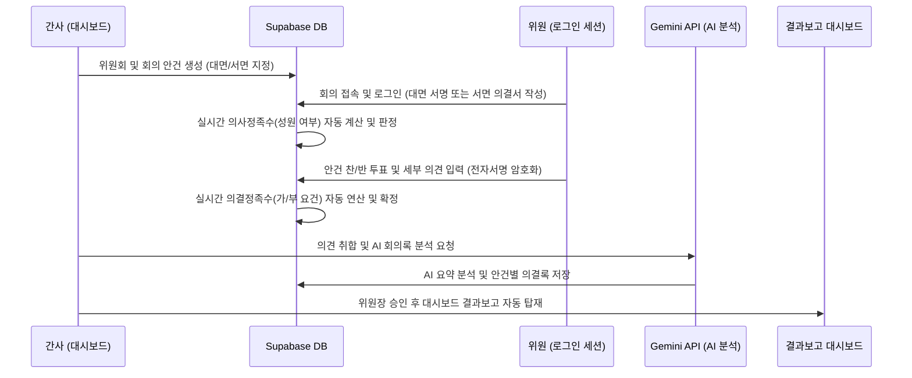

# Skill - paper-less 위원회 운영 시스템 기획 및 구현 제안서

본 문서는 대학 내 각종 사업단위원회(앵커총괄위원회, 앵커기획위원회, 사업비관리위원회, 자체평가위원회, 자문회의 등) 및 센터위원회를 종이 없는 **paper-less 위원회**로 전환하고, 회의 생성부터 성원 판정, 의견 취합, AI 분석, 그리고 대시보드 결과 탑재까지 일관되게 처리하는 연동 서브시스템의 설계와 구현 방안을 제안합니다.

---

## 1. 시스템 아키텍처 및 흐름 (Flow)

사이드바 대메뉴에 **'위원회 관리'** 탭을 추가하고, 하부에 **'회의 운영 및 의결'** 및 **'결과보고 대장'** 서브메뉴를 연동하는 구조로 구축합니다.



---

## 2. 데이터베이스 스키마 설계 (Supabase 연동)

> [!NOTE]
> 데이터베이스의 모든 신규 테이블 및 쿼리는 규정에 따라 순서 번호를 부여하여 `supabase/migrations/` 폴더 내에 정리되어 배포될 수 있도록 설계합니다 (예: `082_create_committee_tables.sql`).
> 특히 위원의 전자서명 및 중요 인적 정보는 **AES 대칭키 암호화(Rule 8)**를 적용하여 저장합니다.

### 2.1 위원회 기본 정의 테이블 (`committees`)
각 위원회의 정원과 의결 요건 기본 설정을 관리합니다.
```sql
CREATE TABLE committees (
    id UUID PRIMARY KEY DEFAULT gen_random_uuid(),
    name VARCHAR(100) NOT NULL, -- 예: '앵커총괄위원회', '자체평가위원회'
    total_quorum INT NOT NULL DEFAULT 0, -- 재적 위원 수
    voting_rule VARCHAR(50) NOT NULL DEFAULT 'majority_of_attendees', -- 'majority_of_total'(재적 과반), 'majority_of_attendees'(출석 과반)
    created_at TIMESTAMP WITH TIME ZONE DEFAULT timezone('utc'::text, now()) NOT NULL
);
```

### 2.2 위원회 위원 정보 테이블 (`committee_members`)
사용자 테이블(`rise_users`)과 매핑하여 권한을 제어합니다.
```sql
CREATE TABLE committee_members (
    id UUID PRIMARY KEY DEFAULT gen_random_uuid(),
    committee_id UUID REFERENCES committees(id) ON DELETE CASCADE,
    user_id VARCHAR(50) REFERENCES rise_users(id) ON DELETE CASCADE,
    role VARCHAR(50) NOT NULL DEFAULT 'MEMBER', -- 'CHAIRMAN'(위원장), 'SECRETARY'(간사), 'MEMBER'(위원)
    term_start DATE,
    term_end DATE,
    created_at TIMESTAMP WITH TIME ZONE DEFAULT timezone('utc'::text, now()) NOT NULL
);
```

### 2.3 회의 생성 및 관리 테이블 (`committee_meetings`)
```sql
CREATE TABLE committee_meetings (
    id UUID PRIMARY KEY DEFAULT gen_random_uuid(),
    committee_id UUID REFERENCES committees(id) ON DELETE CASCADE,
    title VARCHAR(200) NOT NULL, -- 회의명
    meeting_date TIMESTAMP WITH TIME ZONE NOT NULL, -- 회의 일시
    meeting_type VARCHAR(20) NOT NULL DEFAULT 'ONLINE_WRITTEN', -- 'OFFLINE_FACE'(대면), 'ONLINE_WRITTEN'(서면)
    agenda TEXT NOT NULL, -- 안건 내용 및 목적
    status VARCHAR(50) NOT NULL DEFAULT 'CREATED', -- 'CREATED', 'ACTIVE'(성원/의결중), 'CLOSED'(의결종료), 'REPORTED'(대시보드 탑재 완료)
    created_at TIMESTAMP WITH TIME ZONE DEFAULT timezone('utc'::text, now()) NOT NULL
);
```

### 2.4 참석/의결 및 의견 테이블 (`meeting_responses`)
```sql
CREATE TABLE meeting_responses (
    id UUID PRIMARY KEY DEFAULT gen_random_uuid(),
    meeting_id UUID REFERENCES committee_meetings(id) ON DELETE CASCADE,
    member_id UUID REFERENCES committee_members(id) ON DELETE CASCADE,
    attended BOOLEAN DEFAULT FALSE, -- 참석 여부
    vote VARCHAR(20), -- 'APPROVE'(찬성), 'REJECT'(반대), 'ABSTAIN'(기권)
    opinion TEXT, -- 상세 의견 및 검토 사항
    encrypted_signature TEXT, -- AES 암호화된 전자서명 데이터 (Rule 8 준수)
    submitted_at TIMESTAMP WITH TIME ZONE
);
```

### 2.5 최종 의결 및 AI 분석 결과 테이블 (`meeting_results`)
```sql
CREATE TABLE meeting_results (
    id UUID PRIMARY KEY DEFAULT gen_random_uuid(),
    meeting_id UUID REFERENCES committee_meetings(id) ON DELETE CASCADE,
    is_established BOOLEAN DEFAULT FALSE, -- 성원 여부
    decision_status VARCHAR(50), -- 'APPROVED'(가결), 'REJECTED'(부결), 'CANCELLED'(미성원)
    ai_summary TEXT, -- Gemini API를 활용한 참석 위원 의견 종합 요약
    official_minutes TEXT, -- 간사/위원장 확인 완료된 공식 회의록
    published_at TIMESTAMP WITH TIME ZONE,
    created_at TIMESTAMP WITH TIME ZONE DEFAULT timezone('utc'::text, now()) NOT NULL
);
```

---

## 3. 핵심 비즈니스 로직 및 구현 상세

### 3.1 성원 및 의결 요건 자동 판정 알고리즘
회의 상세 화면에 실시간으로 출석자 비율과 찬/반 비율을 계산하여 의사/의결 정족수를 도출하는 로직을 프론트엔드와 Supabase RPC(혹은 Trigger)에 장착합니다.

```javascript
// 💡 성원 및 의결 정족수 실시간 연산 도구
export function evaluateMeetingStatus(committee, responses) {
  const totalMembers = committee.total_quorum; // 재적 위원 수
  const attendedCount = responses.filter(r => r.attended).length; // 출석 위원 수
  
  // 1. 의사정족수 (성원 여부) 판정: 재적 위원 과반수 출석 기준
  const majorityLimit = Math.floor(totalMembers / 2) + 1;
  const isEstablished = attendedCount >= majorityLimit;
  
  if (!isEstablished) {
    return {
      isEstablished: false,
      decisionStatus: "CANCELLED_NO_QUORUM",
      message: `미성원 (재적 ${totalMembers}명 중 ${attendedCount}명 출석, 성원 요건: ${majorityLimit}명)`
    };
  }

  // 2. 의결정족수 (가부 판단) 판정
  const votes = responses.filter(r => r.attended && r.vote);
  const approveCount = votes.filter(v => v.vote === "APPROVE").length;
  
  let decisionStatus = "PENDING";
  let voteRequirementText = "";
  
  if (committee.voting_rule === "majority_of_attendees") {
    // 출석 위원 과반수 찬성
    const requirement = Math.floor(attendedCount / 2) + 1;
    const isApproved = approveCount >= requirement;
    decisionStatus = isApproved ? "APPROVED" : "REJECTED";
    voteRequirementText = `출석 과반 찬성 기준 (출석 ${attendedCount}명 중 찬성 ${approveCount}명 필요: ${requirement}명)`;
  } else if (committee.voting_rule === "majority_of_total") {
    // 재적 위원 과반수 찬성
    const requirement = Math.floor(totalMembers / 2) + 1;
    const isApproved = approveCount >= requirement;
    decisionStatus = isApproved ? "APPROVED" : "REJECTED";
    voteRequirementText = `재적 과반 찬성 기준 (재적 ${totalMembers}명 중 찬성 ${approveCount}명 필요: ${requirement}명)`;
  }

  return {
    isEstablished: true,
    decisionStatus,
    approveCount,
    attendedCount,
    message: `성원 완료 (${attendedCount}명 참석) - 최종 결과: ${decisionStatus === "APPROVED" ? "가결" : "부결"} (${voteRequirementText})`
  };
}
```

### 3.2 위원별 서명 암호화 처리 (Rule 8 보안 규정 준수)
위원들이 대면 확인 서명을 마우스 드로잉(Canvas) 등으로 수행하거나 서면동의 시 전자서명할 때, 이미지 데이터를 AES 대칭키로 암호화하여 DB에 전송합니다.
```javascript
import CryptoJS from "crypto-js";

const SECRET_KEY = "anchor_instructor_secure_encryption_key_2026"; // 전역 대칭키 연동

export function encryptSignature(canvasDataUrl) {
  if (!canvasDataUrl) return "";
  return CryptoJS.AES.encrypt(canvasDataUrl, SECRET_KEY).toString();
}

export function decryptSignature(encryptedData) {
  if (!encryptedData) return "";
  const bytes = CryptoJS.AES.decrypt(encryptedData, SECRET_KEY);
  return bytes.toString(CryptoJS.enc.Utf8);
}
```

### 3.3 Gemini API 연동 AI 자동 분석 및 탑재 요약
위원들이 텍스트로 제출한 개별 의견 데이터를 프롬프트에 실어서 취합 요약을 요청합니다.

* **프롬프트 디자인 예시**:
  ```text
  역할: 울산과학대학교 RISE 사업단 전문 AI 분석관
  작업: 아래 수집된 위원들의 회의 안건 의견들을 분석하여 다음 형식으로 회의록 요약 보고서를 작성해줘.
  
  [안건명]: {회의 안건명}
  1. 종합 찬반 동향 (찬성률, 주요 지지 요인)
  2. 안건별 핵심 쟁점 및 보완 요구사항 (위원들의 세부 의견 취합 요약)
  3. AI 종합 조언 및 추진 방향 제언
  
  [의견 데이터]:
  - 위원 A: "예산 집행 절차 완화에 동의하지만, 사후 감사 가이드라인이 필요합니다."
  - 위원 B: "규정 개정 방향에 전적으로 찬성합니다. 시급히 반영해야 합니다."
  ...
  ```

---

## 4. UI/UX 화면 구성 제안

### 4.1 위원회 회의 운영 화면 (`MeetingDashboard.jsx` - 신규)
* **간사 모드**:
  * 회의 형태(대면/서면) 토글 버튼.
  * 안건 작성 및 위원 성원 문자/메일 발송 연동 버튼.
  * 안건 마감 및 **"AI 의견 종합 분석"** 버튼 탑재.
* **위원 의결 모드**:
  * 로그인 세션을 통한 자동 신원 확인 (위원회 소속 위원인지 체크).
  * 대면 회의: 모바일이나 태블릿으로 회의실 내 QR을 찍거나 접속하여 서명 및 투표 참여.
  * 서면 회의: 안건 명세를 확인하고 찬/반/기권 클릭 후, 의견(의결서 내용)을 직접 타이핑하고 하단 터치 패드에 서명 후 제출.

### 4.2 대시보드 탑재: 위원회 결과보고 대장 화면 (`CommitteeReports.jsx` - 신규)
* **목록**: 연도별, 위원회 구분별(앵커총괄위, 기획위, 자체평가위 등) 의결 목록.
* **상세 보고서 카드**:
  * 회의 개요 (일시, 장소, 성원 상태).
  * 최종 의결 상태 배지 (`성원/가결` [Green], `성원/부결` [Red], `미성원/취소` [Gray]).
  * **AI 자동 분석 의견 리포트** 및 PDF 다운로드 기능 탑재.

---

## 5. 단계별 실행 계획 (Implementation RoadMap)

1. **1단계 (DB 및 백엔드 설정)**:
   * 마이그레이션 파일 `082_create_committee_tables.sql`을 작성하여 Supabase DB 스키마 배포.
   * 위원 권한 검증용 RLS 정책 활성화.
2. **2단계 (성원/의결 판정 및 암호화 연동)**:
   * 성원 및 의결 요건 연산 헬퍼 작성.
   * `CryptoJS` 기반 전자서명(DataURL) 대칭키 암복호화 로직 연동.
3. **3단계 (의결서 작성 및 AI 분석 API 추가)**:
   * 프론트엔드 전자서명 캔버스 컴포넌트 추가.
   * 위원 의견 요약용 Gemini API Edge Function 또는 연동 API 작성.
4. **4단계 (결과보고 대시보드 표출)**:
   * 위원장 승인 처리 후 `CommitteeReports` 대시보드 화면에 회의록 카드 형식으로 동적 렌더링.

---

## 6. 위원회 의결정족수 및 재적 산정 규정 (간사 제외)
* **간사 의결권 제외**: 간사(`role: "SECRETARY"`)는 위원회 의사 진행 및 서기·행정 실무 담당자로서 표결권 및 의결권이 없습니다.
* **재적 위원 수 산정**: 총 위원 중 간사를 제외한 의결 위원 수(N)가 해당 위원회의 재적 위원 수(`total_quorum`)가 됩니다. (예: 4명 중 간사 1명 제외 3명)
* **의사정족수 (성원 요건)**: 간사를 제외한 재적 위원 수(N)의 과반수 (`Math.floor(N / 2) + 1`) 이상 출석 시 성원이 성립됩니다. (예: N=3명일 경우 2명 이상 출석 시 성원)
* **의결정족수 (가결 요건)**: 회의 성원 시, 실제 출석한 의결 참여자 수(M)의 과반수 (`Math.floor(M / 2) + 1`) 이상 찬성 시 안건이 최종 가결(의결)됩니다.
