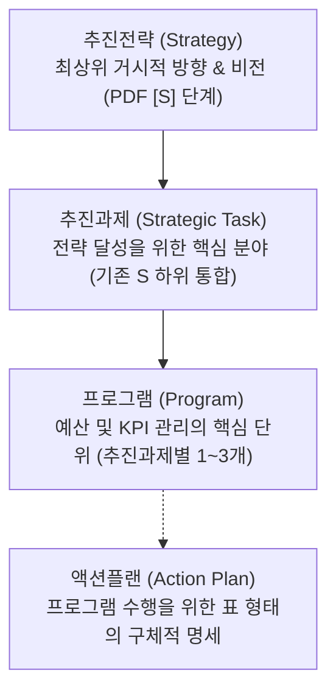

# ⚓ 울산과학대학교 라이즈(앵커) 사업단 기획 체계 가이드 (anchor-plan.md)

이 가이드는 울산과학대학교 라이즈(앵커) 사업단이 프로젝트 관리를 위해 **추진전략 - 추진과제 - 프로그램**의 3단계 핵심 기획 체계를 구축하고, 각 프로그램을 실제로 수행하기 위한 세부 실행 수단으로서 **표(Table) 형식의 액션플랜**을 구성하도록 돕는 메뉴얼입니다.

---

## 1. 배경 및 맥락 (Background & Context)
- **주관 기관**: 울산과학대학교 라이즈(앞으로 '앵커'로 지칭) 사업단
- **지원 규모**:
  - **1차년도 (2025년)**: 최종 **104.23억원** 수주 (12개 단위과제 모두 참여)
  - **2차년도 (2026년)**: 총 **91.83억원** (12개 단위과제 100%수행, 공통운영경비 23.63억원 포함)
- **개편 목적**: 
  - 기획의 공식 체계를 **추진전략 - 추진과제 - 프로그램**의 선명한 3단계로 종결시킵니다.
  - **액션플랜**은 공식 체계 레이어에서 제외하고, 개별 프로그램을 성공적으로 수행하기 위한 **구체적인 실행 수단과 방법(일정, 예산, 자원, 담당 주체, 세부 추진 방식)**을 종합 관리하는 **정밀한 표(Table) 형식**으로 재정립합니다.

---

## 2. 기획 체계 정의 (The Framework)

글로벌 프로젝트 관리론(OKR, WBS, LFA 등)을 울산과학대학교 라이즈 사업 특성에 맞게 결합하여 다음과 같이 구성합니다.



### 1) 추진전략 (Strategy)
* **정의**: 대학 및 울산광역시 혁신을 위한 최상위 거시적 목표이자 사업이 나아가야 할 대방향입니다.
* **성격**: 원래 PDF 파일에 있는 `[S1] ~ [S5]` 구조를 100% 그대로 유지합니다.
* **예시**: *[S1] 지역인력 수요분석 기반 UC-HYPER 실무인재 양성*

### 2) 추진과제 (Strategic Task)
* **정의**: 최상위 추진전략을 달성하기 위한 구체적인 중점 과제 및 추진 분야입니다.
* **성격**: 전략을 구체화하는 중간 가교 역할을 수행하며, 모호한 전략은 과감히 통합합니다.
* **예시**: *[추진과제 1-1] 지역인력 수요 및 역량분석 기반 전공 교육과정 고도화*

### 3) 프로그램 (Program)
* **정의**: 추진과제를 실현하기 위한 구체적인 실무 사업 단위이자 **예산과 성과 지표(KPI)가 배분되는 핵심 기획 관리 단위**입니다.
* **성격**: 추진과제 직속 하위에 연계되며, 성격에 따라 추진과제별 **1~3개의 프로그램**으로 세분화하여 명확히 나눕니다.
* **예시**: *[프로그램 1-1-1] 수소 및 친환경 에너지 융합 교육과정 운영*

### 4) 액션플랜 (Action Plan - 표 형식 구성)
* **정의**: 프로그램 수행을 위한 구체적인 실행 수단과 방법입니다.
* **성격**: 공식적인 기획서 단계(Level) 체계에는 포함하지 않으며, 프로그램을 성공시키기 위한 하위 명세서로 사용합니다.
* **표(Table)의 열 구성 요건 (5W1H 매핑)**:
  1.  **Action Steps (세부 실행 과제)**: 구체적으로 무엇을 진행할 것인가 기술
  2.  **Assigned Person/Team (담당 주체)**: 주관 부서 및 참여 기관 (예: 산학협력단, 참여 기업, 지자체 담당 부서 등 - Who)
  3.  **Priority Level (우선순위)**: 과제 수행의 시급성 및 중요도 (High, Medium, Low)
  4.  **Status (추진 상태)**: 현재 진행 단계 (Not Started, In Progress, Complete)
  5.  **Resources (자원 및 예산)**: 투입되는 물리적/인적 자원 및 소요 예산 명시 (How Much)
  6.  **Due Date (마감 기한)**: 월별 또는 분기별 완료 마일스톤 (When)
  7.  **Notes (비고 및 상세 추진 방식)**: 실행 공간 및 구체적인 세부 추진 절차 (How / Where)

---

## 3. 기획서 적용 예시 (Application Example)

*   **추진전략**: [S3] 지역정주 지산학 맞춤형 고급 기술인재 양성
*   **추진과제**: [추진과제 3-1] 지산학 연계 현장 실무 교육 강화
*   **프로그램**: [프로그램 3-1-1] 이차전지 산업체 현장실습 학기제 운영
*   **액션플랜 (실행 방법 - 표 형식)**:

| Action Steps | Assigned Person/Team | Priority Level | Status | Resources | Due Date | Notes |
| :--- | :--- | :---: | :---: | :--- | :---: | :--- |
| 수요기업 발굴 및 산학 협약 체결 | 산학협력단 | **High** | Complete | 기업 DB, 예산 500만 원 | 5월 | 울산 내 이차전지 기업 5개사 발굴 |
| 참여 학생 선발 및 사전 교육 | 각 전공 학과 | **High** | Complete | 학부생 성적자료, 안전 특강 | 6월 | 선발 학생 대상 사전 10시간 직무 교육 |
| 기업 현장 파견 및 지도교수 점검 | 협약 산업체 & 지도교수 | **Medium** | In Progress | 파견 수당, 현장 실습실 | 7~8월 | 주 1회 지도교수 현장 방문 평가 진행 |
| 실무 역량 향상도 평가 및 학점 부여 | 지산학교육센터 | **Low** | Not Started | 평가표, 학점 인정 위원회 | 9월 | 이수증 발급 및 학과별 학점 승인 |

---

## 4. 기획 및 사업계획 설계 템플릿 (Template)

새로운 체계를 바탕으로 2차년도 사업계획을 기획할 때 활용할 수 있는 양식 예시입니다.

### [템플릿 양식]
```markdown
# [단위과제명] (예: 단위과제 A-1-가. 지역과 미래를 만드는 UC-HYPER 전문기술인재 양성)
- **배정 예산**: 약 ○○억원 (국비 및 지방비 매칭 비율 명시)
- **최종 목표**: [단위과제 성과 목표 요약]

## 1. 추진전략 (Strategy)
> [PDF 원본 파일에 수록된 [S] 추진전략 내용을 100% 동일하게 유지]

## 2. 추진과제 (Strategic Task) 1: [과제명] (S의 하위 과제로 1~2개 수립)
> [과제 개요 서술]

---

## 3. 프로그램 (Program) 1-1: [프로그램명] (추진과제별 1~3개 프로그램으로 구체화)
- **프로그램 개요**: [추진 내용 및 주요 타겟층 요약]
- **성과 지표 (KPI)**: [상위 프로그램 지표 연계]
- **배정 예산**: ○.○억원

### 💡 [액션플랜 (Action Plan): 프로그램 수행을 위한 구체적 실행 수단 및 방법]

| Action Steps | Assigned Person/Team | Priority Level | Status | Resources | Due Date | Notes |
| :--- | :--- | :---: | :---: | :--- | :---: | :--- |
| [실행 과제 1] | [담당 부서/기관] | High/Medium/Low | Not Started | [투입 자원 / 예산] | [추진 일정] | [세부 절차 및 장소] |
| [실행 과제 2] | [담당 부서/기관] | High/Medium/Low | Not Started | [투입 자원 / 예산] | [추진 일정] | [세부 절차 및 장소] |
```
