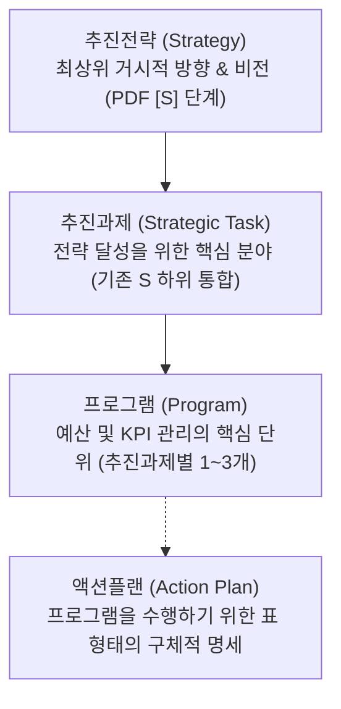

# ⚓ 울산과학대학교 라이즈(앵커) 사업단 기획 체계 가이드 (anchor-plan)

이 스킬은 울산과학대학교 라이즈(앵커) 사업단이 프로젝트 관리를 위해 **추진전략 - 추진과제 - 프로그램**의 3단계 핵심 기획 체계를 구축하고, 각 프로그램을 실제로 수행하기 위한 세부 실행 수단으로서 **표(Table) 형식의 액션플랜**을 구성하도록 돕는 가이드 및 에이전트 행동 지침입니다.

---

## 1. 배경 및 맥락 (Background & Context)
- **주관 기관**: 울산과학대학교 라이즈(앵커) 사업단
- **지원 규모**:
  - **1차년도 (2025년)**: 최종 **104.23억원** 수주 (12개 단위과제 모두 참여)
  - **2차년도 (2026년)**: 총 **91.83억원** (12개 단위과제 및 공통영역인 운영팀 공통운영경비 23.63억원 포함). 단, 신산업특화센터 이관 예산인 **A1나 (3.1억 원, 총 310백만원)**는 본사업비와 별도로 배정되어 총 운영 예산 규모는 **94.93억원**으로 통합 관리합니다.
 - **재원 구분 및 표기 가이드라인 (연차별 회계 규칙)**:
  - 1차년도 사업비는 본사업비로만 구성되며 이월예산이 아예 존재하지 않습니다. 또한, 1차년도(2025년)에는 공통경비(운영팀 공통운영경비) 예산이 별도로 존재하지 않으므로, 대시보드 및 재원 통계 연산 시 공통경비 프로젝트는 1차년도 데이터 집계 및 시각화 차트에서 완전 제외 처리합니다. **특히 이월예산이 존재하지 않는 1차년도(selectedYear === 1)의 경우, 프로그램 실무 PDCA 입력 화면 중 P 단계 예산 기획 및 세부 추진계획 폼에서 국고 이월예산, 지자체 시비 이월예산, 외부사업비 이월예산 등 이월예산 편성(입력) 칸을 완전히 화면에서 삭제(제외)하여 노출해야 합니다.**
  - **1차년도 공통경비 처리 예외 규칙**: 1차년도 사업의 경우 2차년도와 달리 프로젝트 수준에서의 전사 공통경비 편성이 불가합니다. 따라서, 1차년도에 한해 모든 단위과제(A1~D4) 하부에 '공통경비' 추진과제(T)와 '공통경비' 프로그램(Pg)을 반드시 추가하여 운영해야 합니다. 해당 '공통경비' 프로그램의 세부 액션플랜(Action Plan) 표에는 다른 세부 프로그램들에 반영되지 않은 공통 성격의 인건비, 간접비, 그 밖의 사업운영경비, 성과활용확산 지원비 등의 집행 계획을 개별 행으로 명시적으로 기재하여 관리해야 합니다.
  - 2차년도 이상의 N차년도 예산은 **"N차년도 본사업비"**와 **"N-1차년도 이월예산"**으로 구성되며, 이에 따라 화면상의 이월비 명칭도 항상 N-1차년도 기반으로 동적 라벨링하여 추적하고 기록 관리합니다. (예: 2차년도 화면에서 이월비는 `1차년도 이월예산`으로 통일)
  - 대시보드 화면상 모든 사업비(예산액, 집행실적, 잔액 등)의 표시 기본 단위는 **"백만원"**으로 통일하며, 금액 가독성을 위해 3자리마다 **백만원 단위 쉼표(,)**를 표시합니다. (예: 1,500,000,000원은 대시보드에 1,500백만원으로 표출)
  - **단위과제 코드 표기 규칙**:
    - 대시보드 및 성과 명세서(`md`) 내에서 단위과제 코드를 기술할 때는 추진전략의 영문 알파벳과 과제 번호 숫자 사이에 대시(-)를 생략하고 **`A1`**, **`A2`**, **`B1`**과 같이 붙여서 표기합니다. 이는 1차년도와 2차년도 전체 표기를 완벽히 통일하여 가독성과 데이터 연동 일관성을 보장하기 위함입니다. (예: `A-1` ➔ `A1`, `B-4` ➔ `B4`)
- **조직 개편 반영 (6월 1일 자)**:
  - **신산업특화센터**가 신설되어 총 **3.1억 원(310백만원)의 사업 예산을 이관**받았으며, 이는 A1나(신산업특화 전문기술인재 양성)로 신규 과제화되어 전담 연구원에 의해 집행됩니다. (본사업비 91.83억 원과는 별도 예산으로 처리함)
  - 기존 UC-HYPER 사업은 **A1가 과제**로 분리되어 ECC센터에서 전담 집행합니다.
- **1차년도(2025년) 대학 단위과제 명칭 표준 정의**:
  - 1차년도의 사업 설계 및 성과관리 연동을 위해 사용되는 단위과제 코드와 명칭의 공식 리스트는 다음과 같습니다.
  
  | 단위과제 ID | 1차년도 공식 단위과제 명칭 |
  | :---: | :--- |
  | **A1** | 지역과 미래를 만드는 UC-HYPER 전문기술 인재 양성 |
  | **A2** | 지역 창업 생태계 혁신을 위한 글로컬 창업 문화 조성 |
  | **B1** | 중소·중견기업 맞춤형 기술지원·공동연구 활성화 |
  | **B2** | U-LIFE 평생직업교육 플랫폼 구축 |
  | **B3** | 지역을 키우는 지역문제 해결 협력 체계 구축 |
  | **C1** | 복합재난 대응 산업안전·보건 관리시스템 개발 |
  | **C2** | AID 역량강화 기반 지역산업 전환 지원 |
  | **C3** | 교육·산업·복지가 조화로운 지속가능한 탄소중립 |
  | **D1** | 통합형 인재양성 기반 포용적 보건복지서비스 구현 |
  | **D2** | 내일을 밝히는 ‘위드아이’ 늘봄 생태계 조성 |
  | **D3** | 에코 컬처로 만드는 꿀잼도시 울산 |
  | **D4** | 지역산업 연계 글로벌 협력 거점 대학 육성 |
  
---

## 2. 조직 거버넌스 및 예산 매핑

사업단의 기획 및 집행 조직은 아래와 같이 전문 센터 및 실무진으로 매핑되며, 기획서 작성 시 담당 주체를 이 기준에 따라 배정합니다.

1.  **사업단장**: 송경영 교수 (최종 기획 및 예산 승인 주체)
2.  **총괄본부장**: 김현수 교수 (사업단 전체 총괄 및 AID-X지원센터장 겸임)
3.  **전문 센터장 및 팀장교수 매핑**:
    *   **ECC센터**: 센터장 이동은 교수
        *   HYPER교육팀: 팀장 장광일 교수
        *   로컬창업지원팀: 팀장 고형석 교수
        *   G-VET팀: 팀장 양승호 교수
    *   **ICC센터**: 센터장 김기범 교수
        *   R&BD지원팀: 팀장 김기범 교수 (겸임)
        *   지속가능실천팀: 팀장 김산 교수
        *   산업안전지원팀: 팀장 한미라 교수
    *   **RCC센터**: 센터장 현용환 교수
        *   LIFE교육팀: 팀장 김민경 교수, 박성혁 교수
        *   LBA대응팀: 팀장 이한도 교수
        *   로컬브릿지팀: 팀장 이상현 교수
    *   **AID-X지원센터**: 센터장 김현수 교수 (총괄본부장 겸임)
        *   AI∙DX교육팀: 팀장 이정준 교수
    *   **울산늘봄누리센터**: 센터장 홍광표 교수
    *   **신산업특화센터**: A1나 신산업 이관 분 3.1억 원(310백만원) 총괄
    *   **사업운영팀**: 팀장 심현미 부장 (공통 영역 및 운영 행정비 총괄)
4.  **실무 연구진 직급(3구분) 및 부서 배정**:
    *   연구원 직급은 **책임연구원 / 선임연구원 / 연구원**의 3단계로 엄격히 구분하여 호칭 및 역할을 분담합니다.
    *   **ECC센터**: 이은주 선임연구원, 서란 연구원, 정자윤 연구원, 박기범 연구원, 김소연 연구원
    *   **ICC센터**: 이정은 선임연구원, 이혜성 연구원, 도지은 연구원 (기존 김예담 연구원 제외)
    *   **RCC센터**: 이현섭 책임연구원, 박인숙 선임연구원, 이연향 연구원, 김소정 연구원, 오영경 연구원, 최승혜 연구원
    *   **AID-X지원센터**: 임은애 선임연구원, 서은지 연구원, 채민지 연구원
    *   **신산업특화센터**: 김나희 연구원, 정호성 연구원 (이관 신규과제 전담)
    *   **울산늘봄누리센터**: 황수진 선임연구원, 최주명 연구원, 김예지 연구원 (센터장: 홍광표 교수)
    *   **사업운영팀**: 한유경 선임연구원, 김래림 연구원, 박언주 연구원, 이규상 연구원
5.  **사업단 의사결정 거버넌스 위원회 체계**:
    RISE 사업의 체계적 기획 및 투명한 집행 관리를 위해 다음과 같은 5대 주요 의사결정 및 자문 위원회를 운영합니다.
    *   **RISE총괄위원회**: 울산 지역 RISE 사업의 최고 의사 결정 기구로, 사업의 총괄 방향 설정, 주요 계획의 심의·의결, 성과 지표 평가 및 환류 체계 조율 등의 핵심 역할을 담당합니다. (반기별 1회 정기 개최)
    *   **RISE기획위원회**: 세부 추진전략 수립 및 프로그램 기획을 실무적으로 조율하는 위원회로, 유관 기관과의 연계 모델 고도화 및 사업 기획의 타당성 검토를 수행합니다. (분기별 1회 정기 개최)
    *   **RISE사업자평가위원회**: 참여 부서, 연계 기업 및 위탁 기관의 사업 수행 실적을 객관적으로 평가하고, 평가 결과에 기반한 예산 조정 및 성과 극대화 방안을 도출합니다. (연 1회 정기 평가)
    *   **RISE사업비관리위원회**: 사업 예산의 투명하고 효율적인 집행을 보증하는 위원회로, 비목별 예산 전용 심의, 이월 예산 집행 계획 검토 및 정산 프로세스를 감독합니다. (매 분기 정기 개최 및 수시 심의)
    *   **RISE자문회의**: 지역 내 산업계, 학계, 연구계 전문가로 구성되어 지역 정주형 인재 양성 및 지산학연 협력 생태계 구축을 위한 자문과 네트워킹을 지원합니다. (반기별 1회 정기 개최 및 수시 자문)

---

## 3. 기획 체계 정의 (The Framework)

글로벌 프로젝트 관리론(OKR, WBS, LFA 등)을 울산과학대학교 라이즈 사업 특성에 맞게 결합하여 다음과 같이 구성합니다.



### 1) 추진전략 (Strategy)
* **정의**: 대학 및 울산광역시 혁신을 위한 최상위 거시적 목표이자 사업이 나아가야 할 대방향입니다.
* **성격**: 원래 PDF 파일에 있는 `[S1] ~ [S5]` 구조를 100% 그대로 유지합니다. 대시보드 화면상에서는 둥근 핑크색 넘버링 배지(`S1`, `S2`...)와 타이틀을 한 줄로 시각화합니다.

### 2) 추진과제 (Strategic Task)
* **정의**: 최상위 추진전략을 달성하기 위한 구체적인 중점 과제 및 추진 분야입니다. 대시보드 내에서는 선택된 추진전략에 연계하여 `S1과 연계한 추진과제 (Strategic Tasks)` 와 같이 한글 조사 결합 법칙(받침이 있는 경우 '과', 없는 경우 '와')에 따라 맞춤법에 맞는 연쇄 렌더링을 정의합니다.

### 3) 프로그램 (Program)
* **정의**: 추진과제를 실현하기 위한 구체적인 실무 사업 단위이자 **예산과 성과 지표(KPI)가 배분되는 핵심 기획 관리 단위**입니다.
* **재원 기재**: 본사업비와 이월사업비 분배 비율을 프로그램 명세에 함께 명시합니다.
* **Timeline (2차년도 사업 일정)**: 모든 프로그램은 2차년도 사업 기간인 **2026년 3월부터 2027년 2월**까지의 12개월 타임라인으로 일정을 관리 및 표시합니다. 일정 렌더링 시 연도 구분선(2026년/2027년)을 명시하며, 단일 전체일정 막대 대신 **P(Plan, 기획), D(Do, 실행), C(Check, 평가), A(Act, 환류) 단계를 4색(파란색, 초록색, 황색, 보라색)으로 분리 배정**하여 기획과 실행(P와 D)에 가장 긴 시간을 배분하는 구조적 타임라인을 구현해야 합니다. (예: 26.03 ~ 26.08, 26.04 ~ 26.12 등)
* **5단계 기획 위계 체계**:
  - **프로젝트 (Project; PJ)** : 울산광역시에서 제시한 4대 프로젝트
    * **1차년도 (Brain/Bridge/Brand/Booster)**:
      - `A` : 지역 혁신 인재를 양성하는 Brain 대학
      - `B` : 지역과 상생하는 Bridge 대학
      - `C` : 혁신 모델을 확산하는 국가 대표 Brand 대학
      - `D` : 매력적인 도시로의 변화를 촉진하는 Booster 대학
    * **2차년도 (TALENT/BRIDGE/JUMP/CARE)**:
      - `A` : 울산에 뿌리내리는 정주형 실전 인재 양성(Dynamic TALENT)
      - `B` : 기업과 하나되는 지⋅산⋅학⋅연 초연결 생태계 조성(Dynamic BRIDGE)
      - `C` : 다시 뛰게 만드는 생애 ‘직무 도약’ 체계 구축(Dynamic JUMP)
      - `D` : 지역생활 안전⋅의료⋅정주 협력체계 구축(DynamicCARE)
  - **단위과제 (Unit Project; UP)** : 프로젝트 목표 달성을 위한 12대 단위과제 (1차년도: A1~D4, 2차년도: A1가~D3)
    * `A1가` : 지역과 미래를 만드는 UC-HYPER 전문기술인재양성
    * `A1나` : 스마트·친환경선박 직업교육의 글로벌 스탠더드
    * `A2` : 지역 창업 생태계 혁신을 위한 글로컬 창업 문화 조성
    * `A3` : 지역 창업 생태계 혁신을 위한 글로컬 창업 문화 조성
    * `B1` : 울산지역 주력·신산업 분야 산학협력 체계 구축
    * `B2` : AID 역량강화 기반 지역산업 전환 지원
    * `B3` : 지･산･학 협력 탄소중립 실천 플랫폼 구축
    * `B4` : 복합재난 대응 산업안전·보건 통합 운영체계 구축
    * `C1` : U-LIFE 평생직업교육 기반 취∙창업 연계모델 구축
    * `C2` : 동남권과 함께 성장하는 돌봄생태계, 울산愛 구현
    * `D1` : 지역문제해결을 위한 울산형 혁신 솔루션 구축
    * `D2` : 지속가능한 보건복지 특성화 및 인재양성 체계 구축
    * `D3` : 에코 컬처로 만드는 꿀잼도시 울산
  - **추진전략 (Strategy; S)**, **추진과제 (Strategic Task; T)**, **프로그램 (Program; PG)**
  - **액션플랜 (Action Plan; AP)** : 프로그램을 수행하기 위한 다양한 실천 활동과 자원 분배 명세
* **ID 형식 및 작명 규칙 (ID Rule)**:
  - 단위과제 ID는 하이픈 없이 압축된 형식으로 정의합니다. (예: `A1가`, `A1나`, `A2`, `A3`, `B1`, ..., `D3`)
  - 단위과제 번호(ID) 다음에 문자가 오는 경우는 마침표(`.`)를 찍고 한 칸 띄운(스페이스) 다음 문자가 오도록 표기합니다. (예: `A1가. UC-HYPER 전문기술인재 양성`)
  - **추진과제(T) 번호 부여**: 한 단위과제 내의 모든 추진과제는 소속 추진전략(S)과 관계없이 1부터 겹침 없이 순서대로 순차적인 번호(`T1`, `T2`, `T3`...)를 부여받습니다.
  - **프로그램 ID 생성 공식**: `[단위과제번호]-[추진전략번호 + 추진과제번호]-[해당 추진과제 내에서의 프로그램 순번]` 형식을 따릅니다.
    * 예시: `A1가-S1T1-1` ➔ 단위과제 `A1가`, 추진전략 `S1`, 추진과제 `T1`에 매핑된 **해당 추진과제(T1) 내 1번째 프로그램**을 의미함.
  - **2차년도 프로그램 ID 마이그레이션 규칙 (Migration)**:
    * 2차년도의 세부 프로그램 예산 라인아이템들은 기획서 상의 대분류 프로그램에 귀속되므로, 기존 레거시 ID(예: `A1가-01`) 대신 5단계 위계 ID(예: `A1가-S1T1-1` ~ `A1가-S1T1-10`)로 변환되어 관리됩니다.
    * 브라우저 캐시 및 Supabase 원격 DB로부터 이전 데이터를 로드할 시에도 프론트엔드 단에서 자동으로 변환(마이그레이션) 맵(`PROGRAM_ID_MIGRATION_MAP`)을 통과시켜 5단계 위계 ID 구조로 실시간 치환 및 강제 동기화되도록 처리합니다.
  - 신규 프로그램 생성 시에도 각 연도별 자릿수 및 패딩 룰을 반드시 준수하여 고유 번호를 부여해야 합니다.
  - **단위과제 목록 정렬 원칙**: 대시보드 내 단위과제 목록 카드 리스트, 단위과제 집행현황 테이블, 프로그램 배정 드롭다운 및 테이블 등 모든 단위과제 노출 화면에서는 프로젝트 소속 구분과 무관하게 **단위과제 ID 순서(알파벳-숫자 오름차순: A1, A2, B1, B2, B3, C1, C2, C3, D1, D2, D3, D4 등)대로 정렬하여 목록을 표시**해야 합니다.

### 4) 액션플랜 (Action Plan - 표 형식 구성)
* **정의**: 프로그램 수행을 위한 구체적인 실행 수단과 방법입니다.
* **표(Table)의 열 구성 요건 (5W1H 매핑)**:
  1.  **Action Steps (세부 실행 과제)**: 구체적으로 무엇을 진행할 것인가 기술
  2.  **Assigned Person/Team (담당 주체)**: 주관 부서 및 참여 기관 (예: 신산업특화센터, RCC센터 등 - Who)
  3.  **Priority Level (우선순위)**: 과제 수행의 시급성 및 중요도 (High, Medium, Low)
  4.  **Status (추진 상태)**: 현재 진행 단계 (Not Started, In Progress, Complete)
  5.  **Resources (자원 및 예산)**: 투입되는 2026년 본사업비 및 2025년 이월비 배정액 (How Much)
  6.  **Due Date (마감 기한)**: 월별 또는 분기별 완료 마일스톤 (When)
  7.  **Notes (비고 및 상세 추진 방식)**: 실행 공간 및 구체적인 세부 추진 절차 (How / Where)

---

## 4. 기획 및 사업계획 설계 템플릿 (Template)

에이전트는 이 가이드에 따라 사업 계획을 설계할 때 아래 양식을 활용합니다.

### [템플릿 양식]
```markdown
# [단위과제명] (예: 단위과제 A1가. 지역과 미래를 만드는 UC-HYPER 전문기술인재 양성)
- **2026년 본사업비**: ○.○억원
- **2025년 이월사업비**: ○.○억원
- **총 예산**: 약 ○.○억원
- **담당 센터**: [예: ECC센터 / 신산업특화센터(이관)]

## 1. 추진전략 (Strategy)
> [PDF 원본 파일에 수록된 [S] 추진전략 내용을 100% 동일하게 유지]

## 2. 추진과제 (Strategic Task) 1: [과제명] (S의 하위 과제로 1~2개 수립)
> [과제 개요 서술]

---

## 3. 프로그램 (Program) 1-1: [프로그램명] (추진과제별 1~3개 프로그램으로 구체화)
- **프로그램 개요**: [추진 내용 및 주요 타겟층 요약]
- **성과 지표 (KPI)**: [상위 프로그램 지표 연계]
- **배정 예산**: 총 ○.○억원 (본사업비 ○.○억원 / 이월비 ○.○억원)
- **담당 실무자**: [예: 이은주 선임연구원]

### 💡 [액션플랜 (Action Plan): 프로그램 수행을 위한 구체적 실행 수단 및 방법]

| Action Steps | Assigned Person/Team | Priority Level | Status | Resources (본사업비 / 이월비) | Due Date | Notes |
| :--- | :--- | :---: | :---: | :--- | :---: | :--- |
| [실행 과제 1] | [담당 부서/기관] | High/Medium/Low | Not Started | [본사업비 ○원 / 이월비 ○원] | [추진 일정] | [세부 절차 및 장소] |
```

---

## 5. 5개년 전역 다년도 사업 및 성과관리 체계 (Multi-Year Budget & KPI System)

앵커사업은 총 5개년(1차년도 ~ 5차년도)에 걸친 장기 사업이며, 성과지표(KPI) 뿐만 아니라 **단위과제 예산, 세부 프로그램 예산, 비목별 일반예산**까지 모두 연도별 시계열 구조로 기획 및 관리되어야 합니다.

1.  **전역 연도별 예산 및 실적 매핑 구조**:
    *   단위과제, 프로그램, 비목 상세 내역 하위에 `years` 객체를 신설하여 연도별 본사업비 배정/집행 및 이월비 배정/집행 구조를 가집니다.
    *   **연도별 예산 필드**: `{ budget_main: 0, spent_main: 0, budget_carry: 0, spent_carry: 0 }`
    *   **1차년도**: 1차년도 기수행 실적은 추후 일괄 연동하기 위해 우선 배정 및 집행액을 0원으로 초기화하여 구조를 마련해 둡니다.
    - **1차년도 프로그램별 맞춤형 PDCA 일정 설계**:
      - 1차년도 사업의 실질 착수 시점(2025년 5월)을 기준으로 각 프로그램의 본질적 특성(예: 인프라 도입 기간 연장, 학사 일정 연계 캡스톤, 단기 완료형 등)을 반영하여 월별 PDCA 타임라인(timeline 속성 및 제안서 Due Date)을 서로 다르게 배치하여 정합성을 유지합니다.
      - 예시: `A1-S1T1-1` (5월 P, 6~7월 D, 8~9월 C, 10월 A), `A1-S1T2-2` (6월 P, 7~10월 D, 11월 C, 12월 A) 등 고유 추진 스케줄 적용.
    *   **2차년도**: 현재 진행 중인 핵심 사업 연도로서, 실시간 엑셀 업로드 및 대시보드 렌더링 시 **기본 활성 연도**로 작동합니다.
    *   **3~5차년도**: 연차별 마일스톤에 따른 시계열 장기 예산 배정 계획을 수립하고 실적은 0원으로 초기화하여 관리합니다.
  - **1차년도(2025년) 특정 지자체 자율성과지표(L-1, L-2) 세부 구성 및 가중치 산출 산식**:
    - **L-1 (지역 맞춤형 교과과정 혁신지수)**:
      - *세부 구성 (4개)*:
        1. 지역 맞춤형 교과·비교과 프로그램 개편 건수 (기준 28 / 목표 28 / 실적 35)
        2. 지역 맞춤형 교과·비교과 프로그램 이수 학생 수 (기준 3500 / 목표 4000 / 실적 3726)
        3. 졸업자의 지역 내 취업자 수 (기준 624 / 목표 624 / 실적 624)
        4. 졸업자의 지역 외 취업자 수 (기준 527 / 목표 527 / 실적 527)
      - *산출 공식*: `((A)실적/(A)기준)*40 + ((B)실적/(B)기준)*30 + ((C)실적/(C)기준)*20 + ((D)실적/(D)기준)*10` (가중치 연산 결과 1차년도 종합 달성지수는 **111.9%**로 계산됨)
    - **L-2 (현장실습 참여성과지수)**:
      - *세부 구성 (5개)*:
        1. 12주 이상으로 운영된 표준 현장실습 학기제 이수학생 수 (기준 74 / 목표 74 / 실적 66)
        2. 8주이상 12주미만으로 운영된 표준 현장실습 학기제 이수학생 수 (기준 27 / 목표 27 / 실적 26)
        3. 4주 이상 8주 미만으로 운영된 표준 현장실습 학기제 이수학생 수 (기준 103 / 목표 103 / 실적 63)
        4. 4주 이상으로 운영된 일반 현장실습 이수학생 수 (기준 16 / 목표 20 / 실적 1005)
        5. 4주 이상 글로벌 표준 현장실습 학기제 이수학생 수 (기준 4 / 목표 4 / 실적 1)
      - *산출 공식*: `((A)실적/(A)기준)*30 + ((B)실적/(B)기준)*20 + ((C)실적/(C)기준)*10 + ((D)실적/(D)기준)*10 + ((E)실적/(E)기준)*30` (가중치 연산 결과 1차년도 종합 달성지수는 **687.8%**로 계산됨)
2.  **화면상 전역 연도 스위칭 가이드**:
    *   대시보드 상단 네비바에 공통 연도 선택 제어기를 배치하여, 선택 연도(`selectedYear`) 변경 시 요약 지표, 그래프, 단위과제 표, 비목 테이블, 프로그램 PDCA 등이 일시에 해당 연도 값으로 변경되도록 설계합니다.

---

## 6. 대시보드 서브탭 운영 가이드 (Sub-Tab Operation)

1.  **예산항목 관리 탭 서브탭**:
    *   **본사업비**: 본사업비 배정, 본사업비 집행, 본사업비 잔액을 중심으로 차트 및 테이블을 구성하여 예산 한도 내에서 조율합니다.
    *   **이월사업비**: 전년도 이월예산 배정, 이월비 집행, 이월비 잔액을 중심으로 차트 및 테이블을 구성하여 이월 예산 한도 내에서 조율합니다.
    *   **전체예산**: 본사업비와 이월사업비를 합산한 종합 조회 탭으로, 전체 비목의 배정액/집행액/잔액을 종합 차트 및 표 형식으로 한눈에 파악할 수 있는 조회 전용 모드입니다.
2.  **성과지표 관리 탭 서브탭**:
    *   **자율성과지표**: 지자체 자율성과지표(`type: "자율"`) 목록을 필터링하여 노출합니다.
    *   **중점관리지표**: 대학 중점관리지표(`type: "중점"`) 목록을 필터링하여 노출합니다.
    *   **자동 연계**: 성과지표 서브탭 전환 시, 사용자가 빈 화면을 보지 않도록 각 서브탭에 해당하는 첫 번째 지표가 자동으로 선택되는 UX 로직을 준수합니다.

---

## 7. 프로그램 실무 PDCA 및 재원 다변화 운영 규칙 (PDCA & Funding Source)

1.  **PDCA 단계별 표준 프로세스 및 검증**:
    *   **PDCA 단계 간 의존성 규칙**:
        *   *완료 의존성*: 상위 단계가 완료(Complete)되지 않으면 하위 단계를 완료 처리할 수 없습니다. (D 완료를 위해서는 P 완료 필수, C 완료를 위해서는 D 완료 필수, A 완료를 위해서는 C 완료 필수)
        *   *롤백 의존성*: 상위 단계를 완료에서 진행/대기로 롤백하는 경우, 하위 단계(D, C, A)들의 완료 상태도 자동으로 진행 상태로 함께 해제되어 연쇄 롤백됩니다.
    *   **P (Plan) 단계**:
        *   *완료 세부 검증 규칙*:
            - **재원별 예산 배정**: 본예산, 이월예산, 외부사업비 중 하나라도 0원 초과 입력되면 OK
            - **비목별 예산 배정**: 10대 비목 중 최소 하나라도 선택되어 배정액이 0원 초과 입력되면 OK
            - **월별 추진일정**: 12개월 일정 기획에 P(기획), D(수행), C(성과), A(환류)가 각각 최소 1회 이상 모두 반영되어야 OK
            - **성과지표 연계**: '없음'을 선택하면 오른쪽에 성과지표 선택하지 않아도 됨. '자율'이나 '중점'이 선택되면 성과지표를 선택하고 세부 항목(실적목표 수치 중 하나 이상)까지 입력해야 OK
            - **실적목표**: 목표 건수, 참여 인원 등 실적 목표치 중 1개만 입력되더라도 OK
            - **참여대상**: 텍스트 입력 필수
            - **연계부서**: 텍스트 입력이 없거나 비어 있어도 OK
        *   *월별 추진 일정 (PDCA) 레이아웃*: 12개월의 계획 선택 드롭다운 라인은 **가로 12개월 일렬**로 폼 상단에 배치합니다.
        *   *동일 월 다중 계획 지원*: 만약 한 달에 계획(P)과 집행(D) 등 2가지 이상의 단계가 겹쳐 기획되는 경우, 월별 추진 일정 드롭다운에 **다중 선택 옵션(`P/D`, `D/C`, `C/A`)**을 제공하여 사용자가 직접 다중 일정을 등록할 수 있게 합니다.
        *   *Gantt 차트 스타일 타임라인 시각화 및 종적 화살표 연동*: "프로그램 진행" 탭의 월별 모니터링 테이블 셀은 세로로 정확히 이등분(상단: 계획 Gantt Bar / 하단: 실제 Gantt Bar)하여 그립니다. 이때 셀 좌우로 동일한 일정이 이어지면 테두리 라운드 처리를 생략해 **가로로 쭉 연결된 단일 Gantt Bar**로 시각화합니다. 또한 상단의 계획 Bar와 하단의 실제 Bar를 종방향 화살표(`↓`)로 서로 연결하고, 다음 달로 이어질 경우 우측 방향 화살표(`➔`)를 막대 끝에 배치하여 연동 관계를 Gantt식으로 묘사합니다.
    *   **D (Do) 단계**:
        *   *등록 필수 항목*: 세부 재원별 실제 집행 실적 입력 (국고 집행액, 시비 집행액, 외부사업비 집행액) 및 실적 지표.
        *   *실제 실적 연계 및 달성률 자동계산*: P단계의 실적 목표 제목과 단위 명칭을 그대로 상속하여 가져오며 실제 실적 값만 수동 입력합니다. 계획대비 달성률은 수동 입력이 불가하며 각 실적 목표 대비 실제 실적의 비율을 실시간 평균 내어 자동 계산합니다.
        *   *실제 추진일정 입력*: 계획 대비 실제 진행 실적을 직접 월별로 마킹(수동 입력)할 수 있도록 **실제 실적 (Actual Progress) 12개월 select 드롭박스 라인**을 가로형태로 배치합니다.
        *   *완료 세부 검증 규칙*:
            - **실제 추진일정**: 실제 추진일정 마킹에 P, D, C, A 단계가 각각 최소 1개 이상 모두 반영되어야 OK
            - **비목별 집행 내역**: 등록된 비목별 실제 집행액 중 최소 하나 이상이 0원 초과 입력되어야 OK
            - **실제 실적**: 실제 참여인원, 실제 개발수, 실제 기타 실적 중 최소 하나 이상이 0보다 큰 수치로 입력되어야 OK
    *   **C (Check) 단계**:
        *   *상태 구성*: `"대기"`와 `"완료"`로 이원화하며, 사용자의 수동 상태 지정을 금지합니다.
        *   *등록 필수 항목*: 성과사항 (서술형) 및 수요자 만족도 (점 / 100점) 점수 기재.
        *   *완료 조건 (Check Rule)*: 성과분석 저장 시 이전 D단계가 `'완료'` 상태여야 하고, 성과사항이 빈칸 없이 서술되어야 하며 만족도가 0점 초과여야만 자동으로 `"완료"` 로 상태 전환됩니다. C가 `'대기'` 상태로 롤백될 경우 하위 A단계도 자동으로 `'대기'`로 연쇄 롤백됩니다.
    *   **A (Act) 단계**:
        *   *상태 구성*: `"대기"`와 `"완료"`로 이원화하며, 사용자의 수동 상태 지정을 금지합니다.
        *   *등록 필수 항목*: 프로그램 성과 성격에 따른 **2분할 환류 방안** 기재.
            1.  *우수 프로그램*일 때 -> `우수한 점` 및 `발전방안` 필수 기재 (화면에는 이 두 항목만 노출).
            2.  *미흡 프로그램*일 때 -> `미비점` 및 `개선사항` 필수 기재 (화면에는 이 두 항목만 노출).
        *   *완료 조건 (Act Rule)*: 환류평가 저장 시 이전 C단계가 `'완료'` 상태여야 하고, 선택한 자체평가 구분에 따라 해당 필수 서술사항 2종이 모두 빈칸 없이 입력되어야 자동으로 `"완료"` 로 상태 전환됩니다.
    *   **P, D, C, A 저장 버튼 표준 레이아웃**:
        *   각 단계의 저장 버튼명은 각각 **`P 기획정보 저장`**, **`D 수행결과 저장`**, **`C 성과분석 저장`**, **`A 환류평가 저장`**으로 규격화합니다.
        *   모든 저장 버튼은 기존 블록 넓이의 **절반(50%) 길이**로 통일되게 축소하며, 부모 컨테이너 내에서 **가로 중간(가운데) 정렬**하고 버튼 내부의 텍스트 역시 **중간(가운데) 정렬**하여 배치합니다.
2.  **다변화 재원 구분 및 한도 통제**:
    *   사업비는 **국고(National), 시비(지자체 매칭 City), 외부사업비(외부위탁 등 External)**의 3대 재원으로 구분하여 배정 및 집행을 별개 파이프라인으로 추적합니다.
    *   *예산 한도 준수*: D 단계에서 등록되는 재원별 집행액(국고/시비/외부)은 해당 연도에 배정된 개별 재원 예산의 한도액을 절대 초과할 수 없습니다.
    *   *간접비 및 그 밖의 사업운영경비 한도*: '간접비'와 '그 밖의 사업운영경비' 비목의 본예산 편성액은 각각 해당 단위과제 총 사업비(본예산)의 **최대 5% 이내**로 제한하여 편성하는 재정 통제 규칙을 준수합니다. (예: A2 단위과제 총 사업비 900.0M 기준 각 비목별 최대 45.0M 이내로 한도 통제)
3.  **재원별 예산 엑셀 양식 연동 및 비목 롤업**:
    *   *엑셀 레이아웃 구성*: 예산 엑셀 양식은 프로그램별로 **본예산 행과 이월예산 행의 2줄로 종적 분리**하여 구성합니다. 오른쪽의 비목 컬럼은 접미사(`_본예산`, `_이월비`) 없이 10대 표준 비목명으로 축약(인건비, 장학금 등 총 10개)하여 입력 편의성을 제공합니다.
    *   *비목 롤업 적용*: 엑셀 업로드 시 동일 프로그램ID를 가지는 본예산 행과 이월예산 행의 데이터를 병합/조합하여, 10대 비목 중 하나라도 금액이 0보다 큰 비목만 필터링하여 프로그램의 비목 정보(`budget_categories`)에 롤업합니다.
    *   *UI 슬롯 제약 준수*: 프로그램 기획 UI가 최대 4개 슬롯으로 제한되어 있으므로, 엑셀에서 0보다 큰 비목이 4개 초과하여 들어올 경우 선입된 상위 4개 비목만 롤업 저장합니다.
    *   *집행 정보 보존*: 비목이 엑셀에 의해 갱신될 때, 기존에 동일한 비목명으로 등록되어 있던 집행액 정보(`spent`, `spent_carry`)가 유실되지 않고 안전하게 보존 맵핑되도록 처리합니다.
    *   *탭 전환별 반응형 다운로드 및 업로드 필터링*: 프로그램 관리 상단의 보기 탭이 '단위과제별 조회/등록' 상태이면, 다운로드 버튼 라벨이 `(해당 단위과제 ID 전용)`으로 반응 변경되고 엑셀 양식도 선택된 단위과제 데이터만 내려받아집니다. 이 상태에서 엑셀 업로드 시 파일 내의 다른 데이터는 전부 필터링 배제되고 오직 해당 단위과제 소속 데이터만 선별 정비 및 업데이트됩니다. 반면 '전체 목록 조회/등록' 탭이 활성화되면 다운로드 버튼명이 `(전체 목록)`으로 바뀌며 모든 프로그램이 엑셀에 포함되고 업로드 시에도 전체 일괄 반영되어 상호 대칭적 피드백을 제공합니다.
    *   *부모-자식 입력 폼 데이터 동기화*: 엑셀 업로드를 통해 부모 컴포넌트(`App.jsx`)의 `projects` 상태가 업데이트되더라도 하위 상세 입력 컴포넌트(`PDCAManager.jsx`) 내 로컬 인풋 폼 상태(`useState`)들이 갱신을 인지하지 못하는 오차가 없어야 합니다. 이를 예방하기 위해 상세 입력 폼 로딩 `useEffect` 의 의존성 배열에 반드시 `projects` 상태를 등록함으로써, 외부(엑셀 일괄 업로드 등)로부터 갱신된 재원 및 비목 배정 내용이 즉각적으로 인풋 및 드롭다운 컨트롤에 채워지도록 연동을 보완합니다.

---

## 8. 대시보드 탭 구성 및 사이드바 내비게이션 지침 (Tab & Sidebar Navigation Architecture)

- **사이드바 상단 브랜딩**: 사이드바 최상단에는 **울산과학대학교 로고 이미지 (`/logo.png`)**를 배치하고, 그 하단에 **`ANCHOR Portal`** 텍스트 로고를 병렬 배치하여 기관 브랜드 아이덴티티와 시스템 성격을 명확히 전달합니다.

대시보드는 울산과학대학교 라이즈(앵커) 사업의 성격에 따라 다음과 같은 고유 탭 및 사이드바 서브메뉴 구조로 설계 및 표출합니다.
1.  **IR 대시보드**: 전체 사업비의 연도별 요약, 본사업비/이월사업비 집행률, 재원 배분율 및 누적 집행 현황 그래프 등을 시각화하여 대외 보고를 지원합니다.
    *   **총사업비 요약 카드 구성**:
        1.  *2차년도 이상 레이아웃*: 'ANCHOR X차년도 총 예산' 카드의 상세 내역은 총 3줄의 좌우 대칭 레이아웃으로 표현합니다.
            *   *1행*: `앵커(본사업)` 및 `앵커(이월사업)`
            *   *2행*: `신산업(본사업)` 및 `신산업(이월사업)` (단위과제 ID `A1나` 전용 추출 데이터)
            *   *3행*: `{X}차년도(본사업)` (앵커+신산업 본사업 합산) 및 `{X-1}차년도(이월사업)` (앵커+신산업 이월비 합산)
        2.  *1차년도 레이아웃*: 1차년도에는 신산업 특화사업 및 이월예산이 아예 존재하지 않는 순수 본사업 단일 체계이므로, **신산업 특화(A1나) 및 이월사업을 계산식과 요약 카드 표출 항목에서 완전히 영구 제외**합니다. 1행에 `앵커(본사업)` 및 `1차년도(본사업)`만 안전하게 병렬 표출하여 가독 공간을 최적화합니다.
        3.  *요약 카드 레이아웃 가독성*: 가로폭 협소로 인해 총 예산 카드의 하위 서브텍스트들에서 금액의 단위(백만원)만 애매하게 떨어져 깨지는 현상을 해결하기 위해, 명칭 뒤에 강제 줄바꿈(`<br />`)을 주입하여 **수치+단위(예: `X,XXX.X 백만원`) 전체가 한 세트로 다음 행에 가지런히 표출**되도록 서브텍스트 템플릿을 연동합니다.
        4.  *상세 지표 카드형 배지 구조*: 상세 리스트의 가독성 향상과 직관적 구분을 위해, 각 사업비 지표와 금액 수치는 **둥근 모서리 미니 카드 사각형(`border-radius: 0.375rem`, 연한 경계선)**으로 둘러싸며 가로 1행(`flex-direction: row`) 구조로 1줄에 표출합니다. **사업구분 명칭은 왼쪽 정렬**, **사업비 금액은 오른쪽 정렬**이 되도록 양단 정렬(`justify-content: space-between`)을 강제하고 폰트 크기는 시인성 확대를 위해 **`0.85rem`**으로 키워 배치합니다. 채우기 색상은 재원별 성격(앵커 본사업은 옅은 블루, 이월은 옅은 퍼플, 신산업 본사업은 옅은 그린, 신산업 이월은 옅은 골드)에 맞춘 고유 파스텔 톤 배경색으로 칠하여 시각적으로 확실히 분리합니다.
        5.  *그리드 카드 배치 분기 구조*: 상세 정보가 많아 넓은 공간이 필요한 **첫 번째 카드(총 예산)에 2배 크기 너비(`2fr`)를 강제 부여**하고 전체 3열 그리드(`"2fr 1fr 1fr"`)로 고정합니다. 우측에 배치되는 집행 카드들(본사업비 집행, 이월사업비 집행) 및 성과지표 달성도 카드들을 각각 하나의 세로 정렬 컨테이너(`display: flex; flex-direction: column`)로 묶어 **아래위로 2단 정렬**함으로써 좌측 총 예산 카드의 높이와 대칭을 수평 일직선으로 완벽히 이루도록 구성합니다. 1차년도 뷰일 때는 2열에 본사업비 집행 단독(height: 100%), 3열에 자율/중점 성과지표 달성도 세로 2단이 위치하고, 2차년도 이상일 때는 2열에 본/이월사업비 집행 세로 2단, 3열에 자율/중점 성과지표 달성도 세로 2단이 완벽한 기하학적 대칭을 이루도록 설계합니다.
    *   **차트 시각화 및 UX 규격**:
        1.  *도넛 차트 (재원 배분 구조)*: 각 조각(Sector) 옆에 연한 지시선(`labelLine`, 투명도 25%)을 연결하고, 가로 공간 부족으로 인한 글자 잘림을 영구 차단하기 위해 **라벨 글씨를 2줄로 종적 분리**(`프로젝트 명` 아래에 `(비율%)` 표출)하여 직접 렌더링합니다. 폰트 크기는 시인성 확보를 위해 **`12px`**로 설정하며, 하단의 중복 범례(Legend) 리스트는 완전히 생략합니다.
        2.  *막대 그래프 (프로젝트별 재원/집행 현황)*:
            *   *호버 하이라이트 배경 (Cursor)*: 선택(호버) 영역의 가이드 빔은 지정 파스텔 톤인 **`rgba(229, 240, 219, 0.15)`**로 옅게 채워 시각 대비를 포근하게 낮춥니다.
            *   *호버 툴팁 박스 (Tooltip)*: 호버 팝업의 배경 색상은 연한 파스텔 톤인 **`rgba(224, 235, 246, 0.95)`**로 적용하고 내부 글자는 명도 대비가 높은 다크 계열(프로젝트명 `#111827`, 수치 항목 `#1f2937`)로 처리하여 텍스트 판독성을 보장하며 폰트 크기는 `11px`로 일관화합니다.
            *   *X축/Y축 라벨 및 범례 (X/YAxis & Legend)*:
                1. X/Y축 정보의 크기는 기존에서 2pt 가량 키워 **`12px`**로 구성하며, 특히 수치 데이터가 표출되는 **Y축 라벨에 천 단위 구분 쉼표(Thousand separator comma, `.toLocaleString()`)를 삽입**하여 판독 편의성을 보장합니다.
                2. 범례 영역과 그래프 끝자락이 위아래로 포개어지는 겹침 현상을 영구 예방하기 위해, **`BarChart`에 탑 마진(margin.top: 52px)을 강제 확보**하고 범례 카드의 좌표를 상단 끝(`top: 0`)으로 밀착시켜 수직 경계를 확실히 분리합니다.
                3. 범례 카드의 가로폭은 그래프 밖으로 삐져나가지 않도록 **10%가량 줄여 `width: "80%"`로 제한**하고 중앙 배치(`left: "50%", transform: "translateX(-50%)"`)합니다.
                4. 범례 항목들의 표출명은 **`본사업비 예산`**, **`본사업비 집행`**, **`이월사업비 예산`**, **`이월사업비 집행`**의 표준 순서 및 명칭으로 정확히 매핑하여 표출합니다.
                5. 대시보드 전체의 일관성 있는 비주얼 언어를 구축하기 위해, **본사업비의 기준 테마색은 `#55b685` (rgb(85, 182, 133))**, **이월사업비의 기준 테마색은 `#e9a23b` (rgb(233,162, 59))**로 통일하며, 예산 대비 집행을 나타낼 때 집행(Spent)의 막대 및 텍스트 색상은 각각 옅은 파스텔색인 **본사업비 집행 `#94deb8` (rgb(148,222,184))**, **이월사업비 집행 `#f6c97f` (rgb(246,201,127))**로 대치 표현합니다.
        3.  *테마 스위칭 호환성 (Light/Dark Mode)*: 라이트 모드 전환 시 차트 글자 및 경계선이 흰 배경에 묻혀 보이지 않는 현상을 원천 방지하기 위해, SVG 및 Recharts 텍스트 색상에 다크 전용 변수를 사용하지 않고 모드에 따라 값이 자동 전환되는 **`var(--text-primary)`**, **`var(--text-secondary)`**, **`var(--border-color)`**, **`var(--tooltip-bg)`** 범용 테마 변수를 선언하고 연동하도록 설계합니다.
2.  **단위과제 관리**: 센터장 및 실무 연구진을 매핑하여 단위과제 목록을 표시하고, 하위 세부 프로그램의 PDCA 라이프사이클을 작성하고 정보를 등록하는 전담 업무 공간입니다.
    *   **사이드바 호버 서브메뉴**: `- 단위과제 집행현황`, `- 프로그램 관리`
    *   **연동**: 마우스를 올리면 슬라이딩 다운되며 노출되고, 클릭 시 메인 뷰 내부 서브탭(`projectsSubTab`)인 `"unit_status"` 및 `"program_mgmt"`로 실시간 화면 연동을 보장합니다.
3.  **프로그램 진행**: 본사업비와 이월사업비가 통합 배정된 세부 프로그램의 **2차년도 사업 일정(2026.03 ~ 2027.02)**을 12개월 타임라인 간트 차트(Gantt Chart)로 시각화하고, 각 프로그램의 담당연구원과 운영 예산을 종합 표출합니다.
4.  **예산 관리**: 총 예산 한도를 통제하고 집행 실적을 입체적으로 모니터링하는 재정 관리 공간입니다.
    *   **사이드바 호버 서브메뉴**: `- 비목별 관리`, `- 집행률 관리`
    *   **연동**: 클릭 시 메인 뷰 내부 서브탭(`budgetSubTab`)인 `"budget_categories"` 및 `"execution_rate"`로 실시간 화면 연동됩니다.
    *   *비목별 관리 (기존)*: 각 단위과제별 세부 비목의 본사업비와 이월예산 배정액 한도를 통제합니다. 좌측 단위과제 목록은 **공통경비를 최상단에 배치**하고, **담당부서별(ECC센터 -> ICC센터 -> RCC센터 -> AID-X지원센터 -> 울산늘봄누리센터 -> 신산업특화센터 -> 사업운영팀)로 그룹핑하여 시각적 정렬**을 보장합니다. (단, 1차년도의 경우에는 신산업특화센터를 아예 정렬 및 노출 목록에서 제외)
    *   *집행률 관리 (신설)*: 월별 집행현황을 수치로 시각화하고, 집행 엑셀 파일을 업로드하여 관리하는 프레임을 가집니다. 본예산과 이월예산을 구분하여 집행률을 추적하되, **2차년도 기준 1차년도 이월예산은 8월 31일까지만 집행이 인정되고 이후에는 반납해야 하는 규정**을 시각적으로 강하게 경고 및 강조 표기합니다.
5.  **성과지표 관리**: 자율성과지표 및 중점관리지표의 연차별 목표 대비 현재 달성율과 산출 공식을 비교 분석합니다.
    *   **사이드바 호버 서브메뉴**: `- (지자체)자율성과지표`, `- (대학)중점관리지표`
    *   **연동**: 클릭 시 메인 뷰 내부 서브탭(`kpiSubTab`)인 `"자율"` 및 `"중점"`으로 즉각 화면 연동됩니다.
6.  **사업단 관리**: 사업단 인력의 소속/역할/인적사항을 관리합니다.
    *   **사이드바 호버 서브메뉴**: `- 구성원 관리`, `- 프로그램 배정`, `- 회원현황`
    *   **연동**: 클릭 시 메인 뷰 내부 서브탭(`mgmtSubTab`)인 `"members"`, `"programs"`, `"approvals"`로 실시간 화면 연동되며 3분할 탭 아키텍처를 가집니다.

---

## 9. 에이전트 준수 사항 (Agent Instructions)
1. **재원 정합성 유지**: 모든 사업비 계획 및 예산 배분 시 본사업비와 이월비의 구분을 정확히 추적하며 합산 금액이 전체 규모(91.83억원)를 넘지 않도록 안전성을 검증합니다.
2. **울산과학대학교 조직 매핑 준수**: 실명으로 정의된 각 센터장 및 실무 연구원의 배정 매핑 정보를 준수하여 기획과 대시보드를 유지관리합니다.
3. **5개년 전역 시계열 구조 동기화**: 성과 데이터의 변경이나 예산 변경, 엑셀 다운로드 포맷 구성 시 반드시 선택 연차별 `years` 객체 내의 데이터와 연결하여 연쇄 크래시가 없도록 정합성을 사전에 자동 테스트합니다.
4. **한국어 사용 및 친절한 설명**: 모든 출력물과 제안서는 한국어로 명확하게 작성하며, 단장님께서 교원 및 연구원들에게 설명하기 쉽도록 기획 의도를 한글 주석이나 설명으로 상세히 첨부합니다.
5. **P단계 입력 원천 동기화**: 세부 프로그램의 예산 배정 시 P단계 예산 기획 폼에서 실무진이 입력하는 재원별(국고/시비/외부) 예산 및 이월예산의 합계가 해당 프로그램의 상위 '배정 본예산' 및 '이월 예산액'으로 즉시 업데이트되어 데이터 불일치 오차가 생기지 않도록 실시간 동기화 롤업을 유지합니다. **이 원칙은 초기 데이터 로드 및 화면 렌더링 시에도 최우선적으로 적용**되어야 하며, 프로그램 총 본예산 및 이월예산은 항상 입력된 세부 재원의 합산과 일치하도록 강제 동기화되어 정합성이 깨지지 않도록 해야 합니다.
6. **엑셀 업로더 분리 및 탭별 전용화**: 엑셀 기반 데이터 업데이트 영역은 IR 대시보드 화면에 노출하지 않으며, 각각의 비즈니스 도메인 영역(성과지표 관리 및 단위과제 관리/프로그램 관리) 하부로 분리 배치합니다. 또한 각 탭의 모드(BUDGET, KPI)에 따라 다운로드 양식 및 파일 업로드 유효성 검증을 분리하여 다른 포맷의 파일이 유입되는 오동작을 예방해야 합니다.
7. **담당부서별 연구원 배정 필터링**: 테이블이나 폼에서 프로그램 담당연구원을 배정할 때, 오류 배정을 예방하기 위해 해당 프로그램의 담당부서(센터 등) 소속 실무 연구원만 드롭다운에 한정 필터링하여 노출하도록 설계합니다.
8. **단위과제별 배정 필터링**: 프로그램 담당연구원 배정 화면에서 스크롤을 줄이고 업무 효율성을 극대화하기 위해, 전체 프로그램을 나열하는 대신 상단에 단위과제 필터 선택 드롭다운을 제공하여 필요한 과제의 프로그램만 필터링 노출합니다.
9. **저장 즉시 피드백 알림**: 미배정 혹은 기존 지정된 연구원을 선택하여 새로운 매핑이 적용되는 즉시 윈도우 alert 팝업을 통해 "성공적으로 저장 및 반영 완료되었습니다" 라는 저장 피드백을 전달하여 사용자 경험의 신뢰성을 보장합니다.
10. **기획 권한 및 구성원 이력 보존**: 신규 프로그램의 동적 생성 및 추가 버튼은 최고 관리자 권한(rank 1 이하)에게만 제한 노출하여 안전성을 보장하고, 구성원 관리 폼은 재직자/퇴직자 구분을 위한 시작일/종료일 및 재직 상태 관리를 연동하여 1차년도 성과 이력을 보존할 수 있도록 유지합니다.
11. **주소록 기반 자동 계정 매핑 및 퇴직자 차단**: 별도의 수동 회원가입 절차 없이, 구성원 주소록(재직중)에 이메일과 정보가 등록되어 있다면 자동으로 계정이 활성화됩니다. 초기 로그인 비밀번호는 본인의 휴대전화 번호 뒷자리 4자리이며, 로그인 시 직책명에 따라 상응하는 역할 권한이 동적으로 부여됩니다. 또한 기존 "가입 승인 대기" 탭은 시스템 등록 계정, 테스트용 예외 계정, 그리고 주소록의 재직 구성원 전체를 실시간 병합 모니터링하는 **"회원현황"** 탭(아이디, 이름, 역할, 역할키, 시작일 표기)으로 개편 운영하며, 관리자 권한을 가진 계정은 임의 가입 계정을 즉시 삭제할 수 있도록 관리 기능을 제공합니다. (단, 데모 계정 및 주소록 연동 재직 구성원은 시스템 안전성을 위해 직접 삭제가 불가능하도록 제한되며, 이들은 주소록 탭에서 시작일/종료일 및 재직 상태 수정을 통해 간접 관리됩니다.)
12. **테스트용 예외 계정 운영**: 개발 및 시연 상의 편의(또는 주소록 테스트)를 위해 `director`, `team_leader`, `researcher` 아이디는 비밀번호 `1234`로 상시 우회 로그인을 허용하며, 시스템 통합 관리용 계정인 `admin` 아이디는 비밀번호 `uc_anchor`로 고정 로그인할 수 있도록 예외처리합니다. 해당 테스트용 계정들은 구성원 퇴직 차단 등의 주소록 규칙에서 자동 제외됩니다.
13. **연차별 단위과제명 동적 매핑**: 연차별로 단위과제명이 다를 수 있으므로, 렌더링 시 선택된 연차(selectedYear)에 맞추어 적절한 명칭(예: 1차년도의 A1 ➔ "지역과 미래를 만드는 UC-HYPER 전문기술인재 양성", 2차년도의 A1가 ➔ "UC-HYPER 전문기술인재 양성")이 출력되도록 연도별 명칭 매핑 또는 DB 롤업을 지원합니다.
14. **연차별 독립 프로그램 배정**: 동일한 세부 프로그램이라도 연차별로 담당연구원이 다르게 배정될 수 있어야 하므로, 단일 `assignee` 필드 외에 연도별 배정을 격리 보관하는 `assignees` 맵 객체를 활용해 독립적인 기획과 집행 권한 매핑을 지원해야 합니다.
15. **담당자 당해년도 재직 여부 검증**: 프로그램에 실무 연구원을 담당자로 배정할 때, 오류 배정을 예방하기 위해 각 연구원의 입사일(startDate/hireDate) 및 퇴사일(endDate)을 당해년도(예: 2차년도 ➔ 2026.03.01 ~ 2027.02.28) 기준일과 비교하여, 당해년도에 실제로 재직하고 있는 연구원만 담당자 배정 목록에 한정 표출되도록 필터링을 강제합니다.
16. **1차년도 B3과제 담당 부서 예외 규칙**: 1차년도의 B3 과제(지역을 키우는 지역문제 해결 협력 체계 구축)는 ICC센터가 아닌 RCC센터에서 전담하여 예산 및 프로그램을 관리합니다. 따라서 1차년도 매핑 연산 시 B3과제는 RCC센터 소속으로 분류해야 합니다.

---

## 10. 주야간 테마 스타일링 및 가독성 준수 가이드 (Theme & Styling Guidelines)

대시보드는 다크 모드와 라이트 모드 간의 유연한 화면 반전 스위칭을 지원하므로, 인라인 CSS 또는 리액트 `style` 객체 선언 시 텍스트 및 경계선 가독성을 위해 아래의 원칙을 반드시 준수해야 합니다.

1. **글자 색상 하드코딩 절대 금지 (`color: "white"` 등)**:
   - 다크 모드 시연을 위해 성명 텍스트, 입력창 텍스트, 카드 상세 설명에 `color: "white"` (또는 `#fff`)를 하드코딩해서는 안 됩니다. 라이트 모드(밝은 배경)로 전환할 경우 글씨가 하얗게 묻혀 완전히 보이지 않는 치명적인 시각적 인지 버그를 유발합니다.
   - 텍스트 색상 지정 시 다크/라이트 모드에 맞추어 실시간 색상 가용성이 동기화 반전되는 **`var(--text-primary)`** 또는 **`var(--text-secondary)`** 변수를 사용하여 테마 호환성을 확보해야 합니다.
2. **경계선 및 디바이더 컬러 (`border-color` 등)**:
   - 두꺼운 구분실선이나 영역 분할 보더 지정 시 하드코딩된 투명선(`rgba(255,255,255,0.15)`) 대신 테마 글로벌 변수인 **`var(--border-color)`** 를 연동하여 라이트 모드에서도 부드러운 회색조 테두리가 명확히 나타나도록 보증해야 합니다.

---

## 11. UI 주요 개선 이력 (Changelog)

### [6월 28일자 개편 사항]
*   **모달 팝업 위치 고도화**: 화면 해상도가 낮더라도 모달이 하단으로 잘리거나 스크롤 불가한 문제를 차단하기 위해 `App.jsx` 최상위 fixed 렌더링으로 이동 및 `maxHeight: "85vh"`, `overflowY: "auto"` 를 부여했습니다.
*   **프로그램 배정 PDCA 2줄/4열 분할**: 테이블 헤더에 `rowSpan`/`colSpan`을 지정하고 본문 열을 4열로 분리하여 진행단계 모니터링 편의를 제공합니다.
*   **호실 열 표출 제거**: 구성원 테이블 뷰의 가로 폭 확보를 위해 '호실' 컬럼 출력을 제거했습니다.
*   **전체예산 규모 카드 추가**: 예산항목 관리 탭 좌측 목록 상단에 '2차년도 전체 예산 규모' 요약 영역을 신설했습니다.
*   **비목 차트 X축 2줄 틱 처리**: Recharts에 커스텀 틱 컴포넌트(`CustomizedAxisTick`)를 적용하여 원본 비목명이 잘림 없이 2줄 개행 렌더링되도록 수정했습니다.
*   **프로그램 기획(P) 예산 입력 단위 조정**: 입력 라벨에 `(천원)`을 표기하고 입력 예산값을 천원 단위 스케일로 바인딩하여 오기입을 최소화했습니다. (내부 모델은 원화 단위를 유지하도록 `*1000` / `/1000` 연산 보완)

### [6월 29일자 추가 고도화]
*   **전체예산 탭 지원 및 차트 표 통합**: 예산항목 관리에서 본사업비 및 이월비뿐만 아니라 전체 합산 현황을 조회 전용 모드로 확인할 수 있는 `전체예산` 서브탭을 도입했습니다.
*   **Recharts X축 라벨 가독성 보완**: 차트 X축 라벨의 위치(`dy={15}`) 및 2줄 사이의 줄간격(`dy={13}`)을 키우고 축 높이(`height={55}`)를 추가로 확보하여 글자가 겹치거나 잘리지 않도록 개선했습니다.
*   **단위과제 배지 제거**: 단위과제 관리 탭 우측의 불필요한 배지(`A1가/나 분리 및 공통영역`)를 제거했습니다.
*   **구성원 추가 모달 호실 필드 제거**: 구성원 CRUD 모달창 내부에서 '호실' 입력칸을 완전 제외하고 '입사일' 필드가 정돈되도록 정비했습니다.
*   **메인 대시보드 연도 선택 연동 복구**: `App.jsx`에서 `KPIOverview` 컴포넌트로 `selectedYear` 상태를 전달하지 않아 1차년도 등 연도를 변경해도 데이터가 2차년도로 고정되어 표출되던 버그를 패치했습니다.
*   **재원 배분율 차트 연산 오류 교정**: `KPIOverview.jsx` 내 도넛 차트 하단 범례에서 원화 단위인 분모(`totalBudget`)와 백만원 단위인 분자(`item.value`)의 스케일 차이로 인해 모든 프로젝트 비율이 `0.0%`로 잘못 표시되던 단위를 백만원 스케일로 정렬하여 연산 오류를 해결했습니다.
*   **예산항목 관리 모바일 반응형 개편 및 X축 라벨 여백 확대**: 768px 미만 모바일 해상도에서 상하 수직 1열 배치 흐름으로의 전환을 제공하고, 테이블 가로 스크롤을 장착했습니다. 또한, 차트의 X축 라벨 시작 간격(`dy`)을 `28`로 늘리고 모바일 접속 시 비목명을 가독성 높은 1줄 축약형으로 자동 치환되도록 고도화했습니다.

### [6월 30일자 개편 사항]
*   **저장 피드백 알림 화면 중앙 이동**: P, D, C, A 단계 기획 정보 및 예산/실적 저장 완료 시 화면 최하단에 작게 표시되어 스크롤을 내리지 않으면 보이지 않던 토스트 피드백 알림을 화면 정중앙(`fixed` 정중앙 정렬)에 불투명한 다크 글래스 형태의 크고 직관적인 오버레이 팝업 카드로 띄우도록 레이아웃 및 팝업 모션(`centerToastPop` 키프레임 애니메이션)을 개편했습니다.
*   **P단계 재원 예산의 상위 배정 예산 동기화**: 실무진이 P단계 예산 기획 폼에서 수정한 재원별 본예산(국고/시비/외부) 및 이월예산의 합계가 해당 세부 프로그램의 상위 필드(`budget_2026`, `budget_2025_carry`, `budget`)로 즉각 자동 계산 및 동기화 롤업되도록 수정하여 데이터 불일치 오차 문제를 근본적으로 패치했습니다.
*   **D단계 비목별 예산집행 내역 입력 및 자동 롤업**: D단계 세부 실적 입력 폼 내에 P단계에서 배정한 비목 정보가 동적으로 나타나는 비목별 집행액(본집행/이월집행) 입력 필드를 연동 구축했습니다. 저장된 세부 비목별 집행 정보는 단위과제별 종합 비목 집행 정보(`u.budgetDetails`)로 실시간 자동 롤업 갱신됩니다.
*   **신규 프로그램 생성 및 추가 버튼 연동**: '프로그램 관리' 탭 좌측 목록 아래에 '+ 신규 프로그램 추가' 버튼을 신설하여 관리자가 직접 신규 세부 프로그램을 생성할 수 있는 통합 글래스모피즘 모달 팝업을 연계했습니다. 프로그램 추가 즉시 고유 프로그램 ID(A-1-가-X)가 자동 할당되며 5개년 예산 전역 롤업 연산이 실행됩니다.
*   **장학금 및 비목 예산 과다 노출(1,000배) 오버플로우 패치**: 로컬 세부 비목 롤업 시 존재하던 불필요한 `* 1000` 가산 승수를 제거하여 장학금 예산 등이 과다 배정되는 데이터 결함을 해결했으며, 기존에 이미 꼬인 데이터를 위해 앱 초기 로딩 시 비정상 스케일 값을 자동 정화 복구(recovery)하는 안전 패치를 장착했습니다.
*   **1차년도 성과지표 오버라이드 및 정합성 수립**: `L-13` ~ `L-24` 까지의 1차년도 자율성과지표(지자체)를 이미지 명세 및 최종 달성 실적 통계에 맞추어 `App.jsx` 와 `KPIOverview.jsx` 시스템에 완벽하게 오버라이드 구현했습니다. 종합 지표 달성도 평가는 최대 `100.0%` 로 캡핑(Capping)되어 노출되도록 하는 규칙을 정상 적용했습니다.
*   **C1 (L-12) 가중치 및 명칭 교정**: `L-12` 의 정식 명칭을 `재난 및 산업안전 교육성과 종합지수`로 오버라이드하고, 실제 4개 요소(A, B, C, D)의 기준값 기반 종합 산식 수식인 `((A)실적/(A)기준)*20 + ((B)실적/(B)기준)*40 + ((C)실적/(C)기준)*20 + ((D)실적/(D)기준)*20 = 114.6%` 과 목표값 `105.0%` 연산 로직을 정교하게 반영했습니다.
*   **표준어 표기 규칙 통일**: 1차년도/2차년도 사업 계획 및 성과 명세 내의 모든 `목표값` 텍스트를 표준어인 **`목푯값`**으로 일괄 치환 및 통일했습니다.
*   **지표 ID 정렬 구현**: 성과지표 목록 조회 시 지표 ID 숫자 오름차순(`L-1`, `L-2`, ..., `L-24`)으로 정렬하고 중복을 완전 제거하여 출력하는 UX 개선을 적용했습니다.

---

## 10. 구매용역 관리 표준 지침 및 하위 분류 규칙

사업단 내부의 환경 구축, 기자재 수급, 그리고 외부 전문 용역을 체계적으로 추적 관리하기 위해 구매용역 관리 체계를 다음과 같이 3개 하위 영역으로 나누어 구조화합니다.

### 1) 환경개선 (Environment Improvement)
- **적용 대상**: 대학 혁신 교육 모델 지원을 위한 실습 공간 개조 및 리모델링 구축 건
- **기록 필수 항목**:
  - 배정 단위과제 명칭 및 위치
  - 교육환경 구축을 위한 계획 (인테리어, 배선, 환기, 배관 등의 상세 내용)
  - 회의결과 및 최종 심의 의결일
  - 진행 경과 (시공률, 착공, 준공 일정 등)
  - 사업비 계획액 대 실제 집행액 대비 분석
  - 구축 위치 및 구체적 사용 목적
  - 시각적 증빙 (공간 조감도, 세부 설계 도면 등 파일 보관)
  - 향후 교육과정 및 인프라 연계 활용 계획

### 2) 기자재 구입∙운영 (Equipment Purchase & Op)
- **적용 대상**: 학생 전공 실습 및 대외 산학 공동 연구를 위한 고가 핵심 교육/연구 장비 수급
- **기록 필수 항목**:
  - 소속 단위과제별 분류 및 관련 프로그램 매핑
  - 장비 귀속 관련 학부(과) 또는 전문 센터
  - 세부 추진 일정 (발주, 납품, 장비 셋업 및 검수일)
  - 사업비 계획액 대 실제 집행액
  - 기자재 운영방안 (전담 인력 배치, 유지 보수 일정, 장비 예약제 운영 등)
  - 연중 운영 실적 (학생 실습 활용 시간, 시료 분석 실적, 프로젝트 기여 건수 등)

### 3) 주요 용역 (Major Services)
- **적용 대상**: 건당 계약 금액 **500만 원 이상**의 외부 대행 및 전문 학술/안전 컨설팅 용역
- **기록 필수 항목**:
  - 추진 계획 및 용역 목적
  - 수행기관 자격 요건 (업체 규모, 자본금, 최근 3년간 동종 용역 이력 등)
  - 행정 추진 일정 트래킹:
    - **1단계: 사업단 기획 및 최종 내부 결재완료** ➔ **2단계: 대학 총무팀 구매 입찰 및 발주 의뢰** ➔ **3단계: 최종 결과물 검수 및 준공 처리**
  - 최종 용역 수행 결과 및 산출물 내역 보고

---

## 11. 사업단 일정 및 회의록 관리 표준 지침

학사 행정 및 사업단 내외의 일정, 회의 결의 사항을 체계적으로 공유하기 위해 일정 관리 시스템을 다음과 같이 3개 하위 영역으로 나누어 의무 기록 관리합니다.

### 1) 월간 일정 (Monthly Calendar)
- **적용 대상**: 학내 주요 일정, 장비 검수일, 주간 성과 보고회 등 일 단위 정산 마일스톤
- **기록 필수 항목**: 일정명, 일자, 시간, 장소

### 2) 행사 일정 (Event Schedule)
- **적용 대상**: 출범 페스티벌, 성과공유회, 산학 기업 매칭 간담회 등 대내외 대형 행사
- **기록 필수 항목**:
  - 기획 담당 부서 (센터/팀)
  - 상세 일시 및 개최 장소
  - 참석인원 현황: **내부 참석자**와 **외부 인사/기업 임직원**을 분리하여 명확히 명시
  - 연계 단위과제 및 세부 프로그램
  - 행사 추진 목적 및 개최 결과 보고 (수료 인원, 언론 보도 등 정량적 성과 요약)

### 3) 회의 일정 (Meeting Minutes)
- **적용 대상**: 사업단 의사결정을 위한 제반 정기/비정기 회의
- **의무 분류 체계**:
  - **사업단 운영회의**: 사업단장 주재 주요 보직자 회의 및 의결 사항
  - **센터별 회의**: ECC, ICC, RCC 등 실무 센터 회의 및 세부 기획
  - **각종 위원회 회의**: 자문 위원회, 자체평가 위원회, 성과 지수 심의회 등
- **기록 필수 항목**:
  - 회의명, 일시, 장소
  - 참석자 명단 (내부 실무진 및 외부 전문 자문단 분리 기재)
  - 회의 주요 의제 (논의 안건)
  - 회의 최종 결정 사항 및 결의 결과 (합의 사항)

---

## 12. Git, Supabase, Vercel 배포 및 보안 표준 가이드

사업단 기획 및 대시보드 시스템을 외부 클라우드 환경에 안전하고 신뢰성 있게 배포하기 위해 다음 개발 표준 가이드라인을 반드시 준수해야 합니다.

### 1) GitHub 버전 관리 및 협업 규칙
- **저장소 범위**: 프로젝트 루트(`AnchorIR`)를 기준으로 단일 Git 저장소를 운영합니다.
- **환경 변수 노출 방지**: 민감한 환경 변수가 작성된 `.env`, `.env.local` 등 파일은 절대 Git 저장소에 커밋하지 않고, 반드시 `.gitignore`에 등록하여 관리합니다.
- **커밋 메시지 표준**: 작업 성격에 맞게 접두사를 기재하여 가독성을 높입니다.
  - `feat`: 새로운 기능 추가
  - `fix`: 버그 수정
  - `docs`: 문서 수정 (예: SKILL.md 업데이트)
  - `style`: 코드 포맷 변경, UI 스타일 수정
  - `refactor`: 코드 리팩토링

### 2) Supabase 배포 및 쿼리 작성 규칙 (중요)
데이터베이스 고도화 및 쿼리 작성을 수행할 때는 다음 두 규칙을 엄격히 준수합니다.
- **쿼리 순서 번호제 및 전용 폴더 보관**:
  - 모든 SQL 쿼리 파일은 생성 시 파일명 앞에 `000_` 형태의 순서 번호를 반드시 붙여야 합니다. (예: `001_create_users_table.sql`, `002_add_kpi_constraints.sql`)
  - 생성된 모든 쿼리 파일은 프로젝트 내에 분산되지 않도록 반드시 쿼리 전용 폴더인 **`supabase/migrations/`** 안에 모아서 관리합니다.
- **강력한 보안 및 암호화 적용**:
  - 사용자의 개인정보나 민감한 데이터(학생 정보, 비밀번호, 교직원 인적사항 등)를 다룰 때는 데이터베이스로 전달 및 저장하기 전에 **클라이언트 측 혹은 미들웨어 단에서 반드시 암호화 로직을 적용**해야 합니다.
  - 평문 상태의 민감 데이터가 DB에 직접 노출되지 않도록 암호 알고리즘(예: bcrypt, AES-256 등)을 활용해 안전하게 가공한 후 적재합니다.

### 3) Vercel 프론트엔드 배포 가이드
- **배포 방식**: GitHub 저장소와 Vercel을 연동하여 `main` 브랜치에 푸시가 발생할 때마다 자동 배포(CI/CD)가 이루어지도록 설정합니다.
- **Root Directory 지정**:
  - 현재 React SPA 대시보드가 하위 디렉터리(`anchor-dashboard`)에 위치하고 있으므로, Vercel 프로젝트 생성 단계에서 **Root Directory** 설정을 **`anchor-dashboard`**로 반드시 변경해 주어야 빌드가 정상적으로 완료됩니다.
- **빌드 및 개발 설정**:
  - Framework Preset: `Vite`
  - Build Command: `npm run build`
  - Output Directory: `dist`
- **환경 변수(Environment Variables) 등록**:
  - Supabase 연동에 사용되는 API Keys(`VITE_SUPABASE_URL`, `VITE_SUPABASE_ANON_KEY` 등)는 Vercel Project Settings -> Environment Variables 메뉴에서 수동으로 동일하게 등록해 주어야 정상 구동됩니다.

## 13. 2차년도 단위과제별 프로그램 예산 및 담당자 요약

## 📌 단위과제: A1가

| 프로그램 상세 | 사업비 예산 (백만원) | 담당자 |
| :--- | :---: | :--- |
| UC-HYPER 교수법 개발(공학/비공학) | 12.0 | 박기범 |
| 주문식 교육과정 운영 | 202.0 | 정자윤 |
| 주문식(지역맞춤형) 교육과정 개발 및 개편 보고서 | 20.0 | 정자윤 |
| 주문식 교육과정 자체평가 보고서 | 20.0 | 정자윤 |
| 과정평가형 교육과정개발(3개 학과) | 12.0 | 정자윤 |
| 학점교류 교과목 운영 | 20.0 | 서란, 이은주 |
| 학과별 실험실습재료비 지원 | 100.0 | 정자윤 |
| 특화분야 자격증/전문가 과정 운영 | 45.0 | 정자윤 |
| 지산학 페스티벌 운영 창의설계 경진대회 | 10.0 | 이은주 |
| 개방형설계센터 전문가활용교육 개발 및 운영 | 60.0 | 서란, 이은주 |
| 교직원 역량강화 프로그램 운영 | 40.0 | 정자윤 |
| 울산형 데이터센터 기술인재 양성을 위한 자격증과정 운영 | 15.0 | 정자윤 |
| 울산형 데이터센터 기술인재 양성을 위한 마이크로디그리 개발 | 4.0 | 박기범 |
| 표준형 현장실습 교과목 운영 | 50.0 | 정자윤 |
| 기업 PBL 문제해결 지원과제 운영 | 90.0 | 박기범 |
| 전문기술석사 과정 워크숍 | 4.0 | 박기범 |
| 전공심화 산학 PBL과제 | 10.0 | 박기범 |
| 교육환경개선 | 300.0 | 이은주 |
| 생성형 AI 지원 플랫폼 구축 | 50.0 | 이은주 |
| 실시간 쌍방향 소통 수업 플랫폼 구축 | 20.0 | 이은주 |
| 기자재 및 실습장비 구축 | 546.0 | 이은주 |
| ECC플랫폼 구축(2단계) | 15.0 | 이은주 |
| 특화분야 온라인 교육 콘텐츠 개발 | 60.0 | 서란, 이은주 |
| AI리터러시 교과목 운영 | 50.0 | 정자윤 |
| 전자연구노트 이용료 | - | 박기범 |
| 이전 공공기관 합동 채용설명회 및 취업 아카데미 운영 | 5.0 | 김소연 |
| 산학협력 간담회 | 6.0 | 정자윤 |
| 정책연구 | 10.0 | 박기범 |
| 강소기업 현장견학 프로그램 운영 | 10.0 | 정자윤 |
| 학과 전공 맞춤형 모듈식 취업캠프 | 24.0 | 정지윤 |
| 시그니처 클래스 운영 | 40.0 | 정자윤 |
| 벤치마킹 | 14.0 | 서란 |


## 📌 단위과제: A1나

| 프로그램 상세 | 사업비 예산 (백만원) | 담당자 |
| :--- | :---: | :--- |
| 융합전공 세미나 | 2.0 | 정호성 |
| 이수학생 장학금 | 8.0 | 김나희 |
| 역량 디지털배지 | 5.0 | 정호성 |
| 학과 홍보물 구입 | 3.0 | 김나희 |
| 지역 고교 입시 담당자 협의회 | 2.4 | 김나희 |
| 스마트·친환경 선박 직무역량강화 연수 | 3.0 | 김나희 |
| 혁신적 교수법 역량강화 연수 | 3.0 | 김나희 |
| 교원 연수 프로그램 | 7.0 | 김나희 |
| 교육과정 운영 고도화 워크숍 | 1.5 | 김나희 |
| 챌린지 프로젝트(캡스톤디자인) | 7.5 | 정호성 |
| 옵니버스 교과목 운영 및 개선 | 2.0 | 정호성 |
| 융합전공 동아리 운영 | 0.0 | 정호성 |
| 재학생 성과공유대회 | 5.0 | 김나희 |
| 지·산·학 페스티벌 | 10.0 | 김나희 |
| 자율운항보트 경진대회 | 20.0 | 정호성 |
| 4-station 운영 재료비 | 3.0 | 김나희 |
| 글로벌 챌린지 프로그램 | 20.0 | 김나희 |
| 산업체 X-station OJT | 8.0 | 정호성 |
| 학교 밖 수업 | 10.0 | 정호성 |
| 산업체 디지털전환 교육 (HMC) | 0.0 | 정호성 |
| 산업체 맞춤형 비교과 전문가과정 | 5.0 | 정호성 |
| 진로역량개발을 위한 자격증 과정 | 7.0 | 정호성 |
| 진로역량강화 학생 연수 프로그램(대전) | 0.0 | 정호성 |
| 진로역량강화 학생 연수 프로그램 | 14.0 | 김나희 |
| 취업 및 진로 역량 개발 프로그램 | 14.0 | 김나희 |
| 산업친화형 취업처 발굴 | 1.0 | 김나희 |
| 디지털트윈 스테이션 환경 개선 | 15.0 | 김나희 |
| 정도관리 실습실 환경 개선 | 15.0 | 김나희 |
| 혁신적교수법 강의실 환경 개선 | 15.0 | 김나희 |
| 메이커스페이스 환경 | 30.0 | 김나희 |
| 가상현실 실습실 환경 개선 | 10.0 | 김나희 |
| 현장미러형 기자재 | 5.0 | 김나희 |
| 선체 설계 소프트웨어 리스 (1년) | 21.0 | 김나희 |
| 산학연관 거버넌스 구축 확대 | 5.0 | 김나희 |
| 거버넌스 사업참여 활동 | 2.0 | 김나희 |
| 거버넌스 성과공유대회 | 5.0 | 김나희 |
| 사업 우수성과 공유 (조선학회) | 2.6 | 정호성 |


## 📌 단위과제: A2

| 프로그램 상세 | 사업비 예산 (백만원) | 담당자 |
| :--- | :---: | :--- |
| A1 총예산 | 15.0 | 이은주, 서란 |
| 대학 구성원 창업 역량 강화 및 창업 인프라 구축 | 20.0 | 이은주, 서란 |
| 창업 정규 교육과정 개발·운영 | 28.0 | 미지정 |
| 창업문화 확산을 위한 규정·제도 개선 | 150.0 | 미지정 |
| ('26) 삭제 ('25) 교직원 창업역량 강화 | 60.0 | 미지정 |
| 창업 동아리 기자재 구축 | 25.0 | 미지정 |
| 예비창업자 지원 프로그램 운영 | 20.0 | 미지정 |
| 글로벌 역량강화 프로그램 운영 | 10.0 | 미지정 |
| 청년 창업 캠프 운영 | 40.0 | 미지정 |
| 교직원 역량강화 프로그램 운영 | 5.0 | 미지정 |
| 유학생 문화교류 프로그램 운영 | 15.0 | 미지정 |
| 창업 성공 도약 지원 프로그램 운영 | 10.0 | 미지정 |
| 주문식(지역맞춤형) 교육과정 개발 및 개편 보고서 | 3.0 | 미지정 |
| 과정평가형 교육과정개발(3개 학과) | 25.0 | 미지정 |
| 강소기업 현장견학 프로그램 운영 | 3.0 | 미지정 |
| 학과 전공 맟춤형 모듈식 취업캠프 | 30.0 | 미지정 |
| ('25) 초·중·고 창업 교육 통합 지원 프로그램 | 470.0 | 미지정 |


## 📌 단위과제: A3

| 프로그램 상세 | 사업비 예산 (백만원) | 담당자 |
| :--- | :---: | :--- |
| 초중고 및 지역 예비창업자 지원 프로그램 운영 | 50.0 | 미지정 |
| ('26) 초광역 온라인 창업 아이디어 경진대회 운영 ('25) 해외 창업 인큐베이터 연계 프로그램 기획 | 30.0 | 미지정 |
| A2 총예산 | 30.0 | 미지정 |
| 유학생 유치 협력 체계 구축 및 대학 홍보 | 12.0 | 미지정 |
| 지역과 함께하는 축제 프로그램 연계 운영 | 12.0 | 미지정 |
| 해외 대학 국제공동 연구를 위한 네트워크 조성 | 16.0 | 미지정 |
| 국제 공동 연구 | 4.0 | 미지정 |
| 동시통역 소프트웨어 이용 | 10.0 | 미지정 |
| 지역 산업 연계 실무교육 및 취업·정주 연계 강화 | 4.0 | 미지정 |
| 시그니처 클래스 운영 | 6.0 | 미지정 |
| 지역사회 연계 및 교류 홍보 | 5.0 | 미지정 |
| (A1 연계) 유학생 대상 주문식 교육과정 운영 | 240.0 | 미지정 |


## 📌 단위과제: B1

| 프로그램 상세 | 사업비 예산 (백만원) | 담당자 |
| :--- | :---: | :--- |
| 특허출원 | 30.0 | 이혜성 |
| 논문게재료 | 27.5 | 이혜성 |
| 기술 사업화 지원(시제품 제작, 마케팅 지원 등) | 5.0 | 이혜성 |
| AI활용 연구논문 작성법 관련 교직원 역량 강화 교육 | 10.0 | 이혜성 |
| 가족협력회사 지원(현판, 인증서 제작 등) | 5.0 | 이혜성 |
| 성과공유 | 4.0 | 이혜성 |
| 소담스퀘어(로컬창업타운) 활성화 프로젝트 | 100.0 | 이혜성 |
| 청년 예비창업자 창업 교실 운영 | 75.0 | 이혜성 |
| (초광역) 주력신사업 공동연구 과제 개발 1건 | 20.0 | 이혜성 |
| 초광역 온라인 창업 아이디어 경진대회 운영 | 15.0 | 이혜성 |
| (인재양성형) 공동연구 과제 개발(전문기술석사 참여) 3건 | 30.0 | 이혜성 |
| 창업 경진대회 참가 | 1.5 | 이혜성 |
| 대학연계 사회통합프로그램 운영 | 11.0 | 이혜성 |
| 공학계열 취업지원 플랫폼 이용료(indeed) | 10.0 | 미지정 |
| (신산업 분야) 공동연구 과제 개발(에너지, AX 등 1개 과제) 5건 | 2.3 | 미지정 |
| 기업애로 해결 컨설팅 지원 3건 | 191.5 | 미지정 |
| 기업애로 해결 기술 지원 22건 | 266.5 | 미지정 |


## 📌 단위과제: B2

| 프로그램 상세 | 사업비 예산 (백만원) | 담당자 |
| :--- | :---: | :--- |
| DX 확산 | 208.0 | 미지정 |
| 울산과학대학교 RISE Action Plan | 152.0 | 미지정 |
| 동구 문화 | 38.4 | 미지정 |
| e나라 국고시스템 연동 프로그램 구축 진행중 | 12.0 | 미지정 |
| 사업전담직원 전산기기 및 사무실 구축 AI 워크스테이션 [인센티브] 사업전담직원 전산기기 및 사무실 구축 | 20.0 | 채민지 |
| AI·DX 실습재료비 | 10.0 | 미지정 |
| AI·DX 특화교육과정 운영 | 15.0 | 도지은 |
| SLM 챗봇 기반 교과운영 [인센티브] 기술교육용 LLM 챗봇 개발 정책과제 운영 | 60.0 | 채민지 |
| 0/1건 | 370.0 | 미지정 |
| 도지은 | 368.4 | 도지은 |
| AIDX분야 정책연구 | 46.0 | 미지정 |
| AIDX분야 산학협력 간담회 | 30.0 | 미지정 |
| DX 산학공동연구개발과제 | 26.6 | 미지정 |
| 초광역 제조·보건AI 융합을 위한 MANI 공동 인프라 거점 조성 | 15.0 | 미지정 |
| [인센티브] 부울경제(1극1특) 초광역 거버넌스 운영 성과공유회 AIDX 우수사례 국내외 벤치마킹 AIDX분야 세미나/포럼 개최 | 1,558.4 | 도지은, 채민지 |
| AWS C3 기반 초광역 공동 클라우드 실습 거점 운영 | 1.0 | 미지정 |
| AI Worker(휴머노이드 로봇) 20DoF 로봇 핸드 데이터시각화 SW [인센티브] AI매니퓰레이터 고급형(교육용) | 50.0 | 미지정 |


## 📌 단위과제: B3

| 프로그램 상세 | 사업비 예산 (백만원) | 담당자 |
| :--- | :---: | :--- |
| 탄소중립/ESG 정규 교육과정 운영(교양) | 10.0 | 미지정 |
| 탄소중립/ESG 재직자 교육 | 9.0 | 이혜성 |
| 탄소중립/ESG 교직원 역량강화 | 6.0 | 미지정 |
| 온실가스 전문가 양성 비정규 교육과정 | 12.0 | 이정은 |
| ESG경영 전문가 양성 비정규 교육과정 운영 | 12.0 | 미지정 |
| 탄소중립/ESG 중소기업 지원 솔루션 개발 | 70.0 | 이정은 |
| 탄소중립/ESG 산학공동기술개발 2건 | 40.0 | 이혜성 |
| 탄소배출 경영개선 가족회사 기술지원 5건 | 5.0 | 이혜성 |
| ESG 경영개선 가족회사 기술지원 5건 | 5.0 | 이혜성 |
| 탄소중립/ESG 박람회 벤치마킹 | 12.0 | 이혜성 |
| 탄소중립/ESG 우수기업 벤치마킹 | 12.0 | 미지정 |
| DX 초광역 거버넌스 운영 AI | 30.0 | 미지정 |
| 탄소중립/ESG 체험 및 봉사프로그램 | 8.0 | 미지정 |
| 탄소중립/ESG 학생 서포터즈 활동비 | 4.0 | 미지정 |
| DX 세미나 AX 프론티어동아리 [인센티브] 부울경제(1극1특) 초광역 거버넌스 운영 | 10.0 | 이혜성 |
| 탄소중립/ESG 아이디어 경진대회(지속가능캠퍼스 경진대회-B4연계) | 6.0 | 미지정 |
| 성과공유회 | 3.0 | 미지정 |
| [인센티브] 울산MANI 프로그램 개발 [인센티브] 울산 MANI 프로그램 운영 | 2.6 | 미지정 |
| 0/4 | 0.9 | 미지정 |


## 📌 단위과제: B4

| 프로그램 상세 | 사업비 예산 (백만원) | 담당자 |
| :--- | :---: | :--- |
| 복합재난분야 정규 교육과정 운영 | 16.0 | 미지정 |
| 복합재난분야 비정규 교육과정 운영 | 57.0 | 미지정 |
| 복합재난분야 교직원 역량강화 | 14.0 | 이정은 |
| AI·DX 인재 성과 연계 취업·창업 지원 체계 구축 | 5.0 | 이정은 |
| 복합재난 대응 선진기술 벤치마킹 | 20.0 | 이혜성 |
| 복합재난분야 온라인 교육컨텐츠(K-MOOC) 개발 | 30.0 | 도지은 |
| AI 추론용 데스크탑 AI 교육용 4K 모니터 [인센티브] AI 추론용 데스크탑 [인센티브] AI 교육용 4K 모니터 | 10.0 | 이혜성, 도지은, 채민지 |
| 복합재난분야 가족회사 기술지원 | 9.0 | 이혜성 |
| 복합재난분야 정책연구 | 10.0 | 이혜성 |
| ISO45001인증 교육과정 | 10.0 | 이혜성 |
| 복합재난 대응 체험형 교육실습 장비 | 55.0 | 이정은 |
| 복합재난 대응 실감형 컨텐츠 운영장비 | 40.0 | 이정은 |
| 복합재난대응 지자체 협력프로그램 | 4.0 | 이정은 |
| 재난 대응 산학 협의체 운영 | 5.0 | 미지정 |
| 구매완료 | 12.0 | 이정은 |
| 성과공유회 | 3.0 | 이정은 |


## 📌 단위과제: C1

| 프로그램 상세 | 사업비 예산 (백만원) | 담당자 |
| :--- | :---: | :--- |
| 탄소중립지원센터 실증 장비구축(탄소중립지원센터)-장비 | 5.0 | 미지정 |
| 탄소중립/ESG 교육과정 운영 2.6백만원/1건 = 2.6백만원 | 30.0 | 미지정 |
| 백만원 | 95.0 | 미지정 |
| 백만원 | 10.0 | 미지정 |
| 백만원 | 2.0 | 미지정 |
| 연계) | 25.0 | 미지정 |
| 복합재난 대응 콘텐츠 제작 협업 49.0백만원/건 * 1건 = 49.0백만원 1단계 | 10.0 | 미지정 |


## 📌 단위과제: D1

| 프로그램 상세 | 사업비 예산 (백만원) | 담당자 |
| :--- | :---: | :--- |
| 지역사회 기반 보건복지 협의체 구축 및 운영 | 3.2 | 산학협력단 |
| 보건의료 전문기관 연계 협력체계 마련 | 0.0 | 산학협력단 |
| 보건분야 전문기술인력 연수 프로그램 기획 및 운영 | 20.0 | 산학협력단 |
| 요양보호사 등 재직자 대상 직무 역량 강화 교육과정 개발 및 운영 | 33.5 | 산학협력단 |
| 대학생-재직자 매칭 보건복지 연수 과정 운영 | 26.5 | 산학협력단 |
| 취약계층 건강모니터링 프로그램 운영 | 0.0 | 산학협력단 |
| 사회적 약자 의료케어 서포터즈 조직 및 운영 | 0.0 | 서포터즈 단원 |
| 디지털헬스케어 기반 시범사업 적용 및 평가 | 0.0 | 정보통신처 |
| 반려동물보건과 신설을 위한 학과 기반 구축 | 341.4 | 기획처, 시설관리처 |
| 반려동물 매개치료 교육 프로그램 개발 및 적용 | 58.9 | 외부 강사, 산학협력단 |
| 공통경비 (인건비, 간접비, 그 밖의 운영비) | 66.5 | 산학협력단 |


## 📌 단위과제: D2


| 프로그램 상세 | 사업비 예산 (백만원) | 담당자 |
| :--- | :---: | :--- |
| 방과후 늘봄 프로그램 시범 적용 | 55.4 | 늘봄학교지원센터 |
| 전문 강사 양성 과정 설계 | 113.2 | 늘봄학교지원센터 |
| 방학 중 특별 돌봄 캠프 운영 | 21.0 | 늘봄학교지원센터 |
| 대학 컨소시엄 구축 및 MOU 체결 | 34.0 | 늘봄학교지원센터 |
| 공동 성과 공유회 개최 | 0.0 | 늘봄학교지원센터 |
| 교육청-지자체 연합 늘봄 거버넌스 회의 개최 | 20.0 | 늘봄학교지원센터 |
| 늘봄 프로그램 효과 분석 및 고도화 연구 | 13.8 | 늘봄학교지원센터 |
| 늘봄 온라인 플랫폼 내 모니터링 모듈 구축 | 30.0 | 늘봄학교지원센터 |
| 울산 늘봄누리 브랜드 BI 개발 및 홍보 | 33.5 | 늘봄학교지원센터 |
| 동구, 중구, 북구 특화 늘봄 프로그램 개발 | 22.5 | 늘봄학교지원센터 |
| 울산 정주형 예비교사 멘토단 선발 및 파견 | 25.7 | 늘봄학교지원센터 |
| IT·보건 강점을 살린 특화 교육 개설 | 415.9 | 늘봄학교지원센터 |
| 대학 기자재 활용형 늘봄 교육 운영 | 244.0 | 늘봄학교지원센터 |
| 공통경비 (인건비, 간접비, 그 밖의 운영비) | 171.0 | 늘봄학교지원센터 |


## 📌 단위과제: D3

| 프로그램 상세 | 사업비 예산 (백만원) | 실제 집행액 (백만원) | 집행률 (%) | 담당자 |
| :--- | :---: | :---: | :---: | :--- |
| 울산 에코 컬처 관광·문화 콘텐츠 개발 | 27.9 | 17.8 | 63.8% | R&BD지원센터 |
| 기후·문화 융합 시범 강좌 개설 | 12.0 | 0.0 | 0.0% | R&BD지원센터 |
| 지역 문화 기획자 및 에코 도슨트 양성 과정 | 9.2 | 0.0 | 0.0% | R&BD지원센터 |
| 대학생 문화 서포터즈 발굴 및 육성 | 124.4 | 118.4 | 95.2% | R&BD지원센터 |
| 에코 컬처 축제 기획 및 시민 체험 행사 운영 | 136.1 | 132.3 | 97.2% | R&BD지원센터 |
| 에코 컬처 네트워크 구축을 위한 다자간 MOU 체결 | 185.3 | 169.6 | 91.5% | R&BD지원센터 |
| '꿀잼도시 울산' 콘텐츠 브랜딩 BI 개발 및 대외 홍보 | 57.2 | 34.3 | 60.0% | R&BD지원센터 |
| 공통경비 (인건비, 간접비, 그 밖의 운영비) | 73.05 | 58.95 | 80.7% | R&BD지원센터 |


## 📌 단위과제: D4

| 프로그램 상세 | 사업비 예산 (백만원) | 실제 집행액 (백만원) | 집행률 (%) | 담당자 |
| :--- | :--- | :---: | :---: | :--- |
| 글로벌 거점 센터 물리적/제도적 공간 구축 | 66.0 | 62.0 | 94.1% | R&BD지원센터 |
| 센터 운영 규칙 및 마스터플랜 수립 | 157.0 | 57.0 | 36.2% | R&BD지원센터 |
| 무역/글로벌 비즈니스 비교과 트랙 운영 | 21.0 | 18.0 | 84.9% | R&BD지원센터 |
| 해외 인턴십 파견 전 직무 훈련 코스 개설 | 30.0 | 30.0 | 99.3% | R&BD지원센터 |
| 자매대학 교환교류 및 공동 연구 세션 설계 | 25.0 | 2.0 | 6.3% | R&BD지원센터 |
| 글로벌 지산학 거버넌스 위원회 회의 개최 | 8.0 | 0.0 | 0.0% | R&BD지원센터 |
| 해외 우수 바이어 초청 수출상담회 연계 | 62.0 | 55.0 | 88.7% | R&BD지원센터 |
| 글로벌 공동 연구 성과공유 세미나 개최 | 8.0 | 8.0 | 99.8% | R&BD지원센터 |
| 공통경비 (인건비, 장학금, 간접비, 그 밖의 운영비) | 106.0 | 68.0 | 64.2% | R&BD지원센터 |


## 13. 1차년도 단위과제별 예산 및 전략, 추진과제 요약 (A1, A2, B1, B2, B3)

1차년도(2025년) 라이즈(RISE) 단위과제 고도화 및 정비 결과로 도출된 예산 배정 계획과 최상위 추진전략(S) 및 추진과제(T) 매핑 정보는 다음과 같습니다.

### 📌 [A1] 지역과 미래를 만드는 UC-HYPER 전문기술인재 양성
* **초기사업비 (예산)**: 총 20.0억 원 (국비 17.05억 원, 시비 2.95억 원)
* **추진전략 및 추진과제 매핑**:
  - `[S1]` 지역인력 수요분석 기반 UC-HYPER 실무인재 양성
    - `[P1]` UC-HYPER 교수학습 모델 개발
    - `[P2]` 지역산업 맞춤형 정규/비정규 교육과정 운영
  - `[S2]` 교육과정 모니터링 체계 구축 및 성과 확산
    - `[P3]` 지역정주 경력개발 통합지원 체계 구축
    - `[P4]` 고등직업교육모델 공유 및 확산
  - `[S3]` 지역정주 지산학 맞춤형 고급 기술인재 양성
    - `[P5]` 지역정주 지산학 인재양성 체계 구축
    - `[P6]` 고급기술 인재양성 프로그램 운영
  - `[S4]` 하이퍼(Hyper-connected) 캠퍼스 구축 및 운영
    - `[P7]` 하이퍼 캠퍼스 구축
    - `[P8]` 디지털 전환 학습 인프라 강화
  - `[S5]` 지역혁신 선도 인재양성 거버넌스 체계 구축 및 확산
    - `[P9]` 울산 맞춤형 인재양성 거버넌스 강화
    - `[P10]` 글로벌 지산학 혁신 거버넌스 구축 및 확산

### 📌 [A2] 지역 창업 생태계 혁신을 위한 글로컬 창업 문화 조성
* **초기사업비 (예산)**: 총 9.0억 원 (국비 9.0억 원)
* **추진전략 및 추진과제 매핑**:
  - `[S1]` 대학 구성원 창업 역량 강화 및 창업 인프라 구축
    - `[P1]` 재학생 창업 마인드 확산 및 실무 역량 강화 교육 프로그램 운영
    - `[P2]` 교직원 창업 역량 강화 및 창업 인프라 구축
  - `[S2]` 예비창업자 발굴 및 기술/일반 창업 지원 강화
    - `[P3]` 예비창업자 지원 프로그램 운영
    - `[P4]` 사업화 후속 지원 및 성장 가속화 프로그램 운영
  - `[S3]` 지역 연계 창업 네트워크 활성화 및 글로컬 창업 생태계 확장
    - `[P5]` 초중고 및 타 기관과의 연계를 통한 창업 교육 생태계 구축
    - `[P6]` 글로벌 창업 네트워크 구축 및 운영으로 창업 생태계 확장

### 📌 [B1] 중소·중견기업 맞춤형 기술지원·공동연구 활성화
* **초기사업비 (예산)**: 총 3.0억 원 (국비 3.0억 원)
* **추진전략 및 추진과제 매핑**:
  - `[S1]` 종합 공동연구 협업지원 체계 구축
    - `[P1]` 산학협력 연계 기업협업센터 구축 및 운영
    - `[P2]` 지역특화 분야별 산학연 거버넌스 구축 및 운영
  - `[S2]` 대학·기업·연구기관 연계 특화분야 기술개발 지원
    - `[P3]` ICC연계 기업 맞춤형 산학공동연구 및 기술개발
    - `[P4]` 전문기술석사 연계 산학프로젝트 활성화
  - `[S3]` 중소·중견기업 협력형 동반성장 지원
    - `[P5]` 중소·중견기업 현장 애로기술 지도 자문
    - `[P6]` 중소·중견기업을 위한 공용장비 기업지원 활성화

### 📌 [B2] U-LIFE 평생직업교육 플랫폼 구축
* **초기사업비 (예산)**: 총 7.0억 원 (국비 5.15억 원, 시비 1.85억 원)
* **추진전략 및 추진과제 매핑**:
  - `[S1]` 울산 특화형 UC 평생직업 교육 거점센터 운영
    - `[P1]` 울산지역 내 평생직업교육 거점센터 역할 확립
    - `[P2]` AI기반 교육 통합 플랫폼 구축 및 활용 확대
  - `[S2]` 대학기반의 울산형 평생·직업교육 모델 개발
    - `[P3]` 지역주민들을 위한 맞춤형 평생학습 모델 설계
    - `[P4]` 울산형 성인학습자 학과 개설 및 운영
  - `[S3]` 생애주기 맞춤형 평생학습 프로그램 운영
    - `[P5]` 생애주기별 맞춤형 학습 및 직업교육 프로그램 개발 및 운영
    - `[P6]` 성인학습자 확대를 위한 단기 및 실무교육과정 개발 및 운영
  - `[S4]` 지역산업의 안정적 인력공급을 위한 평생직업교육과정 운영
    - `[P7]` 주력 및 신산업과 연계된 교육과정 운영
    - `[P8]` 지역 중소기업 인력해소를 위한 맞춤형 평생 직업교육 프로그램 개발

### 📌 [B3] 지역을 키우는 지역문제 해결 협력 체계 구축
* **초기사업비 (예산)**: 총 3.0억 원 (국비 2.75억 원, 시비 0.25억 원)
* **추진전략 및 추진과제 매핑**:
  - `[S1]` 지역기반 문제해결형 프로젝트 추진
    - `[P1]` 지역문제해결 공용 플랫폼 구축 참여
    - `[P2]` 지역문제해결 캡스톤디자인 (자매도시와 협력)
  - `[S2]` 울산형 2주기 RISE 체계 사전연구
    - `[P3]` 지역사회 협력을 위한 정책연구 및 마일리지 도입
    - `[P4]` 대학의 역량을 활용한 지역사회공헌 활동 확대


---

## 7. 라이트 모드 & 다크 모드 하이브리드 스타일링 가이드
대시보드 화면상에서 인라인 스타일이나 CSS 클래스를 적용할 때는 **글씨 색상(예: `white` 또는 `#ffffff` 등)을 하드코딩해서는 절대 안 됩니다.** 라이트 모드 전환 시 흰색 배경 상에서 글씨가 보이지 않는 문제가 생깁니다.
- **주요 텍스트**: 항상 `var(--text-primary)` 변수를 활용하여 다크에선 흰색 계열, 라이트에선 어두운 자색 계열로 자동 치환되도록 유도합니다.
- **부차적 텍스트 및 라벨**: `var(--text-secondary)` 변수를 사용하여 연차별 테마 모드에 상관없이 선명한 대비(Contrast)를 확보합니다.
- **카드/패널 배경**: `var(--panel-bg)` 와 `var(--border-color)` 변수를 활용하여 라이트 모드용 패널 배경과 테두리가 시스템 모드에 조화롭게 스위칭되도록 구성합니다.
- **강조 색상**: 핵심 정보나 아이디, 활성 텍스트에는 `var(--accent-color)` (Ulsan Blue)를 적용해 가독성을 제공합니다.
- **설정 영속화 (Theme Persistence)**: 사용자가 선호하는 화면 모드(라이트/다크)가 새로고침 시 유실되지 않도록 `localStorage` 에 `anchor_dark_mode` 키로 저장하고, 컴포넌트 초기화 시(`useState` 지연 평가 초기화 패턴) 이를 우선 로드하여 영속적으로 테마가 유지되도록 설계해야 합니다.
- **차트 범례(Legend) 가시성 및 구분성 확보 규칙**: 
  - Recharts 등 차트 라이브러리 사용 시 기본 레전드를 렌더링하면 데이터 색상을 텍스트 색상으로 자동 차용하여 다크 모드 배경에서 짙은 색 텍스트가 묻혀 보이지 않는 심각한 가독성 버그를 유발합니다.
  - 범례 텍스트는 반드시 **`formatter` 속성을 활용해 텍스트를 `var(--text-primary)` 색상의 `span` 으로 감싸 선명하게 가시성**을 확보해야 합니다.
  - 그래프와 범례 영역이 명확히 시각적으로 구분되도록, **`wrapperStyle` 에 `background: "rgba(255, 255, 255, 0.03)"`, `border: "1px solid var(--border-color)"`, `borderRadius: "0.375rem"`(또는 "0.5rem") 속성을 부여해 둥근 보더 박스 패널 형태로 래핑**하여 일관된 톤앤매너를 유지해야 합니다.

---

## 8. RAG AI 위키 폴더 설계 및 구축 가이드
지능형 앵커 RAG 위키 시스템을 로컬/클라우드에 온전히 직접 배포하고 관리하기 위한 표준 폴더 레이아웃 규칙입니다.
- **`backend/` (FastAPI 서버)**: `app/main.py`를 진입점으로 하며, 프론트엔드 리액트와 통신하는 API 라우터(`routes.py`), RAG 알고리즘(`services/rag.py`)을 포함합니다. 파이썬 의존성 패키지는 `requirements.txt`에 기록합니다.
- **`scripts/` (데이터 ETL)**: `ingest.py` 스크립트를 통해 PDF 성과보고서를 읽고, `RecursiveCharacterTextSplitter`를 활용해 1,000자(겹침 200자) 단위로 청킹한 뒤, 임베딩을 거쳐 벡터 데이터베이스에 저장하는 파이프라인 역할을 수행합니다.
- **`data/` (문서 및 DB)**: `documents/`에 원본 성과보고서 PDF를 임시 적재하며, `vector_store/` 폴더 내부에 임베딩된 ChromaDB 바이너리 파일들을 영속적으로 보관 및 보존합니다.
- **`frontend/` (React 대시보드)**: `anchor-dashboard` 리액트 프로젝트로 작동하며 `LLMWiki.jsx`가 챗봇 UI를 렌더링하고 백엔드 API와 통신을 담당합니다.
- **연차별 연동 및 RAG 지식 색인 필터링 규정**:
  - `LLMWiki.jsx` 위키 패널은 대시보드 상단에서 선택한 연차(`selectedYear`)를 프롭스로 전달받아 동작해야 합니다.
  - *개요 카테고리*: 연차별 단위과제 편제 변화(예: 1차년도 A1 및 A2 편제와 A3 부재 / 2차년도 A1가/A1나 분리 및 A3 이관 배치 등)를 완벽히 반영해야 합니다. 이에 대응하여 1차년도에는 `A3` 대신 `D4` 개요가 출현하고, 2차년도에는 `D4` 대신 `A3` 개요가 정상 출현하도록 지식 조각(`WIKI_CHUNKS`)에 연차(`year`) 속성을 엄격하게 분할하여 편제합니다.
  - *과제 정렬 순서*: 좌측 위키 색인 목록의 개요 단락들은 과제 ID 기호(A1 ➔ A2 ➔ B1 ➔ C1 ➔ D1 ➔ D4 등) 순서에 맞춰 **오름차순 넘버링 정렬**하여 체계적으로 렌더링합니다.
  - *기관/부서 명칭 규격*: 교육혁신본부의 공식 앵커 부서 명칭은 `'EC'`나 `'EC 센터'`가 아니라 **`'ECC센터'`**로 정확하게 통일해 표기합니다.
  - *사업비 지침 시기별 비교*: 사업비 지침(회의비/식비, 외부 특강 강사료 등)에 대해 최신 규정과 이전 규정의 차이점을 명시한 지침 비교 지식(`rule-revision-history`)을 구축합니다. 질문자가 특정 시기를 묻지 않은 경우 **최신 규정(2026.07.01 개정)**을 디폴트로 답변하며, 하단에 **이전 규정(2026.04.01)과의 주요 한도 인상폭 및 절차 강화 이력 대조**를 자동 요약 및 결합하여 제공합니다.
  - *기획서 데이터 기반 위키 정교화*: 연도별 단위과제 기획서 제안 파일(`rise_1st_year_unit_XX_proposal.md` 및 `anchor_2nd_year_unit_XX_proposal.md`)의 예산 수치, 주관 부서 및 핵심 KPI 등의 실질적인 내용을 `WIKI_CHUNKS` 에 반영하여 RAG 지식의 사실적 정확도를 확보합니다.

---

## 11. 협약서 관리 및 협약유형 통제 규정

RISE 사업의 성과 분석 및 전략적 협력 관리를 위해 대학과 외부 기관 간 체결하는 협약(Agreement)에 **'협약유형'**을 정의하여 관리합니다.

### 1) 협약유형 분류 정의
- **프리미엄 (Premium)**: 대학과 기관 간의 실질적인 재정적 기여(주문식 교육비 지원, 공동 연구비 분담 등)나 전략적 가치가 매우 높은 공동 R&BD 과제 수행 협약.
- **무료 (Free)**: 별도의 재정 부담이나 상호 예산 집행이 수반되지 않는 학술 교류, 일반 인턴십 매핑, 포괄적 기술 지원 등의 순수 협업 협약.
- **- (기본값)**: 기타 단순 업무 연락 체계 협약 또는 위 분류에 속하지 않는 과도기적 일반 협약.

### 2) 데이터 정합성 통제 원칙
- **DB 컬럼 매핑**: 협약 데이터는 Supabase `agreements` 테이블의 `agreement_type` 컬럼에 직접 동기화되어 저장됩니다.
- **UI 입력 규칙**: 신규 협약서 등록 및 수정 폼 내 '관련 단위과제' 바로 하단에 협약유형 세그먼트 버튼을 필수 배치하여, 사용자가 직관적으로 세 가지 유형 중 하나를 선택할 수 있게 합니다.
- **엑셀 일관성**: 엑셀 업로드/가져오기 시 시트 내 '협약유형' 열을 파싱하며, 값이 누락된 행은 시스템 수준에서 자동으로 기본값 `'-'`로 정화(Sanitize)하여 적재합니다. 엑셀 다운로드 템플릿(서식) 및 목록 내보내기 엑셀 시트에도 이 열이 동일하게 반영되어 정합성이 유지되어야 합니다.

### 3) 대학 측 협약주체(UC) 관리 규칙
- **선택적 역할 분류**: 대학 측 협약주체(UC)는 크게 '단장', '센터장'과 같은 보직 주체와, 일반 교수를 주체로 하는 '기타(직접 입력)' 역할로 분류하여 처리합니다.
- **기타 역할 직접 입력**: 산학공동기술협약 등 특정 세부 R&BD 과제 수행 시 일반 학과 교수가 계약 주체가 될 경우, 사용자는 UI상에서 '기타' 버튼을 누르고 조건부로 생성되는 두 개의 입력란('학과' 및 '성명')에 각각 나누어 직명(예: 기계공학과)과 성명(예: 홍길동 교수)을 개별 기입해야 합니다. 저장 시 두 문자열은 자동으로 한 칸의 공백으로 결합되어 `'기계공학과 홍길동 교수'` 형태로 안전하게 저장되며, 복구 시에도 공백 파싱 규칙에 의거해 두 인풋창에 알아서 복원되어 정합성이 상호 보증됩니다.
  - *Gemini LLM API 확장 대비 구조*: RAG 위키 포털의 챗봇 기능을 향후 외부 거대 언어 모델인 **Gemini API** 및 벡터 DB(ChromaDB 등)와 연동하여 실시간 답변을 생성할 수 있도록 확장 가능한 API 인터페이스 규격과 프론트엔드-백엔드 데이터 통신 구조를 스키마로서 사전에 준수하여 설계합니다.

### 4) 날짜 기반 RISE 사업 연차 자동 스위칭 및 다중 연도 루프 동기화 규칙
- **날짜 기반 연차 자동 도출 및 엑셀 일괄 업로드 자동 분배**: 데이터 개별 등록 및 수정은 물론, **엑셀 파일 일괄 업로드(Excel Import)** 시에도 현재 선택되어 있는 화면 탭(`selectedYear`)에 관계없이 각 행의 `체결일자` 또는 `발급일자` 값을 기반으로 사업 연차(1~5차년도)를 실시간 판정(`getYearFromDate`)하여 각 연도에 맞게 자동으로 분리 적재되어야 합니다. 날짜 포맷 에러 등으로 인해 연차를 판정할 수 없을 때만 현재 선택된 탭의 `selectedYear`를 기본값(Fallback)으로 매핑하여 예외 정합성을 보장합니다.
  - 1차년도: 2025-03-01 ~ 2026-02-28(29)
  - 2차년도: 2026-03-01 ~ 2027-02-28
  - 이처럼 계산된 `calculatedYear`를 DB 전송용 `year`에 동적으로 주입하여, 사용자가 어느 탭에서 입력을 시작했든지 관계없이 날짜가 가리키는 알맞은 사업 연차 탭으로 데이터가 자동 스위칭(마이그레이션)되어야 합니다.
- **다중 연도 루프 동기화 (Data Loss 방지)**: 로컬 상태 데이터가 수정되어 특정 행의 연차(`year`)가 이동할 경우, 변경 전 연도 데이터는 DB에서 완전히 지워져야 하고 변경 후 연도 데이터는 DB에 안전하게 추가되어야 합니다.
  - 이를 보장하기 위해, Supabase DB 동기화 훅은 현재 화면 탭(`selectedYear`) 외에도 로컬 데이터 내에 실질적으로 존재하는 모든 고유 연도 목록(`activeYears`)을 동적으로 추출하여 순차 루프 동기화를 수행해야 합니다. 단일 연도만 지웠다 다시 쓰는 설계는 타 연도 데이터 누락(데이터 증발)을 유발하므로 금지합니다.

### 5) 팝업 모달창 스케일 및 레이아웃 제어 규칙
- **모달창 세로 규격 및 반응형 확보**: 입력 요소가 많은 모달창 활성화 시, 저해상도 화면이나 아이프레임 샌드박스 내부에서도 폼 전체가 쾌적하게 보장되도록 최대 세로 높이를 뷰포트의 85%(`maxHeight: "85vh"`)로 지정하되, 고정 높이 `height`는 제거합니다. 이를 통해 내용물이 적은 이수증/상장 모달은 하단 빈 공간 없이 콤팩트하게 열리고, 입력 필드가 많은 협약서 모달은 화면의 85%까지 반응형으로 확장되어 노출되도록 제어합니다.
- **내부 스크롤 및 중앙 정렬 메커니즘**: 상위 부모 컴포넌트에 부여된 `transform`, `perspective` 또는 애니메이션 CSS 속성으로 인해 `position: "fixed"` 모달창이 화면 전체가 아닌 특정 자식 영역에 처박혀 뷰포트 하단으로 쏠리는 현상을 방지하기 위해, 모든 팝업 모달은 반드시 React Portal(`createPortal(..., document.body)`)을 사용해 DOM 트리 최상단인 `document.body` 아래로 탈출시켜 렌더링해야 합니다. 겉 레이어(overlay wrapper)에는 `position: "fixed"`, `top: 0`, `left: 0`, `width: "100vw"`, `height: "100vh"`, `display: "flex"`, `justifyContent: "center"`, `alignItems: "center"`, `overflowY: "auto"`, `padding: "2rem 1rem"`을 부여하고, 실제 모달 몸체(container)에는 `margin: "auto"`를 명시하여 사용자의 현재 브라우저 뷰포트 정중앙에 완벽하게 안착하도록 강제합니다. 모달 컨테이너 자체는 `maxHeight: "85vh"`를 가지며 헤더는 상단 고정(`flexShrink: 0`)하고, 실제 입력 칸을 품는 양식 영역(`<form>`)에만 `flex: 1` 및 `overflowY: "auto"` 속성을 부여해 내용물만 내부 스크롤이 작동하도록 설계하여, 하단 버튼이 뷰포트 아래로 잘려나가지 않고 항상 화면 중앙 스케일 내에 존재하도록 제어합니다.
- **고속 등록 고유 ID 생성 원칙**: 엑셀 일괄 업로드(Import)와 같이 루프(loop)를 돌며 고속으로 여러 행을 등록할 때, `Date.now()` 밀리초 타임스탬프만 단독 사용할 경우 동일한 ID가 중복 발급되는 중대한 결함이 발생합니다. 이는 단일 행 수정 시 전체 데이터 덮어쓰기 오작동을 유발하므로, 반드시 `Date.now()` 값 뒤에 `Math.random().toString(36).substr(2, 9)` 등의 난수 문자열을 결합하여 고유성을 완전히 확보해야 합니다.

### 6) 사본 파일명 기반 일괄 자동 매핑 제어 규칙
- **드래그 앤 드롭 일괄 매핑**: 사본 파일(PDF, HWP, 이미지 등)을 행마다 개별 업로드하는 소모적인 번거로움을 생략하기 위해, 다중 선택 업로드 기능(`multiple`)을 신설하여 드래그 앤 드롭을 지원합니다.
- **가중치 적합도 매칭 알고리즘**: 업로드된 파일명에서 언더바(`_`) 패턴을 기반으로 협약기관 명칭을 정밀 추출하되, 반각/전각 회사 수식어구(예: `(주)`, `(유)`, `주식회사`, `유한회사` 및 유니코드 `㈜`, `㈔` 등)는 완전히 제외하고 일반 괄호까지 소거한 핵심 브랜드명만을 비교 대조합니다. 괄호 `(...)` 패턴을 통해 맨 마지막 성명(교수명 등)을 정밀 분리하여 대조합니다. 가중치 적합도 점수는 협약기관 일치 50점, 주체 성명 일치 40점, 연도 일치 30점, 구체적 체결날짜 일치 +10점 보너스로 가산 합산합니다. 이때 대시보드 데이터 측의 협약주체(UC) 정보가 `[학과명] [성명]` 형식(예: `치위생학과 이가연`)으로 복합 기입된 경우, 공백 분리 기준을 적용해 맨 마지막 단어인 순수 성명(`이가연`)만 정밀하게 솎아내어 파일명의 성명과 1대1 교집합 대조를 수행합니다.
- **신뢰성 보장 한계선**: 무작위 오매칭을 원천 배제하기 위해, 매칭 최소 통과 장벽을 70점 이상으로 지정합니다. 이를 통해 [연도+기관명(80점)], [기관명+성명(90점)], [연도+성명(70점)]과 같이 3대 핵심 조건 중 최소 2가지 이상의 요건이 복합 결합하여 교집합을 이룬 안전성이 검증된 대상만 100% 성공 매핑되도록 보장합니다.
- **매칭 세부 판정식 리포팅 시각화**: 사용자가 매칭의 타당성을 완벽하게 감사(Audit)하고 검토할 수 있도록, 일괄 매핑 결과 리포트 모달창의 표(Table) 상에 파일명 외에도 정규식으로 자동 추출된 핵심 정보(추출기관, 추출성명)와 가중치 합산 근거 점수 내역(예: `기관명(+50) + 연도(+30)`)을 직관적인 뱃지 형태로 함께 노출하여 가시성을 보증해야 합니다.