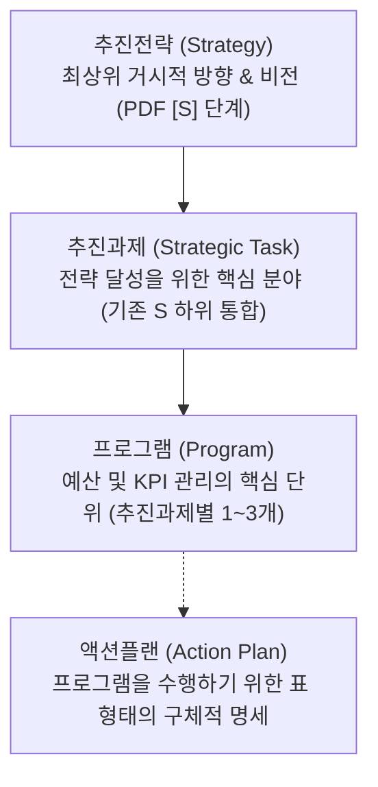

# ⚓ 울산과학대학교 라이즈(앵커) 사업단 기획 체계 가이드 (anchor-plan)

이 스킬은 울산과학대학교 라이즈(앵커) 사업단이 프로젝트 관리를 위해 **추진전략 - 추진과제 - 프로그램**의 3단계 핵심 기획 체계를 구축하고, 각 프로그램을 실제로 수행하기 위한 세부 실행 수단으로서 **표(Table) 형식의 액션플랜**을 구성하도록 돕는 가이드 및 에이전트 행동 지침입니다.

---

## 1. 배경 및 맥락 (Background & Context)
- **주관 기관**: 울산과학대학교 라이즈(앵커) 사업단
- **지원 규모**:
  - **1차년도 (2025년)**: 최종 **104.23억원** 수주 (12개 단위과제 모두 참여)
  - **2차년도 (2026년)**: 총 **91.83억원** (12개 단위과제 및 공통영역인 운영팀 공통운영경비 23.63억원 포함). 단, 신산업특화센터 이관 예산인 **A-1-나 (4억 원)**는 본사업비와 별도로 배정되어 총 운영 예산 규모는 **95.83억원**으로 통합 관리합니다.
 - **재원 구분 및 표기 가이드라인 (연차별 회계 규칙)**:
  - 1차년도 사업비는 본사업비로만 구성되며 이월예산이 아예 존재하지 않습니다.
  - 2차년도 이상의 N차년도 예산은 **"N차년도 본사업비"**와 **"N-1차년도 이월예산"**으로 구성되며, 이에 따라 화면상의 이월비 명칭도 항상 N-1차년도 기반으로 동적 라벨링하여 추적하고 기록 관리합니다. (예: 2차년도 화면에서 이월비는 `1차년도 이월예산`으로 통일)
  - 대시보드 화면상 모든 사업비(예산액, 집행실적, 잔액 등)의 표시 기본 단위는 **"백만원"**으로 통일하며, 금액 가독성을 위해 3자리마다 **백만원 단위 쉼표(,)**를 표시합니다. (예: 1,500,000,000원은 대시보드에 1,500백만원으로 표출)
- **조직 개편 반영 (6월 1일 자)**:
  - **신산업특화센터**가 신설되어 총 **4억 원의 사업 예산을 이관**받았으며, 이는 A-1-나(신산업특화 전문기술인재 양성)로 신규 과제화되어 전담 연구원에 의해 집행됩니다. (본사업비 91.83억 원과는 별도 예산으로 처리함)
  - 기존 UC-HYPER 사업은 **A-1-가 과제**로 분리되어 ECC센터에서 전담 집행합니다.
  
---

## 2. 조직 거버넌스 및 예산 매핑

사업단의 기획 및 집행 조직은 아래와 같이 전문 센터 및 실무진으로 매핑되며, 기획서 작성 시 담당 주체를 이 기준에 따라 배정합니다.

1.  **사업단장**: 송경영 교수 (최종 기획 및 예산 승인 주체)
2.  **총괄본부장**: 김현수 교수 (사업단 전체 총괄 및 AID-X지원센터장 겸임)
3.  **전문 센터장 및 팀장교수 매핑**:
    *   **ECC센터**: 센터장 이동은 교수
        *   HYPER교육팀: 팀장 장광일 교수
        *   로컬창업지원팀: 팀장 고형석 교수
        *   G-VET팀: 팀장 양승호 교수
    *   **ICC센터**: 센터장 김기범 교수
        *   R&BD지원팀: 팀장 김기범 교수 (겸임)
        *   지속가능실천팀: 팀장 김산 교수
        *   산업안전지원팀: 팀장 한미라 교수
    *   **RCC센터**: 센터장 현용환 교수
        *   LIFE교육팀: 팀장 김민경 교수
        *   LBA대응팀: 팀장 이한도 교수
        *   로컬브릿지팀: 팀장 이상현 교수
    *   **AID-X지원센터**: 센터장 김현수 교수 (총괄본부장 겸임)
        *   AI∙DX교육팀: 팀장 이정준 교수
    *   **울산늘봄누리센터**: 센터장 홍광표 교수
    *   **신산업특화센터**: A-1-나 신산업 이관 분 4억 원 총괄
    *   **사업운영팀**: 팀장 심현미 부장 (공통 영역 및 운영 행정비 총괄)
4.  **실무 연구진 직급(3구분) 및 부서 배정**:
    *   연구원 직급은 **책임연구원 / 선임연구원 / 연구원**의 3단계로 엄격히 구분하여 호칭 및 역할을 분담합니다.
    *   **ECC센터**: 이은주 선임연구원, 서란 연구원, 정자윤 연구원, 박기범 연구원, 김소연 연구원
    *   **ICC센터**: 이정은 선임연구원, 이혜성 연구원, 도지은 연구원 (기존 김예담 연구원 제외)
    *   **RCC센터**: 이현섭 책임연구원, 박인숙 선임연구원, 이연향 연구원, 김소정 연구원, 오영경 연구원, 최승혜 연구원
    *   **AID-X지원센터**: 임은애 선임연구원, 서은지 연구원, 채민지 연구원
    *   **신산업특화센터**: 김나희 연구원, 정호성 연구원 (이관 신규과제 전담)
    *   **울산늘봄누리센터**: 황수진 선임연구원, 최주명 연구원, 김예지 연구원 (센터장: 홍광표 교수)
    *   **사업운영팀**: 한유경 선임연구원, 김래림 연구원, 박언주 연구원, 이규상 연구원

---

## 3. 기획 체계 정의 (The Framework)

글로벌 프로젝트 관리론(OKR, WBS, LFA 등)을 울산과학대학교 라이즈 사업 특성에 맞게 결합하여 다음과 같이 구성합니다.



### 1) 추진전략 (Strategy)
* **정의**: 대학 및 울산광역시 혁신을 위한 최상위 거시적 목표이자 사업이 나아가야 할 대방향입니다.
* **성격**: 원래 PDF 파일에 있는 `[S1] ~ [S5]` 구조를 100% 그대로 유지합니다.

### 2) 추진과제 (Strategic Task)
* **정의**: 최상위 추진전략을 달성하기 위한 구체적인 중점 과제 및 추진 분야입니다.

### 3) 프로그램 (Program)
* **정의**: 추진과제를 실현하기 위한 구체적인 실무 사업 단위이자 **예산과 성과 지표(KPI)가 배분되는 핵심 기획 관리 단위**입니다.
* **재원 기재**: 본사업비와 이월사업비 분배 비율을 프로그램 명세에 함께 명시합니다.
* **Timeline (2차년도 사업 일정)**: 모든 프로그램은 2차년도 사업 기간인 **2026년 3월부터 2027년 2월**까지의 12개월 타임라인으로 일정을 관리 및 표시합니다. 일정 렌더링 시 연도 구분선(2026년/2027년)을 명시하며, 단일 전체일정 막대 대신 **P(Plan, 기획), D(Do, 실행), C(Check, 평가), A(Act, 환류) 단계를 4색(파란색, 초록색, 황색, 보라색)으로 분리 배정**하여 기획과 실행(P와 D)에 가장 긴 시간을 배분하는 구조적 타임라인을 구현해야 합니다. (예: 26.03 ~ 26.08, 26.04 ~ 26.12 등)

### 4) 액션플랜 (Action Plan - 표 형식 구성)
* **정의**: 프로그램 수행을 위한 구체적인 실행 수단과 방법입니다.
* **표(Table)의 열 구성 요건 (5W1H 매핑)**:
  1.  **Action Steps (세부 실행 과제)**: 구체적으로 무엇을 진행할 것인가 기술
  2.  **Assigned Person/Team (담당 주체)**: 주관 부서 및 참여 기관 (예: 신산업특화센터, RCC센터 등 - Who)
  3.  **Priority Level (우선순위)**: 과제 수행의 시급성 및 중요도 (High, Medium, Low)
  4.  **Status (추진 상태)**: 현재 진행 단계 (Not Started, In Progress, Complete)
  5.  **Resources (자원 및 예산)**: 투입되는 2026년 본사업비 및 2025년 이월비 배정액 (How Much)
  6.  **Due Date (마감 기한)**: 월별 또는 분기별 완료 마일스톤 (When)
  7.  **Notes (비고 및 상세 추진 방식)**: 실행 공간 및 구체적인 세부 추진 절차 (How / Where)

---

## 4. 기획 및 사업계획 설계 템플릿 (Template)

에이전트는 이 가이드에 따라 사업 계획을 설계할 때 아래 양식을 활용합니다.

### [템플릿 양식]
```markdown
# [단위과제명] (예: 단위과제 A-1-가. 지역과 미래를 만드는 UC-HYPER 전문기술인재 양성)
- **2026년 본사업비**: ○.○억원
- **2025년 이월사업비**: ○.○억원
- **총 예산**: 약 ○.○억원
- **담당 센터**: [예: ECC센터 / 신산업특화센터(이관)]

## 1. 추진전략 (Strategy)
> [PDF 원본 파일에 수록된 [S] 추진전략 내용을 100% 동일하게 유지]

## 2. 추진과제 (Strategic Task) 1: [과제명] (S의 하위 과제로 1~2개 수립)
> [과제 개요 서술]

---

## 3. 프로그램 (Program) 1-1: [프로그램명] (추진과제별 1~3개 프로그램으로 구체화)
- **프로그램 개요**: [추진 내용 및 주요 타겟층 요약]
- **성과 지표 (KPI)**: [상위 프로그램 지표 연계]
- **배정 예산**: 총 ○.○억원 (본사업비 ○.○억원 / 이월비 ○.○억원)
- **담당 실무자**: [예: 이은주 선임연구원]

### 💡 [액션플랜 (Action Plan): 프로그램 수행을 위한 구체적 실행 수단 및 방법]

| Action Steps | Assigned Person/Team | Priority Level | Status | Resources (본사업비 / 이월비) | Due Date | Notes |
| :--- | :--- | :---: | :---: | :--- | :---: | :--- |
| [실행 과제 1] | [담당 부서/기관] | High/Medium/Low | Not Started | [본사업비 ○원 / 이월비 ○원] | [추진 일정] | [세부 절차 및 장소] |
```

---

## 5. 5개년 전역 다년도 사업 및 성과관리 체계 (Multi-Year Budget & KPI System)

앵커사업은 총 5개년(1차년도 ~ 5차년도)에 걸친 장기 사업이며, 성과지표(KPI) 뿐만 아니라 **단위과제 예산, 세부 프로그램 예산, 비목별 일반예산**까지 모두 연도별 시계열 구조로 기획 및 관리되어야 합니다.

1.  **전역 연도별 예산 및 실적 매핑 구조**:
    *   단위과제, 프로그램, 비목 상세 내역 하위에 `years` 객체를 신설하여 연도별 본사업비 배정/집행 및 이월비 배정/집행 구조를 가집니다.
    *   **연도별 예산 필드**: `{ budget_main: 0, spent_main: 0, budget_carry: 0, spent_carry: 0 }`
    *   **1차년도**: 1차년도 기수행 실적은 추후 일괄 연동하기 위해 우선 배정 및 집행액을 0원으로 초기화하여 구조를 마련해 둡니다.
    *   **2차년도**: 현재 진행 중인 핵심 사업 연도로서, 실시간 엑셀 업로드 및 대시보드 렌더링 시 **기본 활성 연도**로 작동합니다.
    *   **3~5차년도**: 연차별 마일스톤에 따른 시계열 장기 예산 배정 계획을 수립하고 실적은 0원으로 초기화하여 관리합니다.
2.  **화면상 전역 연도 스위칭 가이드**:
    *   대시보드 상단 네비바에 공통 연도 선택 제어기를 배치하여, 선택 연도(`selectedYear`) 변경 시 요약 지표, 그래프, 단위과제 표, 비목 테이블, 프로그램 PDCA 등이 일시에 해당 연도 값으로 변경되도록 설계합니다.

---

## 6. 대시보드 서브탭 운영 가이드 (Sub-Tab Operation)

1.  **예산항목 관리 탭 서브탭**:
    *   **본사업비**: 본사업비 배정, 본사업비 집행, 본사업비 잔액을 중심으로 차트 및 테이블을 구성하여 예산 한도 내에서 조율합니다.
    *   **이월사업비**: 전년도 이월예산 배정, 이월비 집행, 이월비 잔액을 중심으로 차트 및 테이블을 구성하여 이월 예산 한도 내에서 조율합니다.
    *   **전체예산**: 본사업비와 이월사업비를 합산한 종합 조회 탭으로, 전체 비목의 배정액/집행액/잔액을 종합 차트 및 표 형식으로 한눈에 파악할 수 있는 조회 전용 모드입니다.
2.  **성과지표 관리 탭 서브탭**:
    *   **자율성과지표**: 지자체 자율성과지표(`type: "자율"`) 목록을 필터링하여 노출합니다.
    *   **중점관리지표**: 대학 중점관리지표(`type: "중점"`) 목록을 필터링하여 노출합니다.
    *   **자동 연계**: 성과지표 서브탭 전환 시, 사용자가 빈 화면을 보지 않도록 각 서브탭에 해당하는 첫 번째 지표가 자동으로 선택되는 UX 로직을 준수합니다.

---

## 7. 프로그램 실무 PDCA 및 재원 다변화 운영 규칙 (PDCA & Funding Source)

1.  **PDCA 단계별 표준 프로세스 및 검증**:
    *   **P (Plan) 단계**:
        *   *등록 필수 항목*: 추진 일정 (Timeline), 참여 대상 (Target), 연계 부서 (Coop Dept) 기획 정보 및 재원별 예산 배정액.
        *   *완료 조건*: 배정 예산이 0원을 초과해야 하고, 추진 일정, 참여 대상, 연계 부서 텍스트가 모두 기입되어야 완료 처리 가능.
    *   **D (Do) 단계**:
        *   *등록 필수 항목*: 세부 재원별 실제 집행 실적 입력 (국고 집행액, 시비 집행액, 외부사업비 집행액) 및 최종 이수인원 (명).
        *   *완료 조건*: 누적 총 집행액이 0원 초과이고, 이수인원이 0명 초과이어야 완료 처리 가능.
    *   **C (Check) 단계**:
        *   *등록 필수 항목*: 성과사항 (서술형) 및 수요자 만족도 (점 / 100점) 점수 기재.
        *   *완료 조건*: 성과사항이 빈칸 없이 서술되어야 하고, 만족도가 0점 초과이어야 완료 처리 가능.
    *   **A (Act) 단계**:
        *   *등록 필수 항목*: 프로그램 성과 성격에 따른 **2분할 환류 방안** 기재.
            1.  *우수 프로그램*일 때 -> `우수한 점` 및 `발전방안` 필수 기재 (화면에는 이 두 항목만 노출).
            2.  *미흡 프로그램*일 때 -> `미비점` 및 `개선사항` 필수 기재 (화면에는 이 두 항목만 노출).
        *   *완료 조건*: 평가 구분에 따른 2가지 세부 사항이 빈칸 없이 채워져야 완료 처리 가능.
2.  **다변화 재원 구분 및 한도 통제**:
    *   사업비는 **국고(National), 시비(지자체 매칭 City), 외부사업비(외부위탁 등 External)**의 3대 재원으로 구분하여 배정 및 집행을 별개 파이프라인으로 추적합니다.
    *   *예산 한도 준수*: D 단계에서 등록되는 재원별 집행액(국고/시비/외부)은 해당 연도에 배정된 개별 재원 예산의 한도액을 절대 초과할 수 없습니다.

---

## 8. 대시보드 탭 구성 표준 지침 (Tab Architecture)

대시보드는 울산과학대학교 라이즈(앵커) 사업의 성격에 따라 다음과 같은 고유 탭 구조로 설계 및 표출합니다.
1.  **IR 대시보드**: 전체 사업비의 연도별 요약, 본사업비/이월사업비 집행률, 재원 배분율 및 누적 집행 현황 그래프 등을 시각화하여 대외 보고를 지원합니다.
2.  **단위과제 관리**: 센터장 및 실무 연구진을 매핑하여 단위과제 목록을 표시하고, 하위 세부 프로그램의 PDCA 라이프사이클을 작성하고 정보를 등록하는 전담 업무 공간입니다.
3.  **프로그램 진행**: 본사업비와 이월사업비가 통합 배정된 세부 프로그램의 **2차년도 사업 일정(2026.03 ~ 2027.02)**을 12개월 타임라인 간트 차트(Gantt Chart)로 시각화하고, 각 프로그램의 담당연구원과 운영 예산을 종합 표출합니다.
4.  **예산항목 관리**: 각 단위과제별 세부 비목의 본사업비와 이월예산 배정액 한도를 통제하고 상세 실적을 확인하는 재정 관리 공간입니다. 좌측 단위과제 목록은 **공통경비를 최상단에 배치**하고, **담당부서별(사업운영팀 -> ECC -> 신산업 -> ICC -> AID-X -> 늘봄누리 -> RCC)로 그룹핑하여 시각적 정렬**을 보장합니다.
5.  **성과지표 관리**: 자율성과지표 및 중점관리지표의 연차별 목표 대비 현재 달성율과 산출 공식을 비교 분석합니다.
6.  **사업단 관리**: 사업단 인력의 소속/역할/인적사항을 관리하는 **'구성원 관리' 서브탭(추가/수정/삭제 CRUD 모달 팝업 탑재)**과 각 실무 프로그램의 담당자를 드롭다운으로 실시간 연계 배정하는 **'프로그램 배정' 서브탭**의 2분할 탭 아키텍처를 가집니다.

---

## 9. 에이전트 준수 사항 (Agent Instructions)
1. **재원 정합성 유지**: 모든 사업비 계획 및 예산 배분 시 본사업비와 이월비의 구분을 정확히 추적하며 합산 금액이 전체 규모(91.83억원)를 넘지 않도록 안전성을 검증합니다.
2. **울산과학대학교 조직 매핑 준수**: 실명으로 정의된 각 센터장 및 실무 연구원의 배정 매핑 정보를 준수하여 기획과 대시보드를 유지관리합니다.
3. **5개년 전역 시계열 구조 동기화**: 성과 데이터의 변경이나 예산 변경, 엑셀 다운로드 포맷 구성 시 반드시 선택 연차별 `years` 객체 내의 데이터와 연결하여 연쇄 크래시가 없도록 정합성을 사전에 자동 테스트합니다.
4. **한국어 사용 및 친절한 설명**: 모든 출력물과 제안서는 한국어로 명확하게 작성하며, 단장님께서 교원 및 연구원들에게 설명하기 쉽도록 기획 의도를 한글 주석이나 설명으로 상세히 첨부합니다.

---

## 10. UI 주요 개선 이력 (Changelog)

### [6월 28일자 개편 사항]
*   **모달 팝업 위치 고도화**: 화면 해상도가 낮더라도 모달이 하단으로 잘리거나 스크롤 불가한 문제를 차단하기 위해 `App.jsx` 최상위 fixed 렌더링으로 이동 및 `maxHeight: "85vh"`, `overflowY: "auto"` 를 부여했습니다.
*   **프로그램 배정 PDCA 2줄/4열 분할**: 테이블 헤더에 `rowSpan`/`colSpan`을 지정하고 본문 열을 4열로 분리하여 진행단계 모니터링 편의를 제공합니다.
*   **호실 열 표출 제거**: 구성원 테이블 뷰의 가로 폭 확보를 위해 '호실' 컬럼 출력을 제거했습니다.
*   **전체예산 규모 카드 추가**: 예산항목 관리 탭 좌측 목록 상단에 '2차년도 전체 예산 규모' 요약 영역을 신설했습니다.
*   **비목 차트 X축 2줄 틱 처리**: Recharts에 커스텀 틱 컴포넌트(`CustomizedAxisTick`)를 적용하여 원본 비목명이 잘림 없이 2줄 개행 렌더링되도록 수정했습니다.
*   **프로그램 기획(P) 예산 입력 단위 조정**: 입력 라벨에 `(천원)`을 표기하고 입력 예산값을 천원 단위 스케일로 바인딩하여 오기입을 최소화했습니다. (내부 모델은 원화 단위를 유지하도록 `*1000` / `/1000` 연산 보완)

### [6월 29일자 추가 고도화]
*   **전체예산 탭 지원 및 차트 표 통합**: 예산항목 관리에서 본사업비 및 이월비뿐만 아니라 전체 합산 현황을 조회 전용 모드로 확인할 수 있는 `전체예산` 서브탭을 도입했습니다.
*   **Recharts X축 라벨 가독성 보완**: 차트 X축 라벨의 위치(`dy={15}`) 및 2줄 사이의 줄간격(`dy={13}`)을 키우고 축 높이(`height={55}`)를 추가로 확보하여 글자가 겹치거나 잘리지 않도록 개선했습니다.
*   **단위과제 배지 제거**: 단위과제 관리 탭 우측의 불필요한 배지(`A-1-가/나 분리 및 공통영역`)를 제거했습니다.
*   **구성원 추가 모달 호실 필드 제거**: 구성원 CRUD 모달창 내부에서 '호실' 입력칸을 완전 제외하고 '입사일' 필드가 정돈되도록 정비했습니다.
*   **메인 대시보드 연도 선택 연동 복구**: `App.jsx`에서 `KPIOverview` 컴포넌트로 `selectedYear` 상태를 전달하지 않아 1차년도 등 연도를 변경해도 데이터가 2차년도로 고정되어 표출되던 버그를 패치했습니다.
*   **재원 배분율 차트 연산 오류 교정**: `KPIOverview.jsx` 내 도넛 차트 하단 범례에서 원화 단위인 분모(`totalBudget`)와 백만원 단위인 분자(`item.value`)의 스케일 차이로 인해 모든 프로젝트 비율이 `0.0%`로 잘못 표시되던 단위를 백만원 스케일로 정렬하여 연산 오류를 해결했습니다.
*   **예산항목 관리 모바일 반응형 개편 및 X축 라벨 여백 확대**: 768px 미만 모바일 해상도에서 상하 수직 1열 배치 흐름으로의 전환을 제공하고, 테이블 가로 스크롤을 장착했습니다. 또한, 차트의 X축 라벨 시작 간격(`dy`)을 `28`로 늘리고 모바일 접속 시 비목명을 가독성 높은 1줄 축약형으로 자동 치환되도록 고도화했습니다.


---

## 11. Git, Supabase, Vercel 배포 및 보안 표준 가이드

사업단 기획 및 대시보드 시스템을 외부 클라우드 환경에 안전하고 신뢰성 있게 배포하기 위해 다음 개발 표준 가이드라인을 반드시 준수해야 합니다.

### 1) GitHub 버전 관리 및 협업 규칙
- **저장소 범위**: 프로젝트 루트(`AnchorIR`)를 기준으로 단일 Git 저장소를 운영합니다.
- **환경 변수 노출 방지**: 민감한 환경 변수가 작성된 `.env`, `.env.local` 등 파일은 절대 Git 저장소에 커밋하지 않고, 반드시 `.gitignore`에 등록하여 관리합니다.
- **커밋 메시지 표준**: 작업 성격에 맞게 접두사를 기재하여 가독성을 높입니다.
  - `feat`: 새로운 기능 추가
  - `fix`: 버그 수정
  - `docs`: 문서 수정 (예: SKILL.md 업데이트)
  - `style`: 코드 포맷 변경, UI 스타일 수정
  - `refactor`: 코드 리팩토링

### 2) Supabase 배포 및 쿼리 작성 규칙 (중요)
데이터베이스 고도화 및 쿼리 작성을 수행할 때는 다음 두 규칙을 엄격히 준수합니다.
- **쿼리 순서 번호제 및 전용 폴더 보관**:
  - 모든 SQL 쿼리 파일은 생성 시 파일명 앞에 `000_` 형태의 순서 번호를 반드시 붙여야 합니다. (예: `001_create_users_table.sql`, `002_add_kpi_constraints.sql`)
  - 생성된 모든 쿼리 파일은 프로젝트 내에 분산되지 않도록 반드시 쿼리 전용 폴더인 **`supabase/migrations/`** 안에 모아서 관리합니다.
- **강력한 보안 및 암호화 적용**:
  - 사용자의 개인정보나 민감한 데이터(학생 정보, 비밀번호, 교직원 인적사항 등)를 다룰 때는 데이터베이스로 전달 및 저장하기 전에 **클라이언트 측 혹은 미들웨어 단에서 반드시 암호화 로직을 적용**해야 합니다.
  - 평문 상태의 민감 데이터가 DB에 직접 노출되지 않도록 암호 알고리즘(예: bcrypt, AES-256 등)을 활용해 안전하게 가공한 후 적재합니다.

### 3) Vercel 프론트엔드 배포 가이드
- **배포 방식**: GitHub 저장소와 Vercel을 연동하여 `main` 브랜치에 푸시가 발생할 때마다 자동 배포(CI/CD)가 이루어지도록 설정합니다.
- **Root Directory 지정**:
  - 현재 React SPA 대시보드가 하위 디렉터리(`rise-dashboard`)에 위치하고 있으므로, Vercel 프로젝트 생성 단계에서 **Root Directory** 설정을 **`rise-dashboard`**로 반드시 변경해 주어야 빌드가 정상적으로 완료됩니다.
- **빌드 및 개발 설정**:
  - Framework Preset: `Vite`
  - Build Command: `npm run build`
  - Output Directory: `dist`
- **환경 변수(Environment Variables) 등록**:
  - Supabase 연동에 사용되는 API Keys(`VITE_SUPABASE_URL`, `VITE_SUPABASE_ANON_KEY` 등)는 Vercel Project Settings -> Environment Variables 메뉴에서 수동으로 동일하게 등록해 주어야 정상 구동됩니다.

## 12. 2차년도 단위과제별 프로그램 예산 및 담당자 요약

## 📌 단위과제: A1-가

| 프로그램 상세 | 사업비 예산 (백만원) | 담당자 |
| :--- | :---: | :--- |
| UC-HYPER 교수학습 모델 개발 | 12.0 | 미지정 |
| 지역산업 맞춤형 정규/비정규 교육과정 운영 | 202.0 | 정자윤 |
| 강소기업 현장견학 프로그램 | 20.0 | 정자윤 |
| ('26) 지역 맞춤형 주문식 교육과정 개편 및 확대 운영 ('25) 채용연계(우대) 맞춤형 주문식 교육과정 개발/운영 ('25) 캡스톤 디자인 운영 ('25) 현장기반 학습공간 연계 정규교과목 운영 ('25) UC-HYPER 융복합 트랙 교육과정 개발/운영 | 20.0 | 정자윤 |
| 개방형설계센터 운영 | 12.0 | 정자윤, 이은주, 서란 |
| 주문식 교육과정 운영 | 20.0 | 정자윤 |
| 이은주 | 100.0 | 정자윤, 이은주 |
| 학과별 실험실습재료비 지원 | 45.0 | 미지정 |
| 고등직업교육모델 공유 및 확산 | 10.0 | 미지정 |
| 지역정주 지산학 인재양성 체계 구축 | 60.0 | 미지정 |
| ('26) 개방형설계센터 전문가 활용 교육 지원 ('25) UC-HYPER 교직원 역량 강화 프로그램 운영 | 40.0 | 미지정 |
| 교직원 역량강화 프로그램 운영 | 15.0 | 미지정 |
| ('26) 울산형 데이터 기술인재 양성 교육 지원 ('25) UC-HYPER 운영 규정 제·개정 | 4.0 | 미지정 |
| 고급 기술인재양성 프로그램 운영 | 50.0 | 서란 |
| 표준형 현장실습 교과목 운영 | 90.0 | 미지정 |
| ('26) 기업 PBL 문제해결지원과제 운영 ('25) 전문기술석사 교육과정 운영 ('25) 글로벌 교육 프로그램 개발/운영 | 4.0 | 미지정 |
| 하이퍼 캠퍼스 구축 | 300.0 | 미지정 |
| UC-HYPER 교육환경 구축(Udx-Lab 포함) | 50.0 | 미지정 |
| 교육환경개선 | 20.0 | 미지정 |
| UDx Lab 환경구축 | 546.0 | 미지정 |
| 지역정주 경력개발 통합지원 체계 구축 | 15.0 | 미지정 |
| 디지털 전환 학습 인프라 강화 | 60.0 | 미지정 |
| ('26) Udx 기반 AI 리터러시 정규/비정규 교육과정 개발/운영 | 50.0 | 미지정 |
| 울산 맞춤형 인재양성 거버넌스 강화 | 6.0 | 미지정 |
| 정책연구 | 10.0 | 미지정 |
| 창업 역량강화 프로그램 운영(로컬 국토 대장정·메가시티 리그전) 16.2백만원 서머창업스쿨(SES)운영 15.3백만원 | 10.0 | 미지정 |
| 외국인 유학생 요양 보호사 과정 장학금 지급 | 24.0 | 미지정 |
| 유학생 유치 협력 체계 구축 및 대학 홍보 | 40.0 | 미지정 |
| 벤치마킹 | 14.0 | 미지정 |
| UDx 거버넌스 운영 | 240.0 | 미지정 |
| 글로벌 지산학 혁신 거버넌스 구축 및 확산 | 2,100.0 | 미지정 |


## 📌 단위과제: A1-나

| 프로그램 상세 | 사업비 예산 (백만원) | 담당자 |
| :--- | :---: | :--- |
| 김소정 | 2,000.0 | 김소정 |
| (미확정)도시재생 인재 양성 벤치마킹 | 8,000.0 | 미지정 |
| K-컬처 글로벌 교류 프로젝트: 대만 충유대 교류 프로그램 | 5,000.0 | 이은주, 서란 |
| (진행중) 6월25일 사전 워크숍 시작 | 2,400.0 | 미지정 |
| 울산 브랜드 디자인 프로그램 운영 | 3,000.0 | 미지정 |
| 로컬 크리에이터 양성을 위한 브랜드 디자인 전문 교육 | 7,000.0 | 미지정 |
| 에코컬처 인재양성을 위한 다양한 프로그램 운영 | 7,500.0 | 미지정 |
| 대학 내 문화커뮤니티 공간 구축 | 20,000.0 | 미지정 |
| 1대학관 커뮤니티 공간 환경개선/대강당 LED전광판 및 음향시설 구축 | 8,000.0 | 미지정 |
| 장생포 웰리키즈랜드 프로젝트 | 5,000.0 | 미지정 |
| 지역사회 에코 | 14,000.0 | 미지정 |
| 박인숙 | 15,000.0 | 박인숙 |
| 학생들을 활용한 지역의 브랜드 디자인 활동 | 15,000.0 | 미지정 |
| 힙합라운지-청년문화체험 | 21,000.0 | 미지정 |
| 3개대학 연합 문화관광 서포터즈 발대식 | 2,600.0 | 미지정 |


## 📌 단위과제: A2

| 프로그램 상세 | 사업비 예산 (백만원) | 담당자 |
| :--- | :---: | :--- |
| A1 총예산 | 15.0 | 이은주, 서란 |
| 대학 구성원 창업 역량 강화 및 창업 인프라 구축 | 20.0 | 이은주, 서란 |
| 창업 정규 교육과정 개발·운영 | 28.0 | 미지정 |
| 창업문화 확산을 위한 규정·제도 개선 | 150.0 | 미지정 |
| ('26) 삭제 ('25) 교직원 창업역량 강화 | 60.0 | 미지정 |
| 창업 동아리 기자재 구축 | 25.0 | 미지정 |
| 예비창업자 지원 프로그램 운영 | 20.0 | 미지정 |
| 글로벌 역량강화 프로그램 운영 | 10.0 | 미지정 |
| 청년 창업 캠프 운영 | 40.0 | 미지정 |
| 교직원 역량강화 프로그램 운영 | 5.0 | 미지정 |
| 유학생 문화교류 프로그램 운영 | 15.0 | 미지정 |
| 창업 성공 도약 지원 프로그램 운영 | 10.0 | 미지정 |
| 주문식(지역맞춤형) 교육과정 개발 및 개편 보고서 | 3.0 | 미지정 |
| 과정평가형 교육과정개발(3개 학과) | 25.0 | 미지정 |
| 강소기업 현장견학 프로그램 운영 | 3.0 | 미지정 |
| 학과 전공 맟춤형 모듈식 취업캠프 | 30.0 | 미지정 |
| ('25) 초·중·고 창업 교육 통합 지원 프로그램 | 470.0 | 미지정 |


## 📌 단위과제: A3

| 프로그램 상세 | 사업비 예산 (백만원) | 담당자 |
| :--- | :---: | :--- |
| 초중고 및 지역 예비창업자 지원 프로그램 운영 | 50.0 | 미지정 |
| ('26) 초광역 온라인 창업 아이디어 경진대회 운영 ('25) 해외 창업 인큐베이터 연계 프로그램 기획 | 30.0 | 미지정 |
| A2 총예산 | 30.0 | 미지정 |
| 유학생 유치 협력 체계 구축 및 대학 홍보 | 12.0 | 미지정 |
| 지역과 함께하는 축제 프로그램 연계 운영 | 12.0 | 미지정 |
| 해외 대학 국제공동 연구를 위한 네트워크 조성 | 16.0 | 미지정 |
| 국제 공동 연구 | 4.0 | 미지정 |
| 동시통역 소프트웨어 이용 | 10.0 | 미지정 |
| 지역 산업 연계 실무교육 및 취업·정주 연계 강화 | 4.0 | 미지정 |
| 시그니처 클래스 운영 | 6.0 | 미지정 |
| 지역사회 연계 및 교류 홍보 | 5.0 | 미지정 |
| (A1 연계) 유학생 대상 주문식 교육과정 운영 | 240.0 | 미지정 |


## 📌 단위과제: B1

| 프로그램 상세 | 사업비 예산 (백만원) | 담당자 |
| :--- | :---: | :--- |
| 특허출원 | 30.0 | 이혜성 |
| 논문게재료 | 27.5 | 이혜성 |
| 기술 사업화 지원(시제품 제작, 마케팅 지원 등) | 5.0 | 이혜성 |
| AI활용 연구논문 작성법 관련 교직원 역량 강화 교육 | 10.0 | 이혜성 |
| 가족협력회사 지원(현판, 인증서 제작 등) | 5.0 | 이혜성 |
| 성과공유 | 4.0 | 이혜성 |
| 소담스퀘어(로컬창업타운) 활성화 프로젝트 | 100.0 | 이혜성 |
| 청년 예비창업자 창업 교실 운영 | 75.0 | 이혜성 |
| (초광역) 주력신사업 공동연구 과제 개발 1건 | 20.0 | 이혜성 |
| 초광역 온라인 창업 아이디어 경진대회 운영 | 15.0 | 이혜성 |
| (인재양성형) 공동연구 과제 개발(전문기술석사 참여) 3건 | 30.0 | 이혜성 |
| 창업 경진대회 참가 | 1.5 | 이혜성 |
| 대학연계 사회통합프로그램 운영 | 11.0 | 이혜성 |
| 공학계열 취업지원 플랫폼 이용료(indeed) | 10.0 | 미지정 |
| (신산업 분야) 공동연구 과제 개발(에너지, AX 등 1개 과제) 5건 | 2.3 | 미지정 |
| 기업애로 해결 컨설팅 지원 3건 | 191.5 | 미지정 |
| 기업애로 해결 기술 지원 22건 | 266.5 | 미지정 |


## 📌 단위과제: B2

| 프로그램 상세 | 사업비 예산 (백만원) | 담당자 |
| :--- | :---: | :--- |
| DX 확산 | 208.0 | 미지정 |
| 울산과학대학교 RISE Action Plan | 152.0 | 미지정 |
| 동구 문화 | 38.4 | 미지정 |
| e나라 국고시스템 연동 프로그램 구축 진행중 | 12.0 | 미지정 |
| 사업전담직원 전산기기 및 사무실 구축 AI 워크스테이션 [인센티브] 사업전담직원 전산기기 및 사무실 구축 | 20.0 | 채민지 |
| AI·DX 실습재료비 | 10.0 | 미지정 |
| AI·DX 특화교육과정 운영 | 15.0 | 도지은 |
| SLM 챗봇 기반 교과운영 [인센티브] 기술교육용 LLM 챗봇 개발 정책과제 운영 | 60.0 | 채민지 |
| 0/1건 | 370.0 | 미지정 |
| 도지은 | 368.4 | 도지은 |
| AIDX분야 정책연구 | 46.0 | 미지정 |
| AIDX분야 산학협력 간담회 | 30.0 | 미지정 |
| DX 산학공동연구개발과제 | 26.6 | 미지정 |
| 초광역 제조·보건AI 융합을 위한 MANI 공동 인프라 거점 조성 | 15.0 | 미지정 |
| [인센티브] 부울경제(1극1특) 초광역 거버넌스 운영 성과공유회 AIDX 우수사례 국내외 벤치마킹 AIDX분야 세미나/포럼 개최 | 1,558.4 | 도지은, 채민지 |
| AWS C3 기반 초광역 공동 클라우드 실습 거점 운영 | 1.0 | 미지정 |
| AI Worker(휴머노이드 로봇) 20DoF 로봇 핸드 데이터시각화 SW [인센티브] AI매니퓰레이터 고급형(교육용) | 50.0 | 미지정 |


## 📌 단위과제: B3

| 프로그램 상세 | 사업비 예산 (백만원) | 담당자 |
| :--- | :---: | :--- |
| 탄소중립/ESG 정규 교육과정 운영(교양) | 10.0 | 미지정 |
| 탄소중립/ESG 재직자 교육 | 9.0 | 이혜성 |
| 탄소중립/ESG 교직원 역량강화 | 6.0 | 미지정 |
| 온실가스 전문가 양성 비정규 교육과정 | 12.0 | 이정은 |
| ESG경영 전문가 양성 비정규 교육과정 운영 | 12.0 | 미지정 |
| 탄소중립/ESG 중소기업 지원 솔루션 개발 | 70.0 | 이정은 |
| 탄소중립/ESG 산학공동기술개발 2건 | 40.0 | 이혜성 |
| 탄소배출 경영개선 가족회사 기술지원 5건 | 5.0 | 이혜성 |
| ESG 경영개선 가족회사 기술지원 5건 | 5.0 | 이혜성 |
| 탄소중립/ESG 박람회 벤치마킹 | 12.0 | 이혜성 |
| 탄소중립/ESG 우수기업 벤치마킹 | 12.0 | 미지정 |
| DX 초광역 거버넌스 운영 AI | 30.0 | 미지정 |
| 탄소중립/ESG 체험 및 봉사프로그램 | 8.0 | 미지정 |
| 탄소중립/ESG 학생 서포터즈 활동비 | 4.0 | 미지정 |
| DX 세미나 AX 프론티어동아리 [인센티브] 부울경제(1극1특) 초광역 거버넌스 운영 | 10.0 | 이혜성 |
| 탄소중립/ESG 아이디어 경진대회(지속가능캠퍼스 경진대회-B4연계) | 6.0 | 미지정 |
| 성과공유회 | 3.0 | 미지정 |
| [인센티브] 울산MANI 프로그램 개발 [인센티브] 울산 MANI 프로그램 운영 | 2.6 | 미지정 |
| 0/4 | 0.9 | 미지정 |


## 📌 단위과제: B4

| 프로그램 상세 | 사업비 예산 (백만원) | 담당자 |
| :--- | :---: | :--- |
| 복합재난분야 정규 교육과정 운영 | 16.0 | 미지정 |
| 복합재난분야 비정규 교육과정 운영 | 57.0 | 미지정 |
| 복합재난분야 교직원 역량강화 | 14.0 | 이정은 |
| AI·DX 인재 성과 연계 취업·창업 지원 체계 구축 | 5.0 | 이정은 |
| 복합재난 대응 선진기술 벤치마킹 | 20.0 | 이혜성 |
| 복합재난분야 온라인 교육컨텐츠(K-MOOC) 개발 | 30.0 | 도지은 |
| AI 추론용 데스크탑 AI 교육용 4K 모니터 [인센티브] AI 추론용 데스크탑 [인센티브] AI 교육용 4K 모니터 | 10.0 | 이혜성, 도지은, 채민지 |
| 복합재난분야 가족회사 기술지원 | 9.0 | 이혜성 |
| 복합재난분야 정책연구 | 10.0 | 이혜성 |
| ISO45001인증 교육과정 | 10.0 | 이혜성 |
| 복합재난 대응 체험형 교육실습 장비 | 55.0 | 이정은 |
| 복합재난 대응 실감형 컨텐츠 운영장비 | 40.0 | 이정은 |
| 복합재난대응 지자체 협력프로그램 | 4.0 | 이정은 |
| 재난 대응 산학 협의체 운영 | 5.0 | 미지정 |
| 구매완료 | 12.0 | 이정은 |
| 성과공유회 | 3.0 | 이정은 |


## 📌 단위과제: C1

| 프로그램 상세 | 사업비 예산 (백만원) | 담당자 |
| :--- | :---: | :--- |
| 탄소중립지원센터 실증 장비구축(탄소중립지원센터)-장비 | 5.0 | 미지정 |
| 탄소중립/ESG 교육과정 운영 2.6백만원/1건 = 2.6백만원 | 30.0 | 미지정 |
| 백만원 | 95.0 | 미지정 |
| 백만원 | 10.0 | 미지정 |
| 백만원 | 2.0 | 미지정 |
| 연계) | 25.0 | 미지정 |
| 복합재난 대응 콘텐츠 제작 협업 49.0백만원/건 * 1건 = 49.0백만원 1단계 | 10.0 | 미지정 |


## 📌 단위과제: D1

| 프로그램 상세 | 사업비 예산 (백만원) | 담당자 |
| :--- | :---: | :--- |
| 연간 운영할 수 있는 방과후 형태의 늘봄 프로그램 개발 | 2.0 | 미지정 |
| 연간늘봄 800*9건 | 5.0 | 최주명 |
| 김예지 | 24.0 | 최주명, 김예지 |
| 온동네돌봄 (지역아동센터) | 5.0 | 미지정 |
| 황수진 | 5.0 | 황수진 |
| 대학 중심 협력체계 구축 및 네트워크 형성 | 5.0 | 미지정 |
| 정책연구 400*3건 | 40.0 | 김예지 |
| 양성된 강사의 현장 매칭 및 보급 | 12.0 | 미지정 |
| 맞춤형돌봄 수업준비물2 | 50.0 | 미지정 |
| 데이터 기반 품질관리 | 5.0 | 미지정 |
| 늘봄愛 플랫폼을 통한 성과관리 | 5.0 | 미지정 |
| 성과확산 패키지 발행(SNS, 유튜브, 홍보영상 등) | 200.0 | 미지정 |


## 📌 단위과제: D2

| 프로그램 상세 | 사업비 예산 (백만원) | 담당자 |
| :--- | :---: | :--- |
| 울산과학대학교 | 50.0 | 미지정 |
| 추진전략 | 100.0 | 미지정 |
| 지역사회문제해결교육과정 Re;Think 울산 운영 | 5.0 | 김소정 |
| 지역사회문제해결 프로젝트 | 25.0 | 미지정 |
| 분야별 지역전문가 풀(Pool) 구축 및 매칭 운영 | 10.0 | 미지정 |
| 지역기관과의 거버넌스 구축 | 136.0 | 미지정 |
| 지역문제해결 플랫폼 구축 | 400.0 | 미지정 |


## 📌 단위과제: D3

| 프로그램 상세 | 사업비 예산 (백만원) | 담당자 |
| :--- | :---: | :--- |
| 울산형 2주기 RISE모델 개발 정책연구 | 5.0 | 미지정 |
| D-2. U-MedTown 지역 완결형 의료체계 구축 | 11.0 | 미지정 |
| 최승혜 | 40.0 | 최승혜 |
| 산업체·의료기관 연계 맞춤형 보건복지 서비스 교육 프로그램 개발 및 운영 | 1.0 | 미지정 |
| 사회적 약자 대상 보건복지케어 수요조사 및 모니터링 기반 보건서비스 기획·운영 | 4.0 | 미지정 |
| 『울산 지역 건강 함께 잇다, AI 활용 지역사회 건강 공익 프로젝트』 운영 | 10.0 | 미지정 |
| 보건복지 특성화 인력 지원 프로그램 | 10.0 | 미지정 |
| D-3. 지역과 문화가 함께하는 매력있는 꿀잼도시 조성 | 390.0 | 미지정 |
