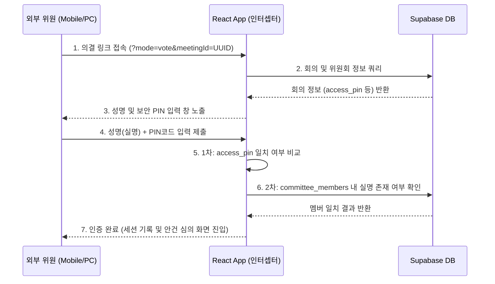

# 📋 앵커사업단 위원회 심의 의결 서브시스템 연동 명세서 (SKILL_COMMITTEE.md)

본 문서는 **앵커사업단 종이 없는(Paper-less) 위원회 의결 서브시스템**의 외부 위원 참여 기술 규격, 보안 로그인 프로세스 및 데이터 암호화 구현 명세를 수록합니다.

---

## 1. 외부 위원 전용 의결 접속 링크 규격
위원회 관리 화면에서 회의 일정을 등록하면 해당 회의 정보와 위원회 식별값, 그리고 보안 PIN코드를 활용하여 아래 규격의 전용 암호화 접속 채널 주소가 자동 생성됩니다.

*   **URL 형식**: `http://[도메인]/?mode=vote&meetingId=[MeetingUUID]`
    *   `mode=vote`: 일반 대시보드 뼈대(헤더, 사이드바 등)를 스킵하고 독립 뷰어로 인터셉트하는 라우팅 키
    *   `meetingId`: Supabase `committee_meetings` 테이블의 기본키(UUID)

---

## 2. 위원 간이 로그인 및 보안 검증 프로세스
회원가입 절차 없이 모바일 및 외부 PC에서 안전하고 간편하게 의결에 참여하기 위해 2단계 검증(이중 가드) 메커니즘을 구현했습니다.

1.  **1차 보안 PIN코드 비교**: 회의 생성 시 난수로 자동 배정되거나 수동 지정된 6자리 PIN코드와 입력값이 일치하는지 비교합니다.
2.  **2차 실명 멤버 대조**: 해당 위원회(`committee_id` 매핑)의 정식 위원 명단(`committee_members` 테이블)에 입력한 성명(실명)이 등록되어 있는지 확인합니다.

---

## 3. 전자서명 및 의결 정보 보안 암호화 명세 (Rule 8 준수)
개인정보 및 서명 도용 방지를 위해 수집된 전자서명은 양방향 AES 256bit 암호화를 적용하여 DB에 암호문으로 영구 적재됩니다.

### 3.1 서명 드로잉 수집 (HTML5 Canvas)
*   웹 및 모바일 반응형 화면에서 터치/마우스 드래그 이벤트를 실시간으로 추적하여 PNG Data URL(Base64) 포맷으로 수집합니다.

### 3.2 AES 256bit 암호화 저장
*   **암호화 대상**: `canvas.toDataURL("image/png")` 문자열
*   **보안 알고리즘**: AES-256-CBC (CryptoJS 라이브러리 사용)
*   **저장 컬럼**: `meeting_responses` 테이블 내 `encrypted_signature` 컬럼
*   **안전성**: 원본 서명 이미지는 데이터베이스 탈취 시에도 절대 평문으로 노출되지 않으며, 암호화 키를 보유한 정식 인가 모듈(대시보드 관리자 화면 등)에서 복호화 과정을 거쳐서만 시각화됩니다.

---

## 4. 첨부 심의 자료 확장자별 렌더링 명세
위원들이 안건 검토 시 다운로드 없이 즉각적으로 심의를 진행할 수 있도록 확장자별 인라인 뷰어를 제공합니다.

| 파일 유형 (확장자) | 렌더링 방식 및 뷰어 기술 |
| :--- | :--- |
| **이미지 파일 (`.png`, `.jpg`, `.jpeg`)** | Base64 소스 바인딩을 통해 화면 하단 이미지 전용 뷰어 프레임에 100% 비율로 즉시 시각화 노출 |
| **마크다운 문서 (`.md`)** | Base64 UTF-8 디코딩 엔진을 통해 안건 문서 구조를 텍스트 영역에 monospace 서체로 인라인 노출 |
| **PDF 문서 (`.pdf`)** | 브라우저 모바일 환경의 메모리 과부하 방지를 위해 원클릭 다운로드 및 외부 뷰어 즉시 연동 지원 |

---

## 5. 데이터베이스 스키마 관계도
기존 위원회 테이블 타입과의 정합성을 위해 튜닝된 릴레이션 관계는 다음과 같습니다.

*   `committees.id` (TEXT) ➡️ `committee_meetings.committee_id` (TEXT)
*   `committee_members.id` (BIGINT) ➡️ `meeting_responses.member_id` (BIGINT)
*   `committee_meetings.id` (UUID) ➡️ `meeting_responses.meeting_id` (UUID)
