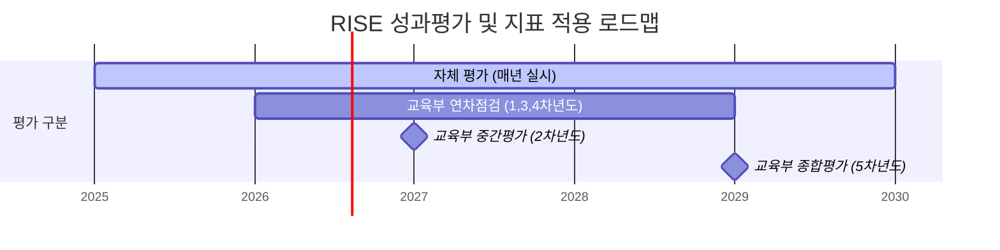

# 교육부 지역혁신중심 대학지원체계(RISE) 공통성과지표 정의서

본 정의서는 교육부의 **「지역혁신중심 대학지원체계(RISE) 지원전략」**을 바탕으로 지자체와 대학이 공통으로 RISE 취지 달성을 위해 필수적으로 관리해야 하는 핵심성과지표 및 성과관리 체계를 규정합니다.

---

## 1. 성과평가 체계 및 지표 활용시기

교육부는 지자체의 자체평가를 기본으로 하되, 사업 연차별로 **연차점검, 중간평가, 종합평가**를 실시하여 예산 배분 및 차기 계획에 환류합니다.

### 1) 평가 구분별 적용 지표
*   **자체 평가 (지자체 ➔ 대학)**: 매년 3~5월 실시하며, 대학별 단위과제 성과 측정을 위해 **자율성과지표**를 활용합니다.
*   **연차점검 (교육부 ➔ 지자체)**: 1, 3, 4차년도 종료 후(6~8월) 실시하며, RISE 진행상황 및 자체평가의 적절성을 점검합니다. (**자율성과지표 달성도** 위주 평가)
*   **중간평가 (2차년도)**: 2차년도 종료 후('27.6~8월) 실시하며, 공통성과지표 중 **결과지표 일부(① ~ ③)** 및 거버넌스 추진과정 정성평가를 결합합니다.
*   **종합평가 (5차년도)**: 5차년도 종료 후('29.12월) 실시하며, **공통성과지표 전체(① ~ ⑥)** 달성도와 5년간의 종합 추진과정을 평가하여 2주기 RISE 사업에 반영합니다.

### 2) 핵심성과지표의 서브탭별 활용 시기 요약

| 지표 번호 | 지표명 | 중간평가 (2차년도) | 종합평가 (5차년도) | 평가 데이터 출처 |
| :--- | :--- | :---: | :---: | :--- |
| **KPI 1** | 지역별 대표 과제의 성과목표 달성률 | **적용 (달성률)** | **적용 (달성률)** | 지자체 대표과제 실적 |
| **KPI 2** | 지산학연 협업 실적 증가율 | **적용 (증가율)** | **적용 (증가율)** | 대학정보공시 및 사업 실적 |
| **KPI 3** | 성인학습자 고등교육 실적 증가율 | **적용 (증가율)** | **적용 (증가율)** | 대학정보공시 |
| **KPI 4** | 지역정주 취업 증가율 | 미적용 | **적용 (증가율)** | 대학정보공시 및 건보 DB |
| **KPI 5** | 지역혁신체제 만족도 증가율 | 미적용 | **적용 (증가율)** | 지자체 만족도 설문조사 |
| **KPI 6** | 대학의 지역경제 영향력 증가율 (IMPACT) | 미적용 | **적용 (증가율)** | IMPACT 평가 모형 |

---

## 2. 평가 방법 및 공통 산식 구조

각 지역별 교육·경제적 여건의 상이함을 감안하여 교육부는 지표 성격에 따라 평가 방식을 이원화합니다.

### 1) 대표과제지표 (KPI 1) ➔ 달성률 평가
지자체가 지정한 대표과제의 연도별 설정 목표치 대비 최종 달성 실적을 측정합니다.
$$\text{대표과제 달성률 (\%)} = \frac{\text{당해연도 대표과제 성과 달성치}}{\text{당해연도 대표과제 목표 설정치}} \times 100$$

### 2) 결과지표 (KPI 2 ~ KPI 6) ➔ 기준연도 대비 증가율 평가
지역 간 단순 양적 비교를 지양하기 위해, **기준연도(2024년, RISE 도입 전년도)** 실적 대비 당해 평가연도의 실적 성장 비율을 평가합니다.
$$\text{지표 증가율 (\%)} = \frac{\text{평가연도 실적치} - \text{기준연도(2024년) 실적치}}{\text{기준연도(2024년) 실적치}} \times 100$$
*(단, 기준연도 실적이 0이거나 정의하기 어려운 특수 항목은 별도 안내된 표준 기준값을 모수로 활용합니다.)*

---

## 3. 세부 지표별 정의 및 구성내용 (세부산식)

### KPI 1: 지역별 대표 과제 성과목표 달성률
*   **정의**: 시·도별 특수성을 고려하여 선정한 대표 프로젝트 및 단위과제의 성과지표 목표 대비 실제 달성 실적률
*   **세부산식**: 
    $$\text{달성률 (\%)} = \left( \sum_{i=1}^{N} \frac{\text{대표과제 } i \text{의 당해연도 실적치}}{\text{대표과제 } i \text{의 당해연도 목표치}} \right) / N \times 100$$
*   **대상 범위**: 울산 앵커 사업 프로젝트 중 시도 지정 대표 단위과제 (예: U-LEAD 인재양성 등)

### KPI 2: 지산학연 협업 실적 증가율
*   **정의**: 대학과 지역 산업체, 유관 연구기관 및 지자체 간에 체결된 공동 R&BD 과제 수행 건수, 기술이전 계약액, 지산학 연계 협약 수 등의 성장률
*   **세부산식**:
    $$\text{협업 증가율 (\%)} = \frac{(\text{당해연도 공동 R&BD 건수} + \text{기술이전 건수}) - (24\text{년 공동 R&BD 건수} + \text{기술이전 건수})}{24\text{년 공동 R&BD 건수} + \text{기술이전 건수} } \times 100$$

### KPI 3: 성인학습자 고등교육 실적 증가율
*   **정의**: 지역 내 재직자 및 평생학습자의 직업 전환 및 역량 제고를 위하여 개설된 비학위 평생직업교육과정 수료생 수 및 평생학습자 전형 입학생 수의 증가율
*   **세부산식**:
    $$\text{성인학습자 증가율 (\%)} = \frac{(\text{평가연도 비학위 수료생} + \text{평생학습 전입생}) - (24\text{년 수료생} + \text{전입생})}{24\text{년 수료생} + \text{전입생}} \times 100$$

### KPI 4: 지역정주 취업 증가율
*   **정의**: 대학 졸업자 중 관내(울산광역시 및 인접 생활권)에 소재한 기업 및 공공기관에 취업하여 정주하게 된 졸업생 인원의 증가율
*   **세부산식**:
    $$\text{정주 취업 증가율 (\%)} = \frac{\text{평가연도 졸업자 중 관내 취업자 수} - 24\text{년 관내 취업자 수}}{24\text{년 관내 취업자 수}} \times 100$$
*   **검증 원천**: 건강보험 직장가입 DB 및 대학정보공시 졸업생 취업 현황 연계

### KPI 5: 지역혁신체제 만족도 증가율
*   **정의**: 지자체-대학-산업체 간 거버넌스(RISE 체제) 운영 및 공동 대응 체계 구축에 대한 이해관계자 체감도 설문지 지표 향상도
*   **세부산식**:
    $$\text{만족도 증가율 (\%)} = \frac{\text{평가연도 거버넌스 만족도 평점(5점 만점)} - 24\text{년 만족도 평점}}{24\text{년 만족도 평점}} \times 100$$

### KPI 6: 대학의 지역경제 영향력 증가율 (IMPACT 평가)
*   **정의**: 대학이 지역사회에 투입하는 예산, 고용 효과, 재정 규모 등으로 인해 발생하는 생산유발액 및 부가가치유발액 등 경제적 파급효과의 성장 비율
*   **세부산식**:
    $$\text{경제영향력 증가율 (\%)} = \frac{\text{평가연도 생산/부가가치 유발액(억원)} - 24\text{년 유발액}}{24\text{년 유발액}} \times 100$$
