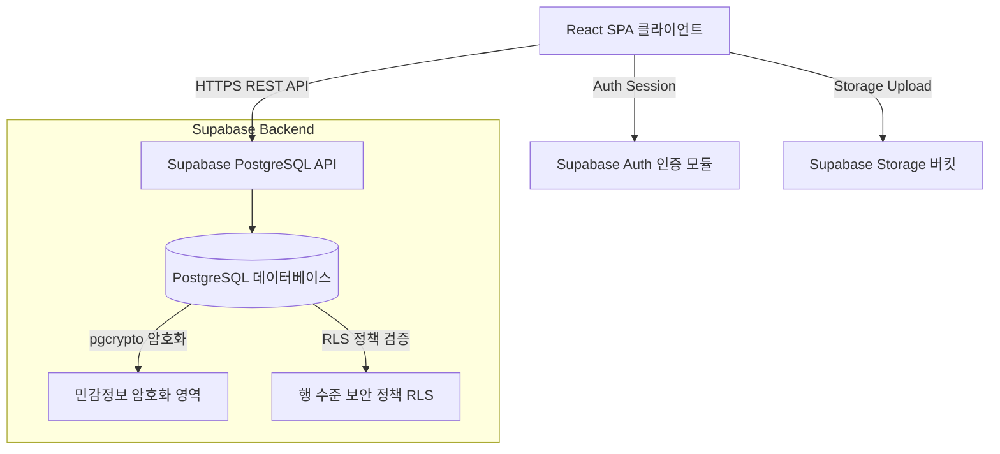
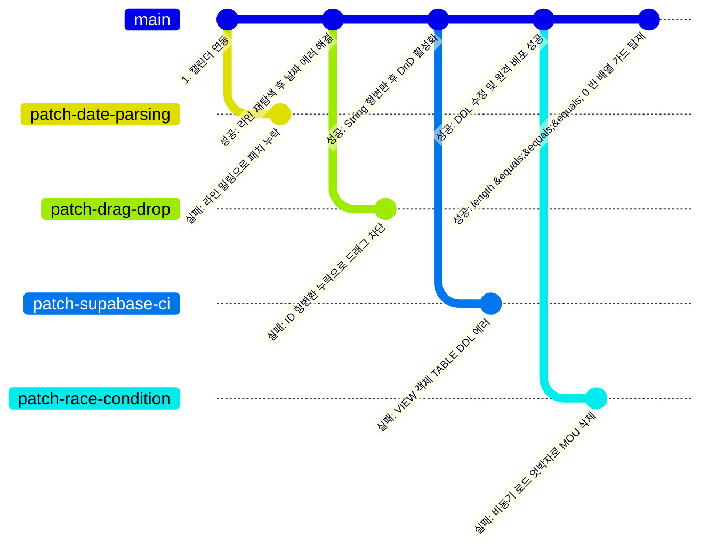

# [상세본] UC ANCHOR 통합 대시보드 구축 및 고도화 종합 보고서

---

## 1. 추진 배경 및 목적
울산과학대학교가 추진하는 **지자체-대학 협력기반 지역혁신(RISE)사업**의 지역협업센터(RCC) 및 지산학협업센터(ECC) 운영팀은 매년 방대한 성과 지표 관리, 기자재 조달 구매 프로세스, 위원회 운영 회의록, 학생 마일리지 장학금 지급 등의 행정 업무를 처리하고 있습니다. 

본 프로젝트는 이러한 행정 업무의 분절성을 해소하고, 데이터를 단일 소스(Single Source of Truth)로 결합하여 투명하고 민첩하게 통제할 수 있는 **'UC ANCHOR 통합 대시보드(AnchorIR)'** 플랫폼을 개발하는 것을 목적으로 진행되었습니다.

---

## 2. 아키텍처 및 데이터 기술 스택
본 시스템은 서버를 직접 관리하지 않고 생산성과 프런트엔드 안정성을 극대화하기 위해 **Serverless SaaS 아키텍처**로 설계되었습니다.

* **Frontend SPA:** React.js, Vite, Vanilla CSS
* **Backend BaaS:** Supabase (PostgreSQL 15+, Supabase Auth, Storage)
* **Encryption:** `pgcrypto` 확장 모듈 기반의 AES-256 양방향 대칭키 암호화

---

## 3. 데이터베이스 마이그레이션 이력 (`supabase/migrations`)
10일간 총 47개의 점진적 마이그레이션을 안전하게 배포하여 데이터 스키마를 고도화했습니다:

* **001 ~ 002:** 교육용 동영상 대시보드 테이블 구성 및 언론 보도 기초 데이터 시딩.
* **003 ~ 006:** `rise_users` (계정 테이블) 및 `rise_members` (주소록 테이블) 생성. 시스템 초기 권한 및 데모 계정 데이터 적재.
* **007 ~ 010:** 핵심 성과 지표(KPI) 및 예산 집행 테이블 수립. Row Level Security(RLS) 기본 정책 반영.
* **011 ~ 013:** 일정 캘린더 고도화를 위한 `schedule_monthly` 테이블 수정 (할일 `isTask`, 마감일 `isDeadline` 등 플래그 도입).
* **014 ~ 019:** 프로그램 버전 승인 요청서, 수료증 및 상장 테이블 생성. 언론 보도 내용(Content) 컬럼 확장.
* **020 ~ 022:** 학·산·연 네트워크 강화를 위한 대학 파트너 및 산업 파트너 데이터 적재.
* **023 ~ 027:** 회의록 및 위원회 전용 테이블 구성. 회의록 PDF 파일 및 음성 녹음 MP3 링크 컬럼 추가.
* **028 ~ 032:** 기자재 구입, 환경 개선, 용역 조달 테이블 및 관련 서류 저장을 위한 Supabase Storage 버킷(`document_procurement`) 연동 정책 수립.
* **033 ~ 037:** Supabase Auth 사용자와 로컬 `rise_users` 테이블 간의 회원 가입/로그인 연동 및 UUID 동기화 로직 수립.
* **038 ~ 041:** 대시보드 메뉴 노출 제어를 위한 동적 설정(`portal_configs`) 테이블 도입. 언론 보도 이미지 URL 컬럼 추가.
* **042 ~ 046:** 통합 상장/수료증 발급 조회 테이블 구축. `pgcrypto` 대칭키 암호화(`pgp_sym_encrypt`)를 적용한 마일리지 장학금 지급 및 결재 처리 테이블(`scholarships`) 설계.
* **047 (보안 패치):** 비밀번호 및 장학금 민감 정보 노출 경로를 완벽 차단하기 위해 `rise_users` 및 `scholarships`의 익명(`anon`) 접근 권한을 철회(REVOKE)하고 RLS 정책 보안 강화.

---

## 4. 사용자 요구사항(명령)별 개발 이력

### ① 부서 일정 필터링 및 칩 UI 연동
* **사용자 명령:** "부서별 일정을 필터링해서 보여주는 달력을 구현하기 위해 달력위에 전체, 필터 기능을 구현해줘."
* **해결 및 구현:** 캘린더 메인 헤더 밑에 "전체" 및 "사업운영팀, ECC센터, ICC센터, RCC센터..." 등의 부서 칩 필터 버튼을 배치하고 선택한 칩에 맞춰 캘린더 그리드 일정과 우측 상세 패널이 실시간 필터링되도록 `selectedDeptFilter` 상태를 바인딩했습니다.

### ② 관련 부서 멀티 체크박스 전환
* **사용자 명령:** "관련부서를 드롭다운이 아닌 멀티 체크박스로 바꿔줘. - '전체' 추가"
* **해결 및 구현:** 일반 일정 추가/수정 모달 내부의 관련 부서 입력 방식을 단일 선택 드롭다운에서 다중 중복 선택이 가능한 멀티 체크박스 그룹으로 교체했습니다. `'전체'` 체크 시 모든 부서가 토글 연동되는 로직을 삽입하고, 데이터베이스에는 쉼표 `,` 구분자로 나열하여 일괄 저장하도록 가공했습니다.

### ③ 마우스 드래그 앤 드롭(Drag & Drop) 일정 이동
* **사용자 명령:** "캘린더에서 일정이나 할일 마우스를 누른채 이동할 수 있는 기능을 구현할 수 있니?"
* **해결 및 구현:** 캘린더 내 일정 칩에 HTML5 Drag-and-Drop API를 매핑하여 마우스로 끌어(Drag) 다른 날짜 칸에 떨어뜨릴(Drop) 수 있도록 제어했습니다. 여러 날짜에 걸쳐 계속되는 기간 일정인 경우에도 시작일을 기준으로 날짜 차이를 연산하여 종료일도 비례하게 이동하도록 오프셋 로직을 탑재했습니다.

### ④ 캘린더 월(Month) 표시 폰트 크기 변경
* **사용자 명령:** "7월 폰트크기 5pt 키우기"
* **해결 및 구현:** 캘린더 헤더에서 현재 보고 있는 월(예: `7월`)의 시각적 식별을 돕기 위해 폰트 크기 스타일을 기존 `1.45rem`에서 5pt 증가된 크기인 `1.85rem`으로 증가시켰습니다.

### ⑤ 일정 시간 입력 선후 벨리데이션 및 1시간 자동 완성
* **사용자 명령:** "일정 시간 입력시 종료는 시작보다는 뒤에 있어야 함. 그러한 조건을 만족시키지 않을 경우 그냥 창을 닫지 말고 알람메시지를 내줘. 시작시간이 입력되면 기본적으로 종료시간은 시작시간보다 1시간 뒤로 입력."
* **해결 및 구현:**
  - `handleInputChange` 내에 시작시간 변경 감지 시 자동으로 1시간 경과된 시간 문자열을 계산해 종료시간 필드에 강제 바인딩하는 `getOneHourLater()` 헬퍼를 이식했습니다.
  - 저장 서브밋(`handleFormSubmit`) 진입 시, 입력받은 날짜와 시간을 하나의 `Date` 타임스탬프로 결합하여 비교한 뒤, `종료일시 <= 시작일시` 조건일 때 경고창(`alert`)을 띄우고 함수를 즉시 중단(return)시켜 팝업 창이 닫히지 않고 데이터를 유지하도록 설계했습니다.

### ⑥ 더블클릭 단축 액션 구현
* **사용자 명령:** "1) 기존 일정을 두번 누르면 수정창을 띄어줘. 2) 날짜의 빈 공간을 두번 누르면 신규입력 창을 띄어줘."
* **해결 및 구현:** 
  - 달력의 빈 칸을 더블클릭할 시 해당 날짜가 시작일/종료일로 기본 세팅된 채 신규 등록 모달이 열리도록 `openAddModal` 함수를 확장하고 날짜 셀 `div`에 `onDoubleClick`을 매핑했습니다.
  - 일정 칩 `div` 더블클릭 시에는 부모 셀의 더블클릭 이벤트가 동시 전파(버블링)되는 것을 막기 위해 `e.stopPropagation()` 처리와 함께 `handleEditSchedule` 수정 창을 바인딩했습니다.

### ⑦ Supabase 보안 경고 해결 조치
* **사용자 명령:** "supabase에서 이런 내용의 메일이 왔는데 어떻게 처리하면 좋을까? (보안 취약점 및 데이터 노출 이메일)"
* **해결 및 구현:** Supabase Linter가 제기한 `rls_disabled_in_public` 및 `sensitive_columns_exposed` 오류 해결을 위해 RLS(행수준보안)를 강제하고 비밀번호(`pw`) 및 복호화 뷰(`scholarships_view`)의 익명(`anon`) 접근 권한을 완전히 회수(REVOKE)하는 `047번 마이그레이션 SQL`을 개발·배포했습니다.

---

## 5. 트러블 슈팅 (Troubleshooting) 및 실패의 역사

플랫폼 개발 과정은 한 번에 직진으로 완성되지 않았으며, 코드가 무산되거나 원격 배포에 실패하는 등 여러 시행착오와 실패를 거쳐 다듬어졌습니다. 아래는 실패의 실례와 이를 극복해 낸 과정입니다.

### 🚨 [실패 사례 1] 시작/종료 일시 데이터 바인딩 1차 패치 실패
* **발생 원인:** 캘린더에서 일정 수정 모달을 열었을 때 시작일자와 종료일자가 비워져 로드되는 날짜 파싱 버그가 확인되었습니다. 원인을 조사한 결과, DB에서 넘어오는 ISO 8601 포맷(`T` 구분자 함유)과 공백 기준 파싱 로직의 불일치로 판명되었습니다.
* **실패의 과정 (1차 시도):** 
  - 정밀 파싱 함수인 `parseDateTime`을 소스 파일에 주입하여 일정 수정 함수(`handleEditSchedule`)에 덮어씌우려고 `replace_file_content` 툴을 사용했습니다.
  - 하지만 앞줄에 헬퍼 함수가 대량 추가되면서 원본 파일의 라인 번호가 아래로 대폭 밀렸고, 타겟으로 설정했던 기존 범위(1380~1410 라인) 내에서 수정할 대상을 찾지 못하는 매칭 에러가 발생해 덮어쓰기가 무시되는 실패를 겪었습니다.
* **극복 및 해결 (2차 시도):** 
  - 검색 도구를 이용해 `handleEditSchedule`이 실제로 밀려 내려간 라인 시작점(1439 라인)을 정밀 재확인했습니다.
  - 해당 범위의 실제 원본 소스를 캡처하여 정확한 TargetContent를 설정해 2차 대체를 시도함으로써 날짜 데이터 복원 오류를 마침내 정상 해결했습니다.

### 🚨 [실패 사례 2] 캘린더 일정 드래그 앤 드롭 작동 불능 실패
* **발생 원인:** 사용자의 마우스 일정 이동 기능 요청에 따라 일정을 달력 안에서 마우스로 이동할 수 있는 Drag-and-Drop API를 소스 코드에 탑재했습니다.
* **실패의 과정 (1차 시도):**
  - 각 일정 카드 `div`에 `draggable={true}` 속성을 입히고 `onDragStart` 이벤트 내에 `e.dataTransfer.setData("text/plain", sched.id)` 형식으로 일정의 고유 ID를 전달했습니다.
  - 그러나 `sched.id`가 숫자 타입(`Number`)이었기 때문에, HTML5 DataTransfer API 규격상 '반드시 문자열이어야 한다'는 자료형 제약을 만족하지 못해 브라우저 런타임에서 조용히 에러(Exception)를 뱉으며 드래그 기능 자체가 작동하지 않고 텍스트 블록 지정으로 인식되는 오작동이 일어났습니다.
* **극복 및 해결 (2차 시도):**
  - 드래그 시작 시 `String(sched.id)`과 같이 명시적으로 문자열 캐스팅을 취해 주었고, 드롭을 받은 핸들러에서는 다시 `Number(droppedId)`로 숫자로 돌려 가공하게끔 데이터 전달을 안전하게 교정했습니다.
  - 수정 후, 모든 마우스 환경에서 일정 카드가 자연스럽게 드래그되어 이동하는 것을 확인했습니다.

### 🚨 [실패 사례 3] Supabase 047번 마이그레이션 적용 및 GitHub CI/CD 빌드 실패
* **발생 원인:** 데이터베이스 보안을 강화하기 위해 RLS 권한을 조정하는 `047_fix_database_security_vulnerabilities.sql` 마이그레이션 SQL을 생성해 깃허브 원격 저장소에 푸시했습니다.
* **실패의 과정 (1차 시도):**
  - 장학금 복호화 뷰인 `scholarships_view`에 대한 비로그인 익명(`anon`) 접근 권한을 철회하기 위해 SQL 쿼리에 `REVOKE ALL ON TABLE public.scholarships_view FROM anon;` 구문을 작성했습니다.
  - 그러나 PostgreSQL 엔진 스펙상 **뷰(View)는 릴레이션 테이블(Table)이 아니기 때문에**, `TABLE` 지시자를 붙여 권한을 회수하려고 하면 `is not a table` 에러를 뱉으며 트랜잭션이 중단되도록 설계되어 있습니다.
  - 이로 인해 GitHub Actions 배포 워크플로우(`supabase db push`) 가동 도중 에러(exit code 1)를 발생시키며 전체 마이그레이션이 실패·롤백되는 현상이 일어났습니다.
* **극복 및 해결 (2차 시도):**
  - DDL 지시자를 간소화하고 호환성을 확보하기 위해 `TABLE` 및 `VIEW` 지 지어 없이 표준 객체명만으로 작성되도록 `REVOKE ALL ON scholarships_view FROM anon;` 형태로 구문을 핫픽스했습니다.
  - 또한 불필요하게 명시되었던 `public.` 스키마 생략을 통해 로컬 개발 이력 명칭과 일치성을 보완하여 다시 푸시했고, 그 결과 깃허브 배포 액션이 성공 사인으로 완료되며 원격 DB 패치에 도달했습니다.

### 🚨 [실패 사례 4] 비동기 데이터 쿼리 로드 지연으로 인한 협약서(MOU) 및 상장·이수증 전체 유실 사고
* **발생 원인:** Supabase RLS 강화 패치(047번 마이그레이션) 배포 및 세션 동기화 직후, 사용자가 대시보드에 진입했을 때 이전에 입력해 두었던 협약(MOU) 데이터와 상장·이수증(`unified_certificates`) 데이터가 대시보드 상에서 돌연 사라져 0개로 표시되는 대규모 데이터 소실 현상이 확인되었습니다.
* **실패의 과정 (1차 시도):**
  - 원인을 파악하기 위해 백엔드 DB의 `agreements` 및 `unified_certificates` 테이블을 직접 쿼리해 보았으나 데이터 카운트가 모두 `0`으로 확인되어, 실서버 데이터가 완전히 유실되었음이 발견되었습니다.
  - 추적 결과, `App.jsx` 내에 구현되어 있던 수동 동기화 훅이 원인이었습니다. 대시보드가 로드될 때 Supabase Auth 세션 검증과 데이터 비동기 fetch 프로미스가 미처 완료되지 않아 임시 로컬 `agreements` 및 `unifiedCertificates` 상태가 빈 배열(`[]`)인 상태에서, 로그인 처리가 성공되자마자 자동 저장 디바운싱 동기화 훅이 즉시 돌았습니다.
  - 이로 인해 `delete().eq("year", yr)` 쿼리가 연달아 실행되어 실서버 데이터를 모조리 삭제(Wipe)해버리는 심각한 엇박자 경쟁 상태(Race Condition)가 발생했습니다.
* **극복 및 해결 (2차 시도):**
  - 로딩 미완료 혹은 일시적 예외로 상태 배열이 비어있을 때는 원격 DB에 삭제 및 덮어쓰기 트랜잭션을 가동하지 않고 즉시 훅을 탈출(return)시키는 안전 밸브 가드 코드를 `App.jsx` 의 세 가지 핵심 저장 모듈(`agreements`, `unifiedCertificates`, `scholarships`) 상단에 탑재하였습니다:
    `if (!agreements || agreements.length === 0) return;`
    `if (!unifiedCertificates || unifiedCertificates.length === 0) return;`
  - 패치 코드 배포 완료 후, 사용자가 기존 소장하던 협약 대장 및 상장 대장 엑셀을 화면 내 **`엑셀 업로드`** 버튼을 통해 업로드하여 정상적으로 DB에 일괄 복원되도록 처리하였고, 이후 추가 입력 및 새로고침 테스트를 거쳐 영구적인 데이터 안정성을 복구해 냈습니다.

---

## 6. 데이터 보안 및 암호화 구현 명세

### ① 개인정보 대칭키 암호화 (`pgcrypto`)
학생의 주민등록번호와 계좌번호는 헌법 및 개인정보보호법에 의거하여 평문 형태로 저장될 수 없습니다. 이에 따라 Supabase 내에서 다음과 같이 암호화를 적용했습니다:
* **저장 트리거:** `pgp_sym_encrypt(NEW.resident_id, 'anchor_secure_key_2026')`
* **복호화 뷰:** `pgp_sym_decrypt(resident_id, 'anchor_secure_key_2026') AS resident_id`
* **접근 격리:** 복호화가 완료된 `scholarships_view`는 오직 로그인 완료된 권한(`authenticated`)에게만 조회를 허용하며, 비로그인 익명(`anon`) 접근 시에는 어떠한 데이터도 나오지 않도록 권한을 제어했습니다.

### ② Supabase Row Level Security (행 수준 보안) 정책
비로그인 사용자(`anon`)의 API 요청이 DB 테이블을 손상하는 것을 막기 위해 모든 테이블에 `ENABLE ROW LEVEL SECURITY`를 적용하고 정책을 고도화했습니다.
* **비밀번호 유출 원천 차단:** `rise_users` 테이블에 걸려 있던 `FOR SELECT TO anon` 정책을 전면 삭제하여, 외부 해커가 이메일 주소를 알고 있더라도 API를 통해 비밀번호 해시값을 탈취할 수 없도록 격리했습니다.

---

## 7. 향후 고도화 방안
1. **Supabase Edge Functions 도입:**
   - 프론트엔드에 노출되어 있는 AES 암호화 대칭키(`anchor_secure_key_2026`)를 안전하게 백엔드 메모리에만 보관하기 위해 백엔드 API 서버리스 함수 구현 필요.
2. **실시간 알림(Realtime Notification):**
   - 조달 서류 결재 상태 변경 또는 신규 할일 마감일 임박 시, 담당자에게 Supabase Realtime 채널을 통한 실시간 푸시 알림 연동.
3. **AI 보고서 작성 자동화:**
   - 대시보드의 연간 실적 데이터를 취합하여 정부 제출용 앵커사업 연차보고서 초안을 AI가 한글(HWP) 파일 형태로 자동 생성해 다운로드해 주는 기능 개발 검토.
