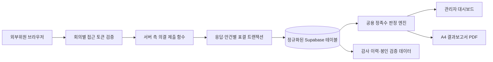

# committee-vote-stabilization - Plan Document

> Version: 1.0.0 | Date: 2026-07-23 | Status: Approved
> Level: Dynamic

---

## 1. Overview

### 1.1 Purpose

기존 앵커사업 대시보드의 JSX 구조, CSS 클래스, 스타일 및 화면 레이아웃을 변경하지 않으면서 외부위원과 간사·관리자가 사용하는 위원회 심의·의결 기능을 운영 가능한 수준으로 안정화한다.

### 1.2 Background

코드 검토 결과 외부위원 인증 우회, 공개 RLS, UUID 스키마와 숫자 ID 가드의 충돌, 동시 제출 시 응답 유실 가능성, 미선택 안건의 자동 찬성, 중복 정족수 계산, 타 회의 첨부자료 폴백, 검증 불가능한 디지털 봉인 표현이 확인되었다. 전체 대시보드의 TypeScript 및 린트 오류 정리는 본 안정화 이후 별도 단계로 수행한다.

### 1.3 Target Users

- 외부위원
- 위원회 간사
- 위원회 관리자

## 2. Goals

### 2.1 Primary Goals

- [ ] 인가된 위원만 지정된 회의에 접근한다.
- [ ] 모든 안건에 명시적인 표결 또는 평가를 요구한다.
- [ ] 동시 제출과 재제출에서도 응답·서명·안건별 표결이 유실되지 않는다.
- [ ] 간사를 제외한 성원 및 가결 규칙을 모든 화면과 보고서에서 동일하게 적용한다.
- [ ] 회의별 안건과 첨부자료를 완전히 격리한다.
- [ ] 확정 DB 데이터를 기준으로 참조 PDF와 같은 A4 결과보고서를 생성한다.
- [ ] 기존 UI/UX를 픽셀 단위로 보존한다.

### 2.2 Non-Goals

- 전체 대시보드 TypeScript 오류 및 린트 경고 정리
- 위원회 화면 디자인 또는 정보 구조 개편
- SMS·이메일 OTP 인증
- 공인인증서 또는 PKI 기반 PDF 서명
- AI 분석 기능 전면 재설계
- 전체 상태 관리 리팩터링
- 번들 분할 및 전역 성능 최적화

## 3. Scope

### 3.1 Functional Requirements

- 외부위원은 유효한 회의별 접근 정보로만 입장할 수 있다.
- 회의 명단에 등록된 위원만 표결할 수 있다.
- 간사는 참석·서명 기록은 가능하지만 재적·출석·찬반 정족수에서 제외한다.
- 일반 안건은 동의·부동의·기권 중 하나를 직접 선택해야 한다.
- 평가 안건은 1~5점 중 하나를 직접 선택해야 한다.
- 하나라도 미선택 안건이 있으면 제출을 차단한다.
- 위원별 응답과 안건별 표결을 하나의 원자적 서버 작업으로 저장한다.
- 재제출은 기존 기록을 갱신하고 감사 이력을 남긴다.
- 현재 회의 및 안건에 해당하는 첨부자료만 표시한다.
- PDF의 성원·표결·서명·제출 시각은 확정 DB 데이터에서만 생성한다.

### 3.2 Non-Functional Requirements

- 기존 JSX 태그, Tailwind/CSS 클래스, 인라인 스타일 및 화면 레이아웃을 변경하지 않는다.
- 외부 브라우저가 위원회 핵심 테이블을 임의로 변경할 수 없도록 RLS를 적용한다.
- 동시 제출 시 응답 유실이 없어야 한다.
- 서명 키, PIN 및 접근 토큰을 클라이언트 코드에 하드코딩하지 않는다.
- DB 마이그레이션은 백업 및 롤백이 가능해야 한다.
- PDF는 한글 깨짐, 잘림, 겹침 없이 렌더링되어야 한다.
- 각 단계 완료 후 자동 검사와 수동 시각 검증을 수행한다.

### 3.3 Six-Stage Delivery

1. **안전망과 기준선 확보**
   - 현재 UI, DOM, PDF 기준선과 핵심 시나리오 테스트를 확보한다.
   - 운영 DB 백업 및 롤백 절차를 준비한다.
2. **인증 및 DB 보안**
   - 공통 PIN, 임시위원, 예외 시 강제 입장을 제거한다.
   - 회의별 접근 토큰과 최소 권한 RLS를 적용한다.
3. **표결 저장 무결성**
   - UUID 기반 저장 경로를 통일한다.
   - 응답·안건별 표결·서명을 트랜잭션과 고유 제약으로 저장한다.
4. **정족수와 결과 판정 통합**
   - 공용 정족수 판정 엔진을 단일 진실 공급원으로 사용한다.
   - 미응답을 찬성으로 간주하는 폴백을 제거한다.
5. **첨부자료와 PDF 결과보고서**
   - 회의·안건별 첨부자료 격리를 보장한다.
   - 참조 PDF와 동일한 A4 문서 구조를 생성하고 서버 검증 봉인 코드를 적용한다.
6. **통합 검증과 운영 전환**
   - 외부위원·간사·관리자 E2E, 동시 제출, 재제출, 정족수 및 PDF 회귀를 검증한다.
   - 운영 배포 후 모니터링하고 후속 TypeScript 정리 단계로 전환한다.

## 4. Architecture Direction

- 브라우저는 위원회 핵심 테이블을 직접 수정하지 않는다.
- 공식 의결 근거는 정규화된 DB 데이터이며 localStorage는 임시 작성 내용에만 사용한다.
- PDF는 확정된 DB 스냅샷에서 생성한다.
- 봉인 코드는 서버 비밀키 기반 검증값으로 생성하고 공인인증서로 오인되는 표현을 사용하지 않는다.

## 5. Success Criteria

- [ ] 미등록 사용자와 잘못된 접근 정보의 입장 성공률 0%
- [ ] 공통 PIN·임시위원·예외 강제 입장 경로 0개
- [ ] 10명 이상 동시 제출 반복 시험의 응답 유실 0건
- [ ] 미선택 안건이 포함된 제출 성공 0건
- [ ] 위원별 중복 응답 및 안건별 중복 표결 0건
- [ ] 간사가 재적·출석·찬반 수에 포함되는 사례 0건
- [ ] 관리자 화면·DB·PDF 판정 불일치 0건
- [ ] 다른 회의의 안건·첨부자료 노출 0건
- [ ] 외부위원 주요 흐름의 런타임 오류 0건
- [ ] 수정 전후 화면의 의도하지 않은 픽셀 차이 0px
- [ ] PDF 한글 깨짐·잘림·겹침 0건
- [ ] 봉인 코드의 원본 기록 검증 실패 0건
- [ ] 마이그레이션 후 기존 회의·응답·서명 유실 0건

## 6. Schedule

| Phase | Scope | Status |
|-------|-------|--------|
| Plan | 요구사항·범위·성공 기준 확정 | Complete |
| Design | DB, RLS, 서버 함수, 토큰, PDF 상세 설계 | Pending |
| Do 1 | 기준선·테스트 안전망 | Pending |
| Do 2 | 인증·RLS | Pending |
| Do 3 | 원자적 표결 저장 | Pending |
| Do 4 | 정족수 통합 | Pending |
| Do 5 | 첨부자료·PDF | Pending |
| Check | 통합·시각·운영 검증 | Pending |
| Report | 결과 및 후속 TypeScript 정리 인계 | Pending |

## 7. Risks & Mitigations

| Risk | Impact | Probability | Mitigation |
|------|--------|-------------|------------|
| RLS 강화 후 외부 제출 차단 | High | Medium | 서버 함수 경유 및 권한별 사전 테스트 |
| `responses_data`와 정규 테이블 충돌 | High | High | 백업, 중복 제거 보고서, 원본 JSON 읽기 전용 보관 |
| 기존 링크 무효화 | Medium | High | 제한 기간 신규 토큰 교환 호환 계층 제공 |
| 동시 제출·재제출 충돌 | Critical | High | 트랜잭션, 고유 제약, idempotency 키, 감사 이력 |
| 기존 보고서와 정족수 결과 차이 | High | Medium | 기존 회의 재계산 후 관리자 검토 대상 표시 |
| PDF 레이아웃 회귀 | High | Medium | 페이지 렌더링 비교와 한글·표·서명 영역 검증 |
| 대시보드 UI 회귀 | Critical | Low | JSX·클래스 수정 금지 및 픽셀 비교 |

## 8. References

- `.agents/AGENTS.md`
- `.agents/DESIGN.md`
- `.agents/GUARDRAILS.md`
- `.agents/skills/SKILL_COMMITTEE.md`
- `anchor-dashboard/src/components/CommitteeManager.tsx`
- `anchor-dashboard/src/components/CommitteeExternalVote.tsx`
- `anchor-dashboard/src/utils/quorumEvaluator.ts`
- `supabase/migrations/084_create_committee_tables_integrated.sql`
- `/Users/thomas/Downloads/[20260811]ECC센터운영위원회-의결서(디지털봉인).pdf`
