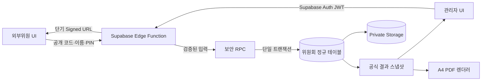

# committee-vote-stabilization - Design Document

> Version: 1.0.0 | Date: 2026-07-23 | Status: Approved for implementation
> Level: Dynamic | Plan: `docs/01-plan/features/committee-vote-stabilization.plan.md`

---

## 1. Design constraints

### 1.1 Absolute UI preservation

- `CommitteeExternalVote.tsx`와 `CommitteeManager.tsx`의 JSX 태그 순서·중첩·개수는 변경하지 않는다.
- 기존 `className`, 인라인 `style`, 표시 문자열, 아이콘, 폰트, 여백, 색상 및 페이지 레이아웃을 변경하지 않는다.
- 기능 교체는 이벤트 핸들러, 데이터 로딩, 계산 값, 서비스 호출 경계 안에서만 수행한다.
- 수정 전후 동일 뷰포트 스크린샷 및 DOM/클래스 스냅샷으로 0px 회귀를 확인한다.
- 전체 TypeScript·lint 정리는 본 기능 안정화 범위에서 제외한다.

### 1.2 Authoritative data

- 공식 의결 근거는 정규화된 Supabase 데이터뿐이다.
- `localStorage`는 회의·위원이 정확히 일치하는 미제출 임시 초안에만 사용한다.
- `responses_data` JSON은 마이그레이션 원본 보존 및 제한된 호환 읽기용이며 신규 공식 기록으로 쓰지 않는다.
- 관리자 화면과 PDF는 같은 서버 결과 스냅샷을 사용한다.

### 1.3 Committee rule

- 간사(`SECRETARY`)는 참석·서명 기록은 가능하나 재적, 의사정족수, 찬반 및 의결정족수에서 제외한다.
- 일반 안건은 `APPROVE`, `REJECT`, `ABSTAIN` 중 명시적 선택을 요구한다.
- 평가 안건은 1~5점 중 명시적 선택을 요구하며 찬반 의결 결과에 섞지 않는다.

## 2. Target architecture



### 2.1 Trust boundary

| Boundary | Rule |
|---|---|
| Anonymous browser | 핵심 테이블 직접 접근 금지, 공개 Edge Function만 호출 |
| External voter session | 원문 토큰은 `sessionStorage`에만 보관, DB에는 SHA-256 해시만 저장 |
| Admin browser | Supabase JWT와 서버의 `rise_users.uuid = auth.uid()` 권한을 함께 검증 |
| Edge Function | 서버 환경의 service role 사용, 입력 검증 후 제한된 RPC만 실행 |
| Database | RLS 기본 거부, 제약·트랜잭션·감사 로그로 최종 무결성 보장 |
| Storage | 회의 자료와 서명은 private bucket, 검증 후 단기 signed URL만 발급 |

## 3. Data model

### 3.1 Existing tables retained

- `committees`
- `committee_members`
- `committee_meetings`
- `meeting_agendas`
- `meeting_responses`
- `meeting_agenda_votes`

기존 UI 필드와의 호환을 유지하되 아래 열과 제약을 추가한다.

### 3.2 Canonical member role

`committee_members.role_code`를 `CHAIRMAN | MEMBER | SECRETARY`로 추가하고 기존 한글 `type` 값을 백필한다. 화면 표시는 기존 `type`을 그대로 사용한다. 정족수 계산은 `role_code`만 사용한다.

### 3.3 Public meeting identifier

`committee_meetings.public_code`에 예측 불가능한 고유 코드를 저장한다. UUID 일부, 회의 ID, 고정 PIN을 공개 식별자로 사용하지 않는다. 회의 상태는 `CREATED | ACTIVE | CLOSED | REPORTED`로 검증한다.

### 3.4 New security and audit tables

#### `committee_vote_credentials`

| Column | Purpose |
|---|---|
| `meeting_id`, `member_id` | 회의별 위원 자격, 복합 unique |
| `pin_hash` | `pgcrypto.crypt()`로 저장한 PIN 해시 |
| `expires_at`, `revoked_at` | 유효기간과 폐기 시각 |
| `failed_attempts`, `locked_until` | 반복 실패 제한 |
| `created_by`, timestamps | 발급 감사 정보 |

#### `committee_vote_sessions`

| Column | Purpose |
|---|---|
| `token_hash` | 원문 세션 토큰의 SHA-256, unique |
| `meeting_id`, `member_id` | 세션 범위 |
| `expires_at`, `revoked_at`, `last_used_at` | 세션 수명 |
| `created_ip_hash`, `user_agent_hash` | 최소화된 보안 감사 정보 |

#### `committee_vote_submission_requests`

`(session_id, idempotency_key)` unique 제약과 요청 payload hash, 처리 결과를 저장해 네트워크 재시도에도 한 번만 반영한다.

#### `committee_vote_audit_log`

표결 제출·수정·마감·보고서 확정 이벤트를 append-only로 저장한다. 이전/이후 payload는 필요한 필드만 기록하고 PIN·토큰·서명 원문은 기록하지 않는다.

#### `committee_report_snapshots`

확정 시점의 canonical JSON, SHA-256, 서버 HMAC seal, 버전, 확정자와 확정 시각을 저장한다. PDF는 이 행의 payload만 렌더링한다.

### 3.5 Response and vote constraints

- `meeting_responses`: `unique(meeting_id, member_id)`, `attended not null`, `signature_object_path`, `signature_sha256`, `revision`, `submitted_at`, `updated_at`.
- `meeting_agenda_votes`: `unique(agenda_id, member_id)`와 `meeting_id`를 보유한다.
- 일반 안건: `vote in ('APPROVE','REJECT','ABSTAIN')`, `score is null`.
- 평가 안건: `score between 1 and 5`, `vote is null`.
- `member_id`가 해당 회의의 위원회에 속하는지 RPC에서 잠금 후 재검증한다.

## 4. API and server operations

### 4.1 Edge Function routes

하나의 `committee-vote` Edge Function에서 다음 경로를 제공한다.

| Method/path | Authentication | Result |
|---|---|---|
| `POST /public` | public code | 제목·일시·상태 등 최소 공개 정보 |
| `POST /authenticate` | public code, 이름, PIN | 제한시간 외부위원 세션 토큰 |
| `POST /context` | voter token | 본인 회의·안건·기존 응답, 자료 signed URL |
| `POST /submit` | voter token | 원자적 제출 결과와 revision |
| `POST /report-snapshot` | admin JWT | 공식 결과 계산·스냅샷 확정/조회 |
| `POST /verify-report` | verification code | 민감정보를 제외한 봉인 검증 결과 |

응답은 필요한 데이터만 반환하며 DB 오류를 성공으로 바꾸지 않는다. 모든 오류는 안정된 코드(`INVALID_CREDENTIALS`, `LOCKED`, `MEETING_CLOSED`, `INCOMPLETE_AGENDAS`, `CONFLICT`, `FORBIDDEN`)로 매핑한다.

### 4.2 External authentication

1. `public_code`로 활성 회의를 찾는다.
2. 정규화된 이름으로 해당 위원회 위원을 정확히 한 명 찾는다.
3. 자격 폐기·만료·잠금 상태를 확인한다.
4. `crypt(input_pin, pin_hash) = pin_hash`를 constant-time 성격으로 검증한다.
5. 실패 시 실제 PIN이나 회원 존재 여부를 노출하지 않고 실패 횟수와 잠금을 갱신한다.
6. 성공 시 256-bit 난수 토큰을 한 번 반환하고 해시만 저장한다.

고정 `123456`, `1234`, 임시위원 생성, 존재하지 않는 회의 폴백, 예외 발생 시 강제 입장은 모두 제거한다.

### 4.3 Atomic submission RPC

`submit_committee_vote(session_token_hash, idempotency_key, payload)`는 다음을 하나의 트랜잭션으로 수행한다.

1. 세션·회의 행을 잠그고 세션 유효성 및 `ACTIVE` 상태를 검증한다.
2. 제출된 안건 ID 집합이 현재 활성 안건 ID 집합과 정확히 같은지 확인한다.
3. 중복·미선택·허용되지 않은 vote/score를 거부한다.
4. 응답을 `(meeting_id, member_id)` 기준 upsert하고 revision을 증가시킨다.
5. 모든 안건별 값을 `(agenda_id, member_id)` 기준 upsert한다.
6. idempotency 결과와 감사 로그를 기록한다.
7. 커밋된 revision과 서버 제출 시각을 반환한다.

서명 파일 업로드 후 DB 트랜잭션이 실패하면 Edge Function이 업로드 객체를 보상 삭제한다. 클라이언트는 서버 성공 응답 전에는 완료 화면으로 전환하지 않는다.

## 5. RLS and grants

- 기존 위원회 테이블의 `TO public USING (true) WITH CHECK (true)` 정책을 모두 제거한다.
- `anon`과 일반 `authenticated` 역할에서 핵심 테이블 직접 write 권한을 회수한다.
- 외부위원의 DB 접근은 Edge Function과 제한된 security-definer RPC로만 허용한다.
- 관리자 정책은 `auth.uid()`에 대응하는 승인된 `rise_users`와 허용 역할을 서버에서 검증한다.
- 위원회 관리 역할은 `ADMIN`, 단장·본부장·운영/팀장 및 센터장 계열로 제한하고 일반 `RESEARCHER`는 관리 write와 보고서 확정을 허용하지 않는다. 위원으로 등록된 사용자의 본인 표결 제출은 별도 roster 검증 경로로 허용한다.
- 위원회 명단 조회는 절대로 fallback 명단의 자동 삭제·삽입을 유발하지 않는다. 공식 명단이 없거나 조회가 실패하면 빈 상태/오류로 처리한다.
- security-definer 함수는 고정 `search_path`, 완전 수식 테이블명, 입력 크기 제한, 최소 `EXECUTE` grant를 사용한다.
- service-role key, HMAC key 및 storage signing 권한은 서버 환경에만 둔다.

## 6. Quorum and decision engine

### 6.1 Authoritative calculation

DB 함수 `get_committee_meeting_result(meeting_id)`가 공식 결과를 반환한다. 관리자 UI와 보고서 스냅샷은 이 결과만 사용한다. 프론트의 `quorumEvaluator.ts`는 표시와 단위시험용 순수 함수로 동일 규칙을 구현하고 SQL 결과와 parity test를 수행한다.

### 6.2 Rules

```text
eligible_members = active members where role_code != SECRETARY
total = count(distinct eligible member)
attended = count(distinct submitted eligible member where attended = true)
attendance_requirement = floor(total / 2) + 1
established = attended >= attendance_requirement
approval_requirement = floor(attended / 2) + 1
```

- 일반 안건별 `APPROVED`: 성원이며 찬성 수가 `approval_requirement` 이상.
- 일반 안건별 `REJECTED`: 성원이나 찬성 수가 요건 미달.
- 모든 안건은 미응답을 찬성으로 보정하지 않는다.
- 평가 안건은 평균·분포·응답 수만 산출하고 가부 판정에서 제외한다.
- 회의 전체 결과는 미성원이면 `CANCELLED_NO_QUORUM`, 일반 안건이 모두 가결이면 `APPROVED`, 하나라도 부결이면 `REJECTED`, 아직 제출 진행 중이면 `PENDING`이다.
- 알 수 없는 위원, 타 위원회 위원, 중복 응답은 계산에서 제외하고 데이터 이상으로 보고한다.

## 7. Attachment and signature storage

- 회의 자료 bucket: private `committee-meeting-documents`.
- 서명 bucket: private `committee-signatures`.
- 객체 경로: `{meeting_id}/{agenda_id-or-member_id}/{random_uuid}-{sanitized_filename}`.
- 인증된 context 요청에만 짧은 유효기간 signed URL을 반환한다.
- `local_meeting_agendas_*`를 임의 순회하는 폴백은 제거한다.
- 서명 원본은 클라이언트 고정 AES 키로 암호화하지 않는다. private storage 접근 제어, SHA-256 무결성 값, 서버 감사 기록을 적용한다.

## 8. PDF result report

참조 PDF의 A4 2쪽 구조를 유지한다.

1. 회의 개요와 성원 현황
2. 안건 목록
3. 안건별 표결 또는 평가 통계
4. AI 분석 요약
5. 위원별 서명과 서버 제출 시각
6. 디지털 기록 검증 상자

PDF 생성 입력은 `committee_report_snapshots.payload` 한 건이다. 하단 검증 상자에는 snapshot ID, payload SHA-256, 서버 HMAC 검증 코드와 검증 URL을 표시한다. 실제 PKI/CA가 아니므로 `공인인증`, `인증기관`, `100% 위변조 방지`라고 표현하지 않는다.

렌더링은 기존 보고서 DOM/CSS를 보존한 클라이언트 렌더러를 사용하되, 데이터 공급만 스냅샷으로 교체한다. 페이지는 A4 고정 크기와 명시적 page break를 사용하고 Poppler raster 결과로 한글, 잘림, 겹침과 2쪽 구성을 확인한다.

## 9. Migration plan

| Migration | Content |
|---|---|
| `091_committee_vote_security_schema.sql` | pgcrypto, role/public code, credentials, sessions, idempotency, audit, snapshot, constraints |
| `092_backfill_committee_vote_data.sql` | role backfill, legacy JSON 정규화, 중복·누락 진단 테이블/뷰 |
| `093_lock_down_committee_rls.sql` | 공개 정책 제거, 최소 RLS 및 grants |
| `094_committee_vote_functions.sql` | 인증 보조·원자적 제출·정족수·스냅샷 RPC |
| `095_committee_storage_policies.sql` | private bucket과 서버 경유 정책 |
| `096_link_supabase_auth_rise_users.sql` | Auth UUID 동기화, 자체 비밀번호 폐기, 최소 `rise_users` RLS/RPC |

### 9.1 Operational sequence

1. 운영 DB point-in-time backup 및 주요 테이블 row count/hash 기록.
2. 091~092 적용 후 dry-run 진단 결과 검토.
3. 신규 endpoint 배포 후 관리 계정·외부위원 smoke test.
4. 짧은 점검 시간에 신규 write 경로 전환, 093~095 적용.
5. row count, 중복, 고아 FK, 과거 회의 표결 표본을 재검증.
6. 문제 시 신규 endpoint를 끄고 백업/PITR 또는 준비된 forward rollback SQL로 복구.

신규 write 경로는 feature flag로 전환하지만, 운영 전환 후 구형 공개 write는 재활성화하지 않는다.

## 10. Frontend implementation boundary

### 10.0 Supabase Auth and `rise_users` identity contract

- Supabase Auth의 `auth.users.id`/`auth.uid()`를 유일한 로그인 신원으로 사용한다.
- `rise_users.uuid = auth.uid()`인 승인 사용자 한 행만 업무 프로필과 역할의 근거로 사용한다.
- `rise_users.pw`는 더 이상 조회·비교·갱신하지 않고 운영 마이그레이션에서 nullable/폐기 상태로 전환한다.
- 브라우저는 사용자가 입력한 비밀번호, access token, refresh token을 앱 사용자 객체나 `anchor_logged_in_user`에 저장하지 않는다.
- Supabase SDK가 세션 저장·자동 갱신·로그아웃을 담당하고, 앱 캐시에는 비민감 프로필만 저장한다.
- 데모 계정 자동 가입, 역할 강제 보정, 타 사용자 계정 터널링, 클라이언트의 UUID/역할 자가 매핑을 제거한다.
- 아이디 입력은 주소록의 실제 이메일로 해석할 수 있는 경우에만 이메일로 변환하며, 최종 인증과 권한은 서버 데이터로 검증한다.
- 비밀번호 변경과 중요 삭제 재인증은 Supabase Auth에 현재 자격증명을 다시 검증한 뒤 수행한다.
- 로그인 UI의 JSX 태그 구조, 클래스, 인라인 스타일과 화면 문자열은 변경하지 않는다.

### 10.1 New files

- `anchor-dashboard/src/services/committee-vote-service.ts`: Edge Function 호출과 안정된 오류 매핑.
- `anchor-dashboard/src/types/committee-vote.ts`: API payload/result 타입.
- `anchor-dashboard/src/utils/committee-vote-validation.ts`: 명시적 선택과 ID 집합 검증.

### 10.2 Existing files

- `CommitteeExternalVote.tsx`: 인증·컨텍스트·제출 handler와 상태 데이터만 교체한다.
- `CommitteeManager.tsx`: 공식 결과와 보고서 스냅샷 로딩만 교체한다.
- `quorumEvaluator.ts`: 간사 제외, unknown/duplicate 방어, 안건별 결과 타입을 강화한다.

상기 컴포넌트의 JSX 및 스타일 구간은 수정하지 않는다. 필요 데이터 형태는 adapter에서 기존 view model로 변환한다.

## 11. Verification plan

### 11.1 Unit

- 홀수·짝수 재적, 간사 포함, 중복 응답, unknown 위원, 기권, 동수, 평가 안건.
- 안건 미선택, 중복 ID, 타 회의 안건, 잘못된 score/vote 검증.
- canonical snapshot serialization과 hash 안정성.

### 11.2 Database/API integration

- anon 직접 CRUD 전부 거부, admin 허용 범위 확인.
- 잘못된 PIN, 공통 PIN, 임시위원, 만료·폐기·잠긴 세션 거부.
- 10명 이상 동시 제출 반복 시 응답·표결 유실 0건.
- 동일 idempotency key 재시도와 새 key 수정 제출의 revision 검증.
- 응답과 일부 안건 저장 사이 오류 주입 시 전부 rollback.
- SQL 정족수 결과와 TypeScript 순수 함수 결과 parity.

### 11.3 UI/E2E and visual

- 외부위원 로그인 → 자료 확인 → 모든 안건 선택 → 서명 → 제출.
- 하나라도 미선택 시 제출 차단, DB 오류 시 성공 화면 미표시.
- 간사 제출은 기록되지만 정족수·찬반에서 제외.
- 다른 회의 자료가 노출되지 않음.
- 수정 전후 DOM 태그·className 스냅샷과 주요 뷰포트 픽셀 비교.

### 11.4 PDF

- 참조 문서와 동일한 2쪽 A4 섹션 순서.
- DB/UI/PDF의 재적·출석·찬반·결과·제출 시각 일치.
- Poppler 렌더링에서 한글 깨짐, 서명 누락, 잘림, 겹침 0건.
- snapshot 변조 시 verification 실패, 원본은 성공.

## 12. Acceptance checklist

- [ ] UI DOM, Tailwind/CSS, 레이아웃 변경 없음
- [ ] 외부 인증 우회 경로 없음
- [ ] 공개 RLS write 정책 없음
- [ ] 원자적·멱등 제출과 감사 이력 동작
- [ ] 간사 제외 규칙이 DB/UI/PDF에서 일치
- [ ] 회의·안건·첨부자료가 정확히 격리됨
- [ ] 공식 DB 스냅샷 기반 A4 PDF 출력 및 검증 가능
- [ ] 운영 백업·점검·검증·복구 절차 준비

## 13. Design decisions and deviations

- 기존 위원회 스킬의 클라이언트 하드코딩 AES 예시는 보안 경계를 충족하지 못하므로 채택하지 않는다. private storage와 서버 무결성 검증으로 대체한다.
- 기존 DESIGN.md의 localStorage 자가복원 원칙은 일반 대시보드에 유지하되, 법적·행정적 근거가 되는 공식 표결에는 적용하지 않는다.
- 공인전자서명은 범위 밖이다. 이번 봉인은 서버 저장 기록의 무결성 검증이며 신원 공인인증을 주장하지 않는다.
