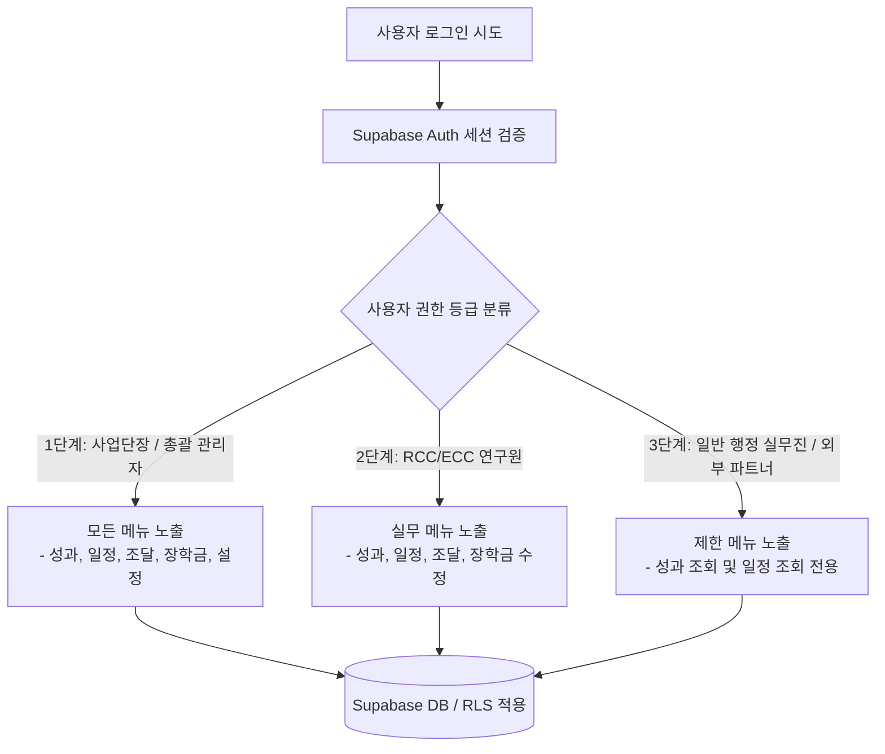
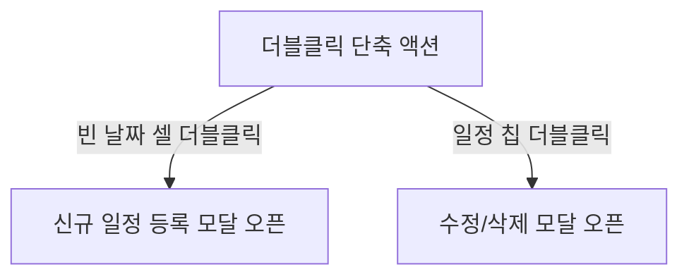

# [발표 자료] UC ANCHOR 통합 대시보드 연구원 사용설명서

---

## 1. 대시보드 개요 및 연동 목적

### 💡 Single Source of Truth (단일 행정 통제 구조)
울산과학대학교 라이즈(RISE)사업단 지역협업센터(RCC) 및 지산학협업센터(ECC)의 행정 업무 효율성을 극대화하고 데이터 누수를 방지하기 위해 구축된 **통합 행정 관리 플랫폼**입니다.

* **통합의 대상**: 추진 실적(PDCA), 예산 집행, 조달 및 기자재 구매, 회의록/위원회 운영, 마일리지 장학금 지급 검증.
* **도입 효과**:
  - 수작업으로 취합되던 연차별 지표의 실시간 통계화.
  - 한눈에 파악하는 사업 기획 대비 집행 실적률(PDCA 환류).
  - 서류 파일(PDF) 및 녹음본(MP3)의 클라우드 스토리지 중앙 집중화.
  - AI를 활용한 조달 서류 요약 및 지식베이스 질의응답 지원.

---

## 2. 계정 권한 및 로그인 체계

본 시스템은 보안 강화와 행정 투명성 보장을 위해 사용자의 신원과 권한 등급을 엄격히 분류하여 처리합니다.

### 🔐 계정 등급별 접근 권한 및 동적 메뉴 노출
대시보드 로그인 시 사용자의 UUID와 연동된 `portal_configs` 설정에 따라 메뉴 탭 노출이 실시간 제어됩니다.



* **보안 및 RLS(Row Level Security)**:
  - 비로그인 사용자(`anon`)의 테이블 접근 권한은 완전히 **Revoke(철회)**되어 있습니다.
  - API 통신 시 발급받은 유효한 JWT 토큰 세션을 헤더에 탑재하여 전송하며, 인가되지 않은 IP나 토큰으로는 데이터의 임의 수정이 절대 불가합니다.

---

## 3. 5대 핵심 서비스 모듈 상세 사용법

---

### ① 사업 성과 관리 (PDCA 모듈)

*추진전략 ➔ 전략과제 ➔ 세부 프로그램*으로 연계되는 성과 목표 대비 실적을 관리하는 모듈입니다.

```
[전략 (예: A1, B1)] ──> [과제 (예: A1-1)] ──> [프로그램 (예: A1-1-1)]
```

#### 1) 예산 계획(Plan) 입력 및 통제
* **입력 방법**: 각 프로그램 상세 모달 내 **[예산 기획]** 섹션에서 **본예산**과 **이월예산**을 세부 재원별(국고, 시비, 외부재원)로 구분하여 기입합니다.
* **자동 롤업**: 입력된 세부 재원의 합은 '총 예산'으로 실시간 자동 합산 연산됩니다.
* **국비 100% 제한 규칙**: **D1, D2, D3 단위과제 및 하위 프로그램**은 정책상 국비 100% 사업이므로, 예산 입력 시 시비 매칭 비율이 **0%로 강제 통제**되며 초과 기입 시 경고 및 자동 보정이 적용됩니다.

#### 2) 반달(15일) 단위 간트 차트 (Gantt Chart) 조작
* **조작법**: 마우스 드래그를 통해 바의 좌/우측 끝을 늘리거나 줄여 일정을 수정합니다.
* **구조**: 1년 12달을 보름씩 쪼갠 **24분할 가상 슬롯 맵핑** 구조로 구성되어 있어, 세밀한 주차별 일정을 마우스 조작만으로 신속하게 수정할 수 있습니다.
* **자동 저장**: 마우스를 놓는 즉시 날짜 범위 형식(`YYYY.MM.DD ~ YYYY.MM.DD`)으로 변환되어 DB에 즉시 동기화됩니다.

#### 3) 실적(Do) 및 점검/환류(Check & Action) 입력
* **추진 일정 설정**: 12개월의 월별 수행 단계를 드롭다운에서 계획(P), 실적(D), 점검(C), 환류(A) 단계로 선택해 줍니다.
* **실적 데이터 및 환류 보고서**:
  - 목표 수행 횟수 대비 실적 횟수를 입력하면 달성률이 자동 갱신됩니다.
  - 프로그램 완료 시 우수사례(Good)와 Deficiency(미흡점) 분석에 따른 피드백 개선조치 양식을 상세히 텍스트 입력합니다.

---

### ② 일정 및 위원회 관리 (캘린더 & 미팅 모듈)

사업단의 월간 일정, 주요 위원회 회의 및 업무 마감일을 가시화하고 제어하는 캘린더 모듈입니다.



#### 1) 부서 일정 필터링 및 칩 UI 활용
* 캘린더 상단에 배치된 **[부서별 필터 칩]**(전체, 사업운영팀, ECC, ICC, RCC 등)을 클릭하여 해당 부서 담당 일정만 필터링해 볼 수 있습니다.

#### 2) 일정 시간 validation 및 1시간 자동 완성
* **시작-종료 자동 완성**: 일정을 추가할 때 시작시간(예: `오전 10:00`)을 선택하면 종료시간이 자동으로 1시간 뒤인 `오전 11:00`로 기본 세팅됩니다.
* **역전 방지 경고**: 종료일시가 시작일시보다 앞서게 기입하고 [저장]을 누를 경우, 오류 안내창(`alert`)을 띄우고 모달 창이 닫히지 않아 데이터가 유실되지 않도록 방어합니다.

#### 3) 드래그 앤 드롭(Drag & Drop) 일정 날짜 이동
* 캘린더에 띄워진 일정 칩을 마우스로 잡고(Drag) 원하는 날짜 칸에 떨어뜨려(Drop) 날짜를 간편하게 변경할 수 있습니다. (여러 날짜에 걸쳐 있는 기간 일정도 시작일 오프셋에 맞추어 종료일이 비례하여 이동합니다.)

#### 4) 회의록 등록 및 위원회 연동
* 회의록 폼 작성 시 참석자 다중 체크박스를 제공하며, 첨부파일 업로드 기능을 통해 회의록 PDF 파일 및 음성 녹음본 MP3 파일을 버킷 스토리지로 바로 저장합니다.

---

### ③ 지산학 장학금 검증 (마일리지 & 결재 모듈)

지산학 연계 마일리지 장학금 지급의 안전성과 정합성을 보장하는 검증 시스템입니다.

#### 1) 개인정보 암호화 수립 (`pgcrypto` 보안 정책)
* 학생의 주민등록번호와 은행 계좌번호는 데이터베이스 내에 평문으로 저장되지 않고 `pgcrypto` 확장 모듈 기반의 **AES-256 대칭키 암호화**로 보호됩니다.
* 인가된 권한으로 로그인된 사용자에게만 복호화 뷰(`scholarships_view`)를 통해 평문 조회가 허용되며, 외부 유출이 불가능한 구조를 갖추고 있습니다.

#### 2) 엑셀 일괄 업로드 및 트랜잭션 백업/롤백 안전 장치
수작업 오류 방지를 위해 대량의 장학금 수혜자 엑셀 명단을 일괄 업로드할 수 있으며, 이 과정에서 **데이터 소실 방지 장치**가 작동합니다.

* **날짜 정화 정규식**: 엑셀 날짜 필드 내 비표준 표기(예: `2026.07.14.(수)`)를 인식하여 요일 문자 및 불필요한 마침표를 정교하게 세척하고 `2026-07-14` 표준 날짜 데이터로 자동 가공합니다.
* **분할 배치 전송 (Batch Insert)**: 수백 건의 장학금 데이터를 업로드할 때 네트워크 병목(`net::ERR_HTTP2_PROTOCOL_ERROR`)을 예방하기 위해 데이터를 **100개 단위**의 작은 단위로 쪼개어 서버에 전송합니다.
* **트랜잭션 롤백(Rollback)**: 데이터 삽입 처리 중 단 1건의 실패라도 감지되면, 업로드 직전의 기존 데이터 백업본으로 테이블 전체를 복원하여 데이터가 통째로 날아가는 유실 참사를 원천 차단합니다.

---

### ④ 행정 조달 및 기자재 관리 (조달 모듈)

기자재 구매, 시설 환경 개선 및 각종 조달 사업의 진척 상황을 관리합니다.

#### 1) 4단계 라이프사이클 관리
조달 관리 카드는 현재 진척 상황에 따라 **[계획] ➔ [입찰] ➔ [계약] ➔ [검수]** 4개 단계를 거치며, 드래그 드롭 또는 상세 폼에서 단계를 변경하여 진척도를 대시보드 메인 화면에서 실시간 추적합니다.

#### 2) PDF 조달 서류 AI Summary 기능
* 조달 단계별 필요 문서(규격서, 입찰 공고문, 계약서 등)를 업로드하면 **AI 엔진이 파일 내부 텍스트를 실시간 스캔하여 핵심 품목, 수량, 조달 예산액, 주의사항 등의 요약 보고서를 추출**해 주는 AI Summary 기능을 지원합니다.

---

### ⑤ 포털 설정 및 AI 지원

#### 1) LLM 지식베이스 챗봇 (AI Wiki)
* 라이즈 사업 운영 지침, 예산 집행 매뉴얼, 센터별 규칙 등을 학습한 AI 챗봇이 탑재되어 있습니다. 
* 질문 입력창에 포커스할 경우 브랜드 네온 글로우 효과가 발산되어 직관적으로 질의응답을 나눌 수 있습니다.

#### 2) 동적 포털 메뉴 커스텀 (`portal_configs`)
* 특정 기간 동안 특정 탭(예: 연말 정산 기간 장학금 탭 우선 노출 등)의 순서를 바꾸거나 숨길 수 있는 유연한 동적 포털 렌더링 기능을 제공합니다.

---

## 4. 실무 필수 팁 및 문제 해결 가이드 (Troubleshooting)

대시보드 실무 사용 중 발생할 수 있는 이상 현상에 대한 대처 가이드입니다.

### 🚨 화면 좌측 상단에 노란색 "동기화 실패 (클릭 시 복구)" 배지가 나타났어요.
* **원인**: 장시간 화면을 켜두어 Supabase 인증을 위한 세션 토큰(JWT)이 만료되었거나, 브라우저 로컬 저장소 세션이 꼬여 데이터 조회/수정이 차단된 상태입니다.
* **해결 방법**: 
  1. 우측 상단의 **[로그아웃]** 버튼을 클릭하여 기존의 만료된 브라우저 세션을 안전하게 정리합니다.
  2. 본인의 계정(예: `송경영 사업단장` 등)으로 **재로그인**을 시도하여 유효한 신규 토큰을 발급받으면 초록색 **"DB 동기화 완료"** 배지로 복구됩니다.

### 🔄 화면을 새로고침했는데 제가 방금 입력한 예산 수치들이 날아갔나요?
* **원인**: 네트워크 지연 또는 서버 저장 시간 중 브라우저가 강제로 새로고침된 상황입니다.
* **복구 메커니즘**: 본 대시보드에는 **자가치유형 복원 엔진(Self-healing Engine)**이 내장되어 있습니다. 화면이 다시 열릴 때 로컬 저장소(`anchor_projects_data_v22`)의 변경사항 캐시를 분석하여 수정 중이었던 `actual_timeline`, `achieveRate` 등을 정합성 있게 자동 복구해 주므로 안심하고 사용하셔도 됩니다.
