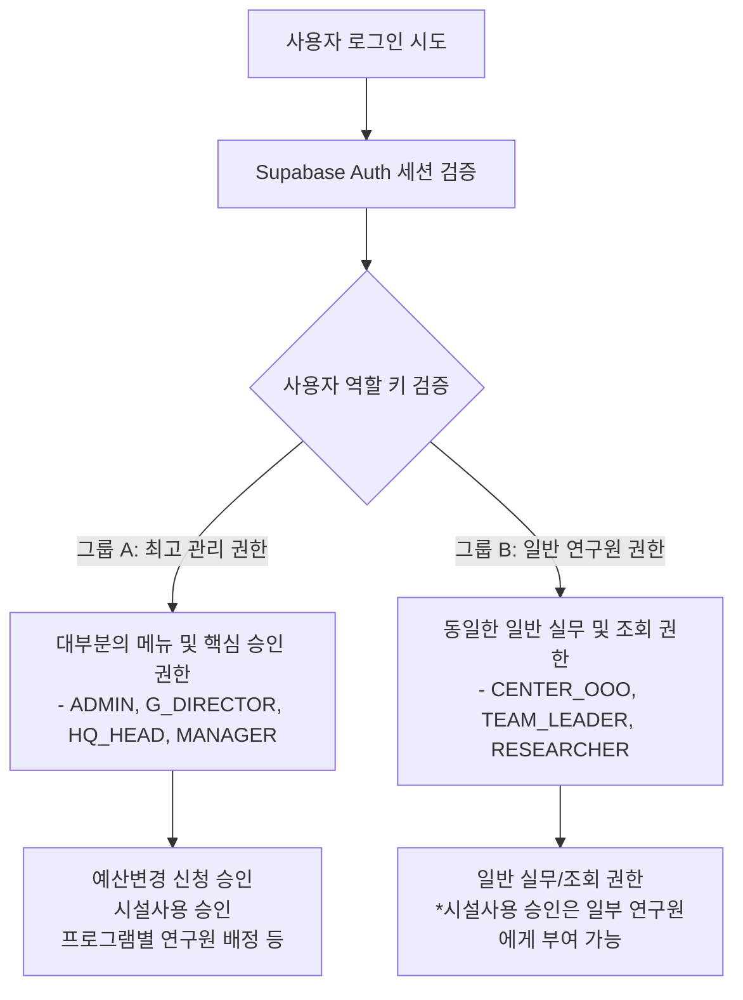
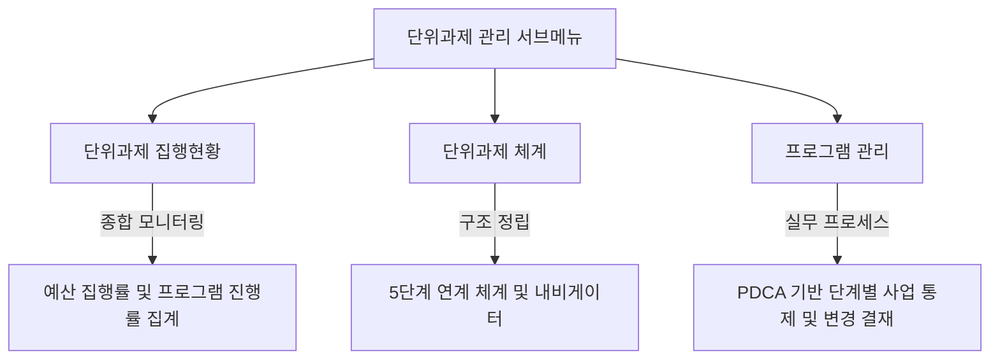
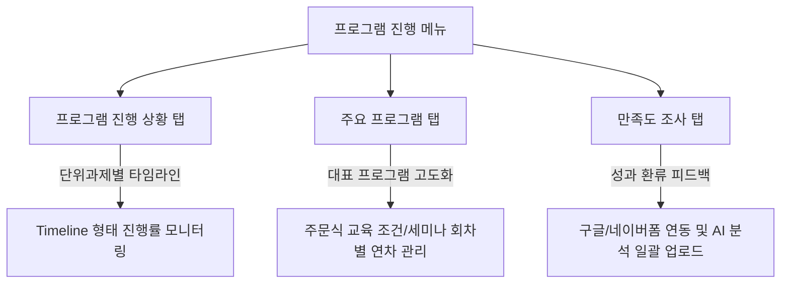
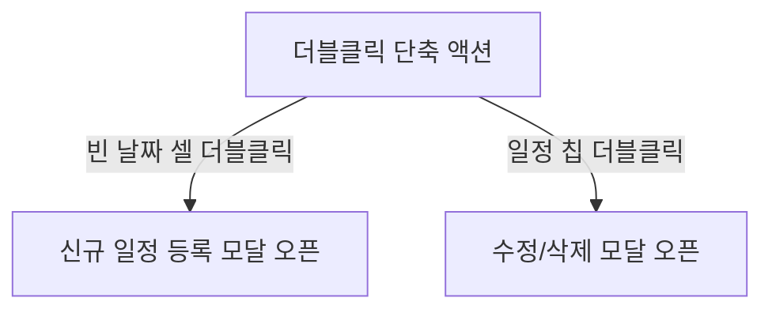

# [발표 자료] UC ANCHOR 통합 대시보드 연구원 사용설명서

---

## 1. 대시보드 개요 및 연동 목적

### 💡 Single Source of Truth (단일 행정 통제 구조)
울산과학대학교 앵커사업단 행정 업무 효율성 극대화, 데이터 누수 방지 및 성과관리 일원화를 위해 구축된 **통합 행정 관리 플랫폼**입니다.

* **통합의 대상**: 추진 실적(PDCA), 예산 집행, 조달 및 기자재 구매, 회의록/위원회 운영, 마일리지 장학금 지급 검증.
* **도입 효과**:
  - 수작업으로 취합되던 연차별 지표의 실시간 통계화.
  - 한눈에 파악하는 사업 기획 대비 집행 실적률(PDCA 환류).
  - 서류 파일(PDF) 및 녹음본(MP3)의 클라우드 스토리지 중앙 집중화.
  - AI를 활용한 조달 서류 요약 및 지식베이스 질의응답 지원.

---

## 2. 계정 권한 및 로그인 체계

본 시스템은 보안 강화와 행정 투명성 보장을 위해 사용자의 신원과 권한 등급을 엄격히 분류하여 처리합니다.

### 🔐 계정 등급별 접근 권한 및 기능 승인 분기
대시보드 로그인 시 사용자의 UUID와 연동된 `portal_configs` 설정에 따라 메뉴 탭 및 기능 접근 권한이 실시간 제어됩니다.



#### 1) 최고 관리 권한 그룹 (대부분의 메뉴 및 핵심 행정 권한 소유)
다음 역할군에 매핑된 계정은 대시보드 내의 대부분의 메뉴에 접근할 수 있으며, 핵심 행정 프로세스에 대한 통제 권한을 가집니다.
* **대상 역할 키**: `ADMIN`(최고관리자), `G_DIRECTOR`(사업단장), `HQ_HEAD`(총괄본부장), `MANAGER`(운영팀장)
* **주요 승인 및 관리 권한**:
  - **예산변경 신청 승인**: 프로그램별 예산 기획 변경 요청에 대한 최종 승인 및 롤업 반영.
  - **시설사용 승인**: 사업단 보유 시설 및 기자재 공간 대여/사용에 대한 승인 처리.
  - **프로그램별 연구원 배정**: 단위사업 산하 각 프로그램에 참여할 연구원(책임/선임/연구원)을 조직도 및 주소록 기반으로 동적 배정.

#### 2) 일반 연구원 및 센터장 권한 그룹 (상호 동일한 기본 실무 권한)
다음 역할군은 기본적으로 대시보드 내에서 동일한 권한을 공유하며, 배정된 프로그램의 PDCA 실적 입력 및 관리, 회의록 등록 등의 실무를 수행합니다.
* **대상 역할 키**: 
  - `CENTER_OOO` (각 센터장: `CENTER_ECC` - ECC센터장, `CENTER_ICC` - ICC센터장, `CENTER_RCC` - RCC센터장, `CENTER_NURI` - 늘봄누리센터장, `CENTER_SPECIAL` - 신산업특화센터장 등)
  - `TEAM_LEADER` (팀장교수)
  - `RESEARCHER` (책임연구원, 선임연구원, 실무 연구원)
* **주요 특징**:
  - 그룹 내 역할 간 기본 권한은 상호 **동일**합니다.
  - **시설사용 승인** 권한의 경우, 책임연구원이나 선임연구원 등 **일부 연구원에 한해 개별적으로 승인 권한을 예외적으로 부여**할 수 있도록 설계되어 있습니다.

* **보안 및 RLS(Row Level Security)**:
  - 비로그인 사용자(`anon`)의 테이블 접근 권한은 완전히 **Revoke(철회)**되어 있습니다.
  - API 통신 시 발급받은 유효한 JWT 토큰 세션을 헤더에 탑재하여 전송하며, 인가되지 않은 IP나 토큰으로는 데이터의 임의 수정이 절대 불가합니다.

---

## 3. 5대 핵심 서비스 모듈 상세 사용법

---

### 🖥️ 통합 IR 대시보드 (메인 요약 화면)

대시보드 접속 시 가장 먼저 노출되는 화면으로, 사업단장 및 실무 연구진이 **사업 예산 집행 현황과 핵심 성과 지표**를 실시간 모니터링할 수 있는 종합 관제 센터입니다.

```mermaid
graph TD
    Dashboard[앵커사업 통합 IR 대시보드] --> BudgetSummary[예산 집행 현황 카드]
    Dashboard --> KPISummary[성과지표 달성율 카드]
    Dashboard --> ChartSection[시각화 차트 영역]
    
    BudgetSummary --> |12,278.5 백만원| TotalBudget[2차년도 총 예산]
    BudgetSummary --> |0.0%| SpentRate[본사업비/이월사업비 집행률]
    
    KPISummary --> |80.5%| LocalKPI[(지자체) 자율성과지표]
    KPISummary --> |82.0%| UnivKPI[(대학) 중점관리지표]
    
    ChartSection --> |프로젝트별 재원/집행 비교| BarChart[막대 차트]
    ChartSection --> |재원 배분 비율| PieChart[도넛 차트]
```

#### 1) 다년도 연차 선택 및 동기화 상태 제어
* **다년도 연차 탭**: 상단에 배정된 `1차년도` ~ `5차년도` 탭을 클릭하여 각 연차별 재원 데이터와 집행 통계를 실시간으로 전환 조회할 수 있습니다. (현재 2차년도가 활성화된 상태임)
* **DB 동기화 표시 배지**: 백엔드 DB와 클라이언트 로컬 상태 간에 연동이 안전하게 완결되었을 경우 `DB 동기화 완료` 배지가 초록색으로 활성화됩니다.
* **로그아웃 및 세션 제어**: 로그인된 사업단장 정보 및 보안 관리를 위한 버튼이 헤더 우측에 배치되어 있어 세션 안정성을 즉각 확인할 수 있습니다.

#### 2) 핵심 요약 지표 카드 (KPI & Budget Summary Card)
* **총 예산 관리 요약**: 
  - 본사업(앵커 본사업 + 신산업 본사업) 및 이월사업(앵커 이월 + 신산업 이월) 재원을 구분하여 총 **12,278.5 백만원**의 재원을 종합 가시화합니다.
* **본사업비 및 이월사업비 집행 현황**:
  - 당해 연도 본사업비 집행 실적과 전년도 이월사업비 집행 실적(집행 금액, 집행률)을 독립적으로 분리하여 추적합니다.
* **성과지표 실시간 달성도**:
  - **(지자체) 자율성과지표**: 지자체 요구 자율 혁신목표 달성률 (**80.5%**)을 시각화합니다.
  - **(대학) 중점관리지표**: 대학 특성 핵심관리지표 달성률 (**82.0%**)을 실시간 제공하여 사업 목표치 달성을 유도합니다.

#### 3) 프로젝트별 재원 배분 및 누적 집행 현황 (하단 막대 차트)
* 본사업비 예산, 본사업비 집행, 이월사업비 예산, 이월사업비 집행 4가지 지표를 프로젝트별(프로젝트 A, B, C, D) 및 공통운영경비 항목에 병렬 막대그래프로 배치하여 재원 균형 집행을 관리합니다.

#### 4) 재원 배분 구조 (하단 도넛 차트)
* 공통운영경비를 포함한 전체 예산의 부문별 배분 비중을 한눈에 식별할 수 있습니다:
  - **프로젝트 A**: 34.0%
  - **프로젝트 B**: 24.6%
  - **프로젝트 C**: 12.8%
  - **프로젝트 D**: 8.7%
  - **공통운영경비**: 19.8%

---

### ① 단위과제 및 프로그램 관리 (PDCA 성과 모듈)

앵커 사업의 체계적인 기획, 예산 통제 및 성과 관리를 위해 대시보드 좌측의 **[단위과제 관리]** 메뉴는 세 가지 핵심 세부 메뉴로 구성되어 있습니다.



#### 1) 단위과제 집행현황 (종합 통계 모니터링)
사업단 내 개설된 모든 단위과제(A1~D2 등)의 재원 상태와 실적 진척도를 한눈에 비교 분석할 수 있는 종합 그리드 뷰입니다.
* **예산 배정 및 집행 통계 (단위: 백만원)**:
  - 각 단위과제별 **본예산, 이월예산, 총 배정액** 대비 **누적 집행액**과 **실시간 집행률(%)**을 자동 롤업 계산하여 제공합니다.
* **프로그램 현황 및 진행 지표**:
  - 단위과제 하위에 소속된 프로그램의 **총 개수**와 현재 상태별 수치(**준비, 진행, 완료**)를 구분하여 보여주며, 실질적인 **프로그램 진행률(%)**을 바 그래프 형태로 시각화합니다.

#### 2) 단위과제 체계 (5단계 연계 및 룰 정의)
앵커 사업의 효율적인 기획 및 성과관리를 위해 프로젝트 - 단위과제 - 추진전략 - 전략과제 - 프로그램의 5단계 고유 연계 체계를 정의합니다.
* **5단계 고유 연계 체계**:
  - **1단계: PJ (프로젝트)**: 울산시가 제시한 4대 핵심 사업 분야
  - **2단계: UP (단위과제)**: 목표 달성을 위한 12대 단위 사업 (A1~D3)
  - **3단계: S (추진전략)**: 단위과제 달성을 위한 거시적 사업 비전
  - **4단계: T (전략과제)**: 전략 실현을 위한 고유 중점 분야
  - **5단계: PG (프로그램)**: 실질적 예산 및 KPI가 매칭되는 행동 단위
* **프로그램 ID 규칙 (Rule)**:
  - `단위과제번호 - (추진전략번호 + 전략과제번호) - 프로그램번호` (예: `A1가-S1T1-1`)
  - *액션플랜(Action Plan; AP): 각 프로그램 수행을 위해 예산(본사업비/이월비), 담당자, 추진 단계, 마일스톤 기한 등을 상세히 테이블로 명시한 최하위 실천 명세입니다.
* **과제 & 전략 내비게이터**:
  - 대시보드 내비게이터를 통해 선택된 추진전략(`S1`)과 전략과제(`T1`)에 맵핑된 세부 프로그램(`A1가-S1T1-1`)을 우측 상세 정보 패널로 실시간 연동합니다.

#### 3) 프로그램 관리 (PDCA 기반의 빈틈없는 사업 운영 지원)
실무 연구원이 프로그램 단위로 상세 계획을 수립하고, 비동기 결재선을 통해 실시간으로 사업을 보완하며 집행하는 핵심 실무 모듈입니다. **PDCA 기반의 프로그램 관리를 통해 사업 운영에 빈틈이 없도록 빈틈없이 지원합니다.**
* **단위과제별 또는 전체 목록 조회/등록 지원**:
  - **단위과제별 조회/등록**: 특정 단위과제를 필터링하여 해당 과제에 매핑된 세부 프로그램만 선별적으로 조회하고 관리할 수 있습니다.
  - **전체 목록 조회/등록**: 사업단 전체 프로그램의 추진 상태 목록을 한눈에 조회할 수 있으며, 각 프로그램 행을 클릭하거나 우측의 [정보 등록] 버튼을 눌러 실시간 PDCA 수치 및 집행 실적을 입력하고 관리할 수 있습니다.
* **프로그램별 전담 연구원 배정**:
  - 각 프로그램 카드별로 담당 연구원(예: `박기범 연구원` 등)의 이름이 명시되어 책임 있는 사업 운영을 돕습니다.
* **PDCA 4단계 실시간 상태 신호등**:
  - **P (Plan)**, **D (Do)**, **C (Check)**, **A (Act)** 4개 단계의 완결 여부를 신호등 형태(완료-초록색, 진행-파란색, 대기-주황색 등)로 실시간 시각화하여 현재 사업의 정체 구간을 즉각 탐지합니다.
* **P-D-C-A 단계별 기획-실적 수립 및 버전 관리**:
  - **Plan (P단계)**: 국고, 지자체 시비, 외부사업비 등의 재원별 예산 배정액과 비목별 예산, 월별 추진 일정을 기획합니다. (D1, D2, D3 단위과제 하위 프로그램은 시비 매칭 비율이 0%인 국비 100% 조건으로 통제됩니다.)
  - **Do (D단계)**: 12개월의 월별 수행 단계를 드롭다운 콤보박스 형태로 입력하며, 집행액 세부 재원을 기입합니다.
  - **Check / Act (C/A단계)**: 목표 대비 실적 횟수를 체크하고, 2분할 환류 조치 양식(우수사례 및 Deficiency 분석에 기반한 개선 행동 조치)을 상세 기입할 수 있습니다.
* **예산 및 기획 변경을 위한 3단계 결재 프로세스**:
  - 연구원이 예산 배정, 비목 구성, 월별 일정 등을 수정하여 [저장 및 결재 요청]을 누르면 '승인데기' 상태로 등록됩니다.
  - **운영팀장 ➔ 총괄본부장 ➔ 사업단장**의 3단계 결재 승인이 온라인으로 최종 완료되어야 대시보드에 실시간 반영되며, **새로운 변경 차수 버전(예: 최초, 1차 변경 등)으로 이력이 영구 보존**되어 예산 남용 및 계획 왜곡을 원천 방어합니다.
* **반달(15일) 단위 간트 차트 (Gantt Chart) 조작**:
  - 마우스 드래그를 통해 일정 바의 좌/우측 끝을 늘리거나 줄여 일정을 수정합니다.
  - 1년 12달을 보름씩 쪼갠 24분할 가상 슬롯 맵핑 구조로 구성되어 있어, 세밀한 주차별 일정을 마우스 조작만으로 신속하게 수정할 수 있으며, 마우스를 놓는 즉시 날짜 범위 형식(`YYYY.MM.DD ~ YYYY.MM.DD`)으로 변환되어 DB에 실시간 저장됩니다.

---
 
### ② 프로그램 진행 상황 및 성과 관리 (프로그램 진행 모듈)
 
사업단의 단위과제별 세부 프로그램의 진행 상태와 주요 정보, 그리고 프로그램별 만족도 결과를 상세히 관리하는 모듈입니다.
 

 
#### 1) 프로그램 진행 상황 (단위과제별 타임라인 모니터링)
* **단위과제별 진행률 및 Timeline 시각화**: '프로그램 진행 상황' 탭에서는 각 단위과제에 매핑된 세부 프로그램들의 예산 배정/집행 금액뿐만 아니라, **Timeline(타임라인)** 인터페이스를 제공하여 프로그램의 실행 일정을 시각적으로 추적할 수 있습니다.
 
#### 2) 주요 프로그램 관리 (단위과제별 대표 프로그램 상세 통제)
* **대표 프로그램 고도화 관리**: 단위과제별로 중요한 대표 프로그램의 상세 핵심 정보를 수집하고 정밀하게 제어하기 위한 특화된 공간입니다.
  - **주문식 교육과정 관련 프로그램**: A1가 단위과제 등의 주문식 교육과정 운영과 관련해서는 '주문식 교육과정 조건', '참여학과', '학생 수', '이수학생 정보' 등의 실적 데이터를 체계적으로 기록합니다.
  - **지산학 이음 세미나 관련 프로그램**: 세미나의 '회차별 연차', '참석자 수', '만족도' 등을 폼에 따라 정밀하게 수집하여 성과 분석의 토대로 삼습니다.
 
#### 3) 만족도 조사 및 AI 분석 툴 연동
* **만족도 조사 원칙**: 모든 프로그램은 종료 후 참여자 대상 만족도 조사를 필수적으로 시행해야 합니다.

* **외부 만족도조사 파일 AI 분석 및 디베이트(Debate) 자동 합의**: 
  - 신설된 `기존 만족도조사 결과 입력 (AI)` 기능을 통해, 외부 플랫폼(구글폼, 네이버폼 등)에서 내려받은 결과 보고서 파일(`xlsx`, `hwp`, `pdf`)을 업로드하여 새 만족도 조사로 즉시 변환 등록할 수 있습니다. 엑셀 파일의 경우 실제 셀 데이터를 읽어와서 파싱을 적용합니다.
  - 분석 모델은 사용자가 직접 단일 모델을 지정하지 않고, **GPT-4o와 Gemini 두 거대 모델 간의 실시간 교차 토론(Cross Debate) 룸 인터페이스**가 구동됩니다. 두 모델은 파일 내 텍스트를 정밀 상호 대조하며, 쟁점 데이터(예: 날짜 오차율 팩트체크, 응답자수 누계 합의 등)에 대해 반론과 검증을 벌여 최종 Consensus(합의안)를 자동으로 도출합니다.
  - 토론이 성공적으로 마감되면 설문제목, 대상, 시기, 목적, 응답자수, 평균점수, 주관식 피드백 등의 최종 합의 결과가 입력 필드에 자동으로 프리필(pre-fill)됩니다. 사용자는 이를 최종 검토하고 저장하여 DB에 개별 분포 응답자 행을 실시간으로 일괄 인서트 처리합니다.
* **만족도조사 결과 통계 리스트 탭 신설**:
  - 서브메뉴에 `만족도조사 결과` 탭이 신설되어, 등록된 전체 만족도 조사의 주요 통계 지표(누적 응답수, 100점 환산 평균 점수, 진행 상태 등)를 일목요연한 표(Table) 형태로 실시간 모니터링할 수 있습니다.
* **AI 분석 툴을 통한 일괄 업로드**: 외부 폼 등에서 다운로드한 데이터를 빠르고 편리하게 업로드하여 취합 및 정량 분석할 수 있도록 전용 **AI 분석 툴**을 지원하여 행정 편의를 보장합니다.
 
---
 
### ③ 일정 및 위원회 관리 (캘린더 & 미팅 모듈)
 
사업단의 월간 일정, 주요 위원회 회의 및 업무 마감일을 가시화하고 제어하는 캘린더 모듈입니다.
 

 
#### 1) 부서 일정 필터링 및 칩 UI 활용
* 캘린더 상단에 배치된 **[부서별 필터 칩]**(전체, 사업운영팀, ECC, ICC, RCC 등)을 클릭하여 해당 부서 담당 일정만 필터링해 볼 수 있습니다.
 
#### 2) 일정 시간 validation 및 1시간 자동 완성
* **시작-종료 자동 완성**: 일정을 추가할 때 시작시간(예: `오전 10:00`)을 선택하면 종료시간이 자동으로 1시간 뒤인 `오전 11:00`로 기본 세팅됩니다.
* **역전 방지 경고**: 종료일시가 시작일시보다 앞서게 기입하고 [저장]을 누를 경우, 오류 안내창(`alert`)을 띄우고 모달 창이 닫히지 않아 데이터가 유실되지 않도록 방어합니다.
 
#### 3) 드래그 앤 드롭(Drag & Drop) 일정 날짜 이동
* 캘린더에 띄워진 일정 칩을 마우스로 잡고(Drag) 원하는 날짜 칸에 떨어뜨려(Drop) 날짜를 간편하게 변경할 수 있습니다. (여러 날짜에 걸쳐 있는 기간 일정도 시작일 오프셋에 맞추어 종료일이 비례하여 이동합니다.)
 
#### 4) 회의록 등록 및 위원회 연동
* 회의록 폼 작성 시 참석자 다중 체크박스를 제공하며, 첨부파일 업로드 기능을 통해 회의록 PDF 파일 및 음성 녹음본 MP3 파일을 버킷 스토리지로 바로 저장합니다.
 
---
 
### ④ 지산학 장학금 검증 (마일리지 & 결재 모듈)
 
지산학 연계 마일리지 장학금 지급의 안전성과 정합성을 보장하는 검증 시스템입니다.
 
#### 1) 개인정보 암호화 수립 (`pgcrypto` 보안 정책)
* 학생의 주민등록번호와 은행 계좌번호는 데이터베이스 내에 평문으로 저장되지 않고 `pgcrypto` 확장 모듈 기반의 **AES-256 대칭키 암호화**로 보호됩니다.
* 인가된 권한으로 로그인된 사용자에게만 복호화 뷰(`scholarships_view`)를 통해 평문 조회가 허용되며, 외부 유출이 불가능한 구조를 갖추고 있습니다.
 
#### 2) 엑셀 일괄 업로드 및 트랜잭션 백업/롤백 안전 장치
수작업 오류 방지를 위해 대량의 장학금 수혜자 엑셀 명단을 일괄 업로드할 수 있으며, 이 과정에서 **데이터 소실 방지 장치**가 작동합니다.
 
* **날짜 정화 정규식**: 엑셀 날짜 필드 내 비표준 표기(예: `2026.07.14.(수)`)를 인식하여 요일 문자 및 불필요한 마침표를 정교하게 세척하고 `2026-07-14` 표준 날짜 데이터로 자동 가공합니다.
* **분할 배치 전송 (Batch Insert)**: 수백 건의 장학금 데이터를 업로드할 때 네트워크 병목(`net::ERR_HTTP2_PROTOCOL_ERROR`)을 예방하기 위해 데이터를 **100개 단위**의 작은 단위로 쪼개어 서버에 전송합니다.
* **트랜잭션 롤백(Rollback)**: 데이터 삽입 처리 중 단 1건의 실패라도 감지되면, 업로드 직전의 기존 데이터 백업본으로 테이블 전체를 복원하여 데이터가 통째로 날아가는 유실 참사를 원천 차단합니다.
 
---
 
### ⑤ 행정 조달 및 기자재 관리 (조달 모듈)
 
기자재 구매, 시설 환경 개선 및 각종 조달 사업의 진척 상황을 관리합니다.
 
#### 1) 4단계 라이프사이클 관리
조달 관리 카드는 현재 진척 상황에 따라 **[계획] ➔ [입찰] ➔ [계약] ➔ [검수]** 4개 단계를 거치며, 드래그 드롭 또는 상세 폼에서 단계를 변경하여 진척도를 대시보드 메인 화면에서 실시간 추적합니다.
 
#### 2) PDF 조달 서류 AI Summary 기능
* 조달 단계별 필요 문서(규격서, 입찰 공고문, 계약서 등)를 업로드하면 **AI 엔진이 파일 내부 텍스트를 실시간 스캔하여 핵심 품목, 수량, 조달 예산액, 주의사항 등의 요약 보고서를 추출**해 주는 AI Summary 기능을 지원합니다.
 
---
 
### ⑥ 포털 설정 및 AI 지원
 
#### 1) LLM 지식베이스 챗봇 (AI Wiki)
* 라이즈 사업 운영 지침, 예산 집행 매뉴얼, 센터별 규칙 등을 학습한 AI 챗봇이 탑재되어 있습니다. 
* 질문 입력창에 포커스할 경우 브랜드 네온 글로우 효과가 발산되어 직관적으로 질의응답을 나눌 수 있습니다.
 
#### 2) 동적 포털 메뉴 커스텀 (`portal_configs`)
* 특정 기간 동안 특정 탭(예: 연말 정산 기간 장학금 탭 우선 노출 등)의 순서를 바꾸거나 숨길 수 있는 유연한 동적 포털 렌더링 기능을 제공합니다.

---

## 4. 실무 필수 팁 및 문제 해결 가이드 (Troubleshooting)

대시보드 실무 사용 중 발생할 수 있는 이상 현상에 대한 대처 가이드입니다.

### 🚨 화면 좌측 상단에 노란색 "동기화 실패 (클릭 시 복구)" 배지가 나타났어요.
* **원인**: 장시간 화면을 켜두어 Supabase 인증을 위한 세션 토큰(JWT)이 만료되었거나, 브라우저 로컬 저장소 세션이 꼬여 데이터 조회/수정이 차단된 상태입니다.
* **해결 방법**: 
  1. 우측 상단의 **[로그아웃]** 버튼을 클릭하여 기존의 만료된 브라우저 세션을 안전하게 정리합니다.
  2. 본인의 계정(예: `송경영 사업단장` 등)으로 **재로그인**을 시도하여 유효한 신규 토큰을 발급받으면 초록색 **"DB 동기화 완료"** 배지로 복구됩니다.

### 🔄 화면을 새로고침했는데 제가 방금 입력한 예산 수치들이 날아갔나요?
* **원인**: 네트워크 지연 또는 서버 저장 시간 중 브라우저가 강제로 새로고침된 상황입니다.
* **복구 메커니즘**: 본 대시보드에는 **자가치유형 복원 엔진(Self-healing Engine)**이 내장되어 있습니다. 화면이 다시 열릴 때 로컬 저장소(`anchor_projects_data_v22`)의 변경사항 캐시를 분석하여 수정 중이었던 `actual_timeline`, `achieveRate` 등을 정합성 있게 자동 복구해 주므로 안심하고 사용하셔도 됩니다.
