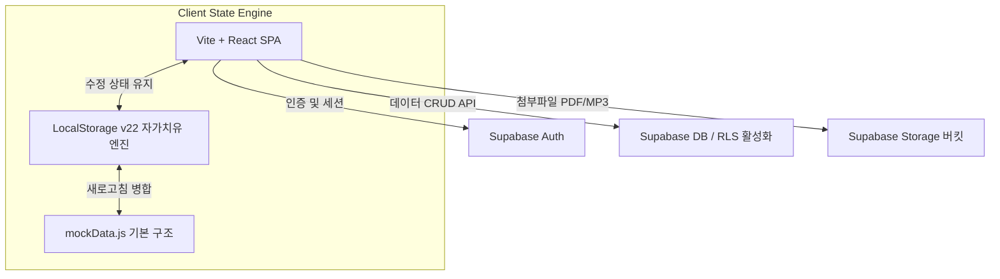
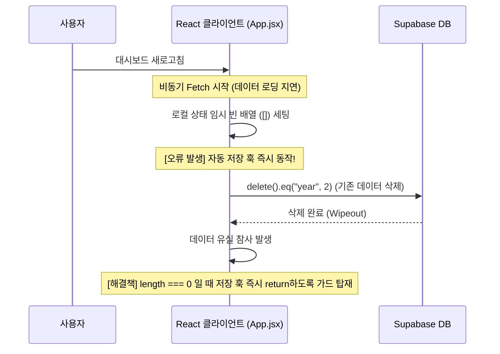
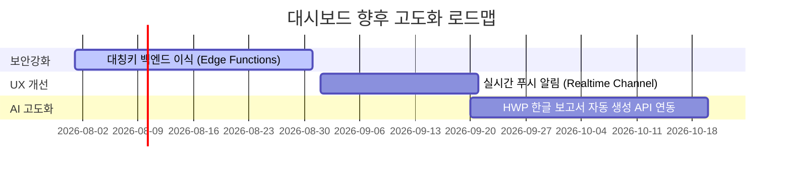

# [발표 자료] 바이브코딩 기반 UC ANCHOR 통합 대시보드 구축 회고록

---

## 1. 기획 단계 (Architecture & Tools)

본 프로젝트는 비전문가 개발자(교육진)와 AI 코딩 에이전트가 협력하는 **바이브코딩(Vibe Coding)**을 통해, 기획부터 배포까지 **단 10일 만에** 고도의 행정 관리 플랫폼을 완성한 사례입니다.

### 🛠️ 도구 구성 및 채택 배경
* **Antigravity (AI 에이전트)**: 인간 기획자의 자연어 비즈니스 요구사항을 해석하고, 코드베이스를 안전하게 분석하여 패치를 수행하는 지능형 개발 어시스턴트입니다.
* **Supabase (BaaS)**: 서버 인프라를 직접 구축하지 않고도 인증(Auth), PostgreSQL 데이터베이스, Storage 버킷, Row Level Security(RLS)를 즉시 확보하기 위해 채택했습니다.
* **Vercel**: React Single Page Application(SPA)의 빌드 및 실서버 호스팅 속도를 극대화하고 CI/CD 파이프라인을 자동 연동하기 위해 적용했습니다.

### 📐 설계 아키텍처

---

## 2. 개발 과정과 7대 시행착오 (시행착오 중심)

10일 동안 47개의 점진적인 DB 마이그레이션을 안전하게 배포하고 수십 차례 프런트엔드 기능을 고도화했습니다. 이 과정에서 겪은 **7가지 핵심 시행착오와 이를 해결해 낸 극복 과정**은 바이브코딩의 진정한 묘미를 보여줍니다.

---

### 🚨 [시행착오 1] 코드 라인 밀림으로 인한 1차 패치 실패
* **상황**: 달력 일정 수정 모달에서 날짜 파싱 오류가 발생하여 날짜 포맷 정제 함수 `parseDateTime`을 주입하고 적용하려 했습니다.
* **원인**: AI 에이전트가 파일의 특정 라인(1380~1410 라인) 범위 내 코드를 수정하려고 타겟팅했으나, 다른 수정 사항들이 앞서 대량 반영되면서 실제 수정 대상 코드의 위치가 아래로 밀려 매칭 에러가 발생하며 패치에 실패했습니다.
* **해결 및 학습**: 
  - 단순히 라인 번호에만 의존하지 않고, 수정할 대상 함수(`handleEditSchedule`)가 밀려 내려간 실제 위치(1439 라인)를 검색 툴을 통해 재검증하여 2차 대체를 시도함으로써 버그를 해결했습니다.
  - **학습**: AI 페어 프로그래밍 시, 파일이 지속적으로 업데이트되면 라인 오프셋이 수시로 변하므로, **고유한 함수명이나 고유 코드를 명확히 검색하여 타겟으로 지정**해야 함을 배웠습니다.

---

### 🚨 [시행착오 2] HTML5 Drag-and-Drop ID 타입 불일치 에러
* **상황**: 캘린더 화면 내에서 일정 칩을 마우스로 끌어서 날짜를 이동시키는 드래그 앤 드롭 기능을 탑재했습니다.
* **원인**: 드래그 시작 시 `e.dataTransfer.setData("text/plain", sched.id)` 형태로 일정 ID를 저장했는데, `sched.id`가 숫자형(`Number`)이었기에 브라우저 규격상 '반드시 문자열이어야 한다'는 제약을 충족하지 못해 런타임 에러를 뱉으며 드래그 기능 자체가 먹통이 되었습니다.
* **해결 및 학습**: 
  - `String(sched.id)`으로 형변환하여 드래그 시 데이터셋에 이식하고, 드롭을 처리하는 수신부에서 다시 `Number(droppedId)`로 복원하여 연산하도록 교정하여 정상 작동시켰습니다.
  - **학습**: 브라우저 기본 웹 API 규격의 타입 규칙을 면밀히 분석하는 것이 런타임 에러 방지에 필수적임을 확인했습니다.

---

### 🚨 [시행착오 3] Supabase 047번 마이그레이션 뷰(View) 권한 SQL DDL 빌드 실패
* **상황**: 장학금 수혜자 주민번호 조회를 위한 뷰(`scholarships_view`)의 비로그인 익명(`anon`) 접근 권한을 완전히 철회(REVOKE)하는 마이그레이션 SQL을 푸시했습니다.
* **원인**: SQL DDL 작성 시 `REVOKE ALL ON TABLE public.scholarships_view FROM anon;` 문법을 기입했으나, PostgreSQL 엔진 상 **뷰(View)는 릴레이션 테이블(Table)이 아니므로** `TABLE` 지시어를 붙여 권한을 박탈하려 하면 에러를 뱉으며 GitHub Actions CI/CD 빌드가 실패하고 롤백되었습니다.
* **해결 및 학습**:
  - DDL 지시어를 간소화하고 호환성을 확보하여 `REVOKE ALL ON scholarships_view FROM anon;` 형태로 구문을 핫픽스하여 푸시함으로써 원격 배포에 성공했습니다.
  - **학습**: 관계형 데이터베이스에서 물리 테이블과 논리 뷰의 DDL 구문 규칙 차이를 보다 정교하게 검사해야 함을 인지했습니다.

---

### 🚨 [시행착오 4] 비동기 데이터 쿼리 지연에 따른 데이터 전면 유실 대형 사고
* **상황**: RLS 보안 패치 후 대시보드에 접속했을 때, 기존에 잘 들어있던 협약(MOU), 상장, 장학금 데이터가 대시보드 화면상에서 돌연 사라져 0개로 표시되고, 백엔드 DB에서도 모두 지워진 심각한 유실 사고가 발생했습니다.
* **원인**: 대시보드가 로드될 때 Supabase Auth 세션 검증과 데이터 비동기 Fetch가 미처 끝나기도 전에, `App.jsx` 내에 구현된 로컬스토리지 기반 '자동 저장 디바운싱 훅'이 먼저 트리거되었습니다. 이로 인해 임시로 비어있는 상태 배열(`[]`)이 원격 DB로 저장 명령(`delete().eq("year", yr)`)을 내려서 실서버 데이터를 모두 지워버리는 경쟁 상태(Race Condition)가 빚어졌습니다.
* **해결 및 학습**:
  - 데이터 로딩이 완료되지 않았거나 일시적 예외로 로컬 상태 배열이 비어있을 때는 원격 DB 저장 로직을 가동하지 않고 즉시 탈출(return)시키는 안전 가드를 탑재했습니다:
    `if (!agreements || agreements.length === 0) return;`
  - 이후 엑셀 업로드 기능을 통해 복원하여 데이터를 성공적으로 회수했습니다.
  - **학습**: **비동기 상태 전이 시 가드 절(Guard Clauses)을 촘촘히 두는 설계**가 BaaS 아키텍처의 필수조건임을 뼈아프게 깨달았습니다.

---

### 🚨 [시행착오 5] API 401 Unauthorized 거부 장애
* **상황**: RLS 보안 설정 및 권한 철회 마이그레이션이 적용된 직후, 실사용자 화면 좌측 상단에 노란색 "동기화 실패 (클릭 시 복구)" 배지가 사라지지 않고 모든 통신이 401 Unauthorized로 거부되었습니다.
* **원인**: 브라우저 LocalStorage에 오래전 발급받아 만료된 과거 JWT 세션 토큰이 손상된 채 남아 있었고, API 요청 헤더에 이 토큰이 실려 가면서 Supabase API 게이트웨이가 요청 자체를 거부한 현상이었습니다.
* **해결 및 학습**:
  - 코드 수정 대신 사용자에게 대시보드 우측 상단 **[로그아웃]** 버튼을 눌러 로컬 스토리지의 인증 상태를 완전히 클리어하도록 가이드하였고, 재로그인을 통해 신규 토큰을 발급받아 정상 동기화 상태로 신속 복구시켰습니다.
  - **학습**: 인증 세션과 관련된 문제는 코드 픽스 외에도 세션 만료 처리를 위한 UX적 로그아웃 유도가 유효한 해결책이 됨을 입증했습니다.

---

### 🚨 [시행착오 6] 대용량 엑셀 업로드 시 HTTP/2 프로토콜 에러 및 데이터 증발
* **상황**: 수백 건 이상의 장학금/상장 명단이 들어있는 대용량 엑셀을 업로드하면 네트워크 스트림이 도중에 끊어지고 DB 데이터가 증발하는 현상이 발생했습니다.
* **원인**: 
  1. 엑셀의 날짜 데이터 형식에 `2026.07.14.(수)`와 같은 요일 한글 괄호가 포함되어 DB 데이터 타입 제약을 위반함.
  2. 수천 건의 삽입(Insert) 페이로드가 단일 HTTP POST 요청으로 한 번에 묶여 전송되면서 브라우저 한계치 초과(`net::ERR_HTTP2_PROTOCOL_ERROR`)로 전체 요청이 중단됨.
  3. 기존 데이터를 먼저 지우고 삽입하는 과정에서 중간에 중단되어 데이터가 공중분해됨.
* **해결 및 학습**:
  - **날짜 전처리 정규식**: 요일 괄호 및 비표준 마침표 구분자를 완벽히 제거해 표준 포맷(`YYYY-MM-DD`)으로 정밀 세척했습니다.
  - **분할 배치 전송 (Batching)**: 데이터를 **최대 100개 단위** 청크로 쪼개어 루프를 통해 안전하게 순차 송신하도록 개선했습니다.
  - **트랜잭션 롤백 백업 복원**: 동기화 연동 직전 테이블의 데이터를 임시 메모리에 백업하고, 삽입 프로세스 중 1건이라도 실패 시 자동으로 기존 데이터를 재적재하여 복구하는 안전장치를 내장했습니다.
  - **학습**: 대량 데이터 동기화 시에는 네트워크 불안정을 상정하여 반드시 배치 처리와 백업/롤백 메커니즘을 동반해야 함을 배웠습니다.

---

### 🚨 [시행착오 7] 연차 탭 전환 시 타 연차 일정 잔상 깜빡임 현상
* **상황**: 사용자가 1차년도(2025년) 탭에서 2차년도(2026년) 탭으로 이동할 때, 1차년도의 특정 일정이 2차년도 달력에 일시적으로 보였다가 로딩이 끝나면서 사라지는 유령 깜빡임 현상이 확인되었습니다.
* **원인**: 탭 전환 시 비동기 쿼리가 완료되어 상태가 업데이트되기 전까지의 1~2초 동안 로컬 React 상태에는 여전히 이전 연차 데이터가 들어있었습니다. 달력 그리드를 그릴 때 단순히 일시(`dateString`)만 대조해 그리다 보니 이전 연차 일정이 엉뚱한 연도 캘린더에 매핑되어 표현된 것이었습니다.
* **해결 및 학습**:
  - 달력을 렌더링하는 루프 조건문에 날짜 일치 여부 외에도 **`s.year === selectedYear` (데이터의 연차가 현재 활성화된 탭 연차와 정확히 일치하는지)** 조건을 추가하여Stale State에 의한 잘못된 렌더링을 격리했습니다.
  - **학습**: React 비동기 렌더링에서 연차 탭과 같이 상태 변화가 격리되어야 하는 경우, 데이터 고유의 식별 정보 검증을 이중으로 결합해야 함을 이해했습니다.

---

## 3. 완성 및 데이터 보안 성과

다양한 위기 상황을 바이브코딩 협업 모델을 통해 정교하게 방어해 내며, 다음과 같은 강력한 대시보드를 완성했습니다.

* **5대 핵심 모듈 안정성 확보**: PDCA 사업 성과, 부서 필터링 캘린더, 암호화 기반 장학금 대장, AI summary 조달 관리, AI Wiki 포털 연동 완료.
* **완벽한 데이터 암호화 구현**: `pgcrypto`를 통한 주민번호/계좌번호 AES-256 암호화 적재, `authenticated` 로그인 사용자 외 조회 원천 차단(RLS).
* **데이터 정합성 보장**: 새로고침 자가치유 복원 엔진 및 엑셀 일괄 삽입/롤백 구조 완성.

---

## 4. 보수 및 향후 고도화 방안 (Maintenance Roadmap)

향후 안정적인 운영과 기능 고도화를 위한 기술적 보수 계획입니다.

1. **Supabase Edge Functions 도입 (보안 보수)**:
   * **현재의 한계**: 프론트엔드 코드에 암호화 대칭키(`anchor_secure_key_2026`)가 내장되어 있어 클라이언트 코드 디버깅 시 노출될 위험이 존재합니다.
   * **보수 방향**: 백엔드 서버리스 함수(Edge Functions)를 구성하여 키를 백엔드 환경 변수로 은닉하고, 클라이언트는 평문 전달 후 백엔드에서만 암복호화를 수행하도록 격리 조치할 예정입니다.
2. **실시간 알림 (Realtime Notification)**:
   * **보수 방향**: 조달 단계 변경이나 마일리지 장학금 결재 승인 등의 이벤트 발생 시, Supabase Realtime 채널을 활성화하여 로그인된 담당자 화면에 즉각 실시간 웹 푸시 알림이 발송되도록 UX를 보완합니다.
3. **AI 기반 HWP 행정 보고서 자동 추출**:
   * **보수 방향**: 대시보드에 축적된 연간 PDCA 실적 데이터와 조달 지표를 취합한 뒤, 정부 제출 양식의 한글(HWP) 파일 DDL 구조를 AI API로 맵핑하여 자동으로 완성된 보고서를 다운로드할 수 있는 자동화 행정 시스템을 구축할 계획입니다.
