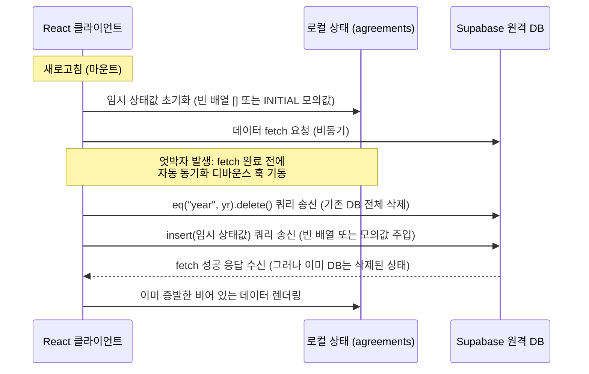

# [회고 및 대처 가이드] 로딩 시간차에 따른 Supabase 데이터 유실(증발) 문제와 방지 대책

이 문서는 대시보드 새로고침 시 혹은 메뉴 탭 전환 시 빈번하게 발생했던 **행정 데이터(협약 내용, 상장·이수증, 장학금 내역 등)의 원격 데이터베이스 영구 삭제 및 유실 오류**의 원인을 기술적으로 명확히 분석하고, 향후 동일한 아키텍처적 결함이 재발하지 않도록 안전 수칙 및 대응 방안을 정리한 회고록입니다.

---

## 1. 🚨 문제 현상 정의

* **증상**: 
  - 사용자가 화면상에서 협약서, 장학금 명단 등을 기입하고 새로고침을 하거나 화면의 탭을 빠르게 조작할 때, 기존에 작성되어 Supabase DB에 분명히 저장되어 있던 데이터가 **"등록된 내역이 없습니다."** 상태로 일제히 초기화되거나 날아가는 현상.
  - 이로 인해 실무 연구원이 등록한 행정 데이터가 유실되어 수차례 중복 입력을 유도하는 대형 오류가 반복적으로 누출됨.

---

## 2. 🔍 원인 분석 (Root Cause)

이 오류는 리액트 컴포넌트의 **비동기 데이터 유입 타이밍**과 **실시간 동기화 디바운스(Debounce) 훅의 정합성 검증 부재**가 결합하여 발생한 아키텍처 구조적 버그였습니다.



### ① 비동기 페칭과 컴포넌트 마운트 초기값의 시간차
- 브라우저를 새로고침하면 React State는 완전히 리셋되어 **초기값(빈 배열 `[]` 또는 초기 모의 객체)**으로 세팅됩니다.
- 그와 동시에 Supabase로부터 최신 데이터를 불러오는 비동기 API 요청(`select(*)`)을 보냅니다.
- 그러나 API 요청이 다녀와서 로컬 State를 갱신하기 전에, 컴포넌트가 렌더링되면서 **자동 저장 디바운스 훅(`useEffect`)이 먼저 실행**되어 버립니다.

### ② 무조건적인 DB 삭제 후 삽입 (`delete & insert`) 방식
- 실시간 저장을 위해, 로컬 데이터에 변동이 있을 때마다 해당 연차(`year`)의 DB 행을 전부 삭제(`delete`)하고, 현재 로컬에 존재하는 상태 데이터를 새로 통째로 밀어 넣는(`insert`) 동기화 방식이 적용되어 있었습니다.
- 데이터 로딩이 채 끝나지 않아 **일시적으로 비어 있는 상태(`[]` 등)**가 훅에 유입되는 순간, 훅은 이를 "사용자가 모든 내용을 지웠다"고 잘못 판단하여 **원격 DB 레코드를 전부 `delete`로 날렸습니다.**
- 그 후 실제 DB로부터 복원된 데이터가 도착했을 때는 이미 원격 테이블의 내용이 다 밀려 나간 상태이므로 화면에 아무것도 나타나지 않게 되었습니다.

---

## 3. 🛡️ 해결 방안 및 철통 안전장치 설계

이와 같이 '데이터를 가져오기 전에 저장 요청이 DB를 오염시키는 참사'를 차단하기 위해 **대조식 원본 대조 가드(Ref Hash Guard)** 설계를 도입했습니다.

### ① `useRef`를 이용한 원격 오리지널 캐싱
- Supabase로부터 데이터 fetch를 정상 완결하는 시점에, 로드된 원본 데이터를 문자열로 직렬화하여 별도의 참조 객체(`fetchedRef.current`)에 고정 저장해 둡니다.
  ```javascript
  setAgreements(formatted);
  fetchedAgreementsRef.current = JSON.stringify(formatted); // 원본 백업
  ```

### ② 정합성 대조 가드 (오염 전면 차단)
- 자동 동기화 훅이 기동할 때, 현재 상태값의 직렬화 문자열이 원본 캐시인 `fetchedRef.current`와 **완벽히 동일한 경우**에는 절대로 Supabase에 삭제/입력 요청을 보내지 않고 **즉시 실행을 스킵(`return`)**시킵니다.
  ```javascript
  const currentCleanStr = JSON.stringify(state);
  if (!fetchedRef.current || fetchedRef.current === currentCleanStr) {
    // 로컬 스토리지에 백업만 갱신하고, 원격 DB 쓰기 동작은 즉시 차단
    return;
  }
  ```
- 이로 인해, 화면 마운트 및 엇박자 로딩 시점에 일시적으로 비어 있거나 임시 데이터 상태인 경우에도 원격 DB가 멋대로 덮어씌워지는 대형 참사가 완벽히 물리적으로 차단됩니다.
- 오직 사용자가 직접 화면 상에서 행을 추가, 수정, 삭제하여 **상태값이 오리지널(Ref) 데이터와 분명히 달라졌을 때에만** 비로소 안전하게 Supabase 트랜잭션이 작동하게 됩니다.

---

## 4. 📝 개발자를 위한 재발 방지 수칙 및 가이드라인

향후 새로운 행정 모듈이나 관리 탭을 추가할 때, 아래 수칙을 반드시 준수하여 개발해야 데이터 유실 사고를 원천 예방할 수 있습니다.

1. **`delete-insert` 트랜잭션 사용 시 `fetchedRef` 필수 연동**
   - 네트워크 과부하 등을 막기 위해 특정 연차 전체 행을 지우고 다시 쓰는 형태의 동기화 훅을 작성할 때는, 절대 `useState` 변수 하나에만 의존하지 말고 반드시 `fetchedRef`를 쌍으로 선언하여 원본 일치 여부를 가드할 것.
2. **동기화 훅의 의존성(dependency) 배열 검증**
   - 비동기 로딩 완결 여부를 알려주는 플래그(`isLoaded`)를 반드시 `useEffect` 의존성 배열에 삽입하여, 로딩 상태가 최종 전환되는 타이밍을 훅이 완벽히 인지하도록 설계할 것.
3. **수동 강제 저장 기능(버튼) 제공 검토**
   - 자동 저장이 백그라운드에서 지나치게 엇갈릴 우려가 있는 거대 테이블의 경우, 화면 상단에 명시적인 `[저장 및 동기화]` 버튼을 제공하고, 디바운스 자동 저장 주기를 넓히거나 수동 저장을 권장하는 폼 설계를 고려할 것.
